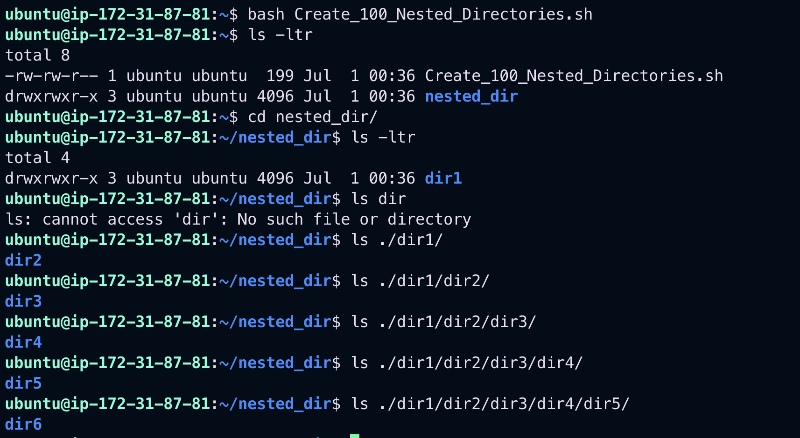

# 📂 Create 100 Nested Directories in Linux

This guide shows how to create **100 nested directories**, where each directory is created inside the previous one.

---

## ✅ Option 1: One-Liner Bash Command

```bash
mkdir -p dir1/$(seq -s/ 2 100)
```

### 🔍 Explanation:

- `seq -s/ 2 100`: Generates the sequence `2/3/4/.../100`
- `mkdir -p`: Creates all parent directories as needed

This will result in a structure like:

```
dir1/
└── 2/
    └── 3/
        └── 4/
            └── ...
                └── 100/
```

---

## ✅ Option 2: Shell Script to Create Nested Directories

You can use the following shell script for more control.

```bash
#!/bin/bash

base="nested_dir"
mkdir "$base"
cd "$base"

for i in $(seq 1 100); do
  mkdir "dir$i"
  cd "dir$i"
done

# Final structure: nested_dir/dir1/dir2/.../dir100
```

### 💾 Save & Run

1. Save as `create_nested_dirs.sh`
2. Make it executable and run:

```bash
chmod +x create_nested_dirs.sh
./create_nested_dirs.sh
```

`Output`


---

## 🧪 Check Depth

After running the script, use:

```bash
pwd
```

You’ll see the full path down to `dir100`.

---

## Script to view nested directories

```bash
#!/bin/bash
# view_all_nested_directories.sh: use for loop to view all nested directories
#
base="nested_dir"
ls -ltr
cd "$base"
pwd
for i in $(seq 1 100)
do
	echo "Present Working Directory is: \n"
        pwd
	echo
	echo "List all files and directories:"
	ls -ltr "dir$i"
	cd "dir$i"
	echo
	echo "present working directory is:"
	pwd
done
```

`Output:`

```bash
/home/ubuntu/nested_dir
List all files and directories of current directory:
total 4
drwxrwxr-x 3 ubuntu ubuntu 4096 Jul  1 00:36 dir2
present working directory is:
/home/ubuntu/nested_dir/dir1
Present Working Directory is:
/home/ubuntu/nested_dir/dir1
List all files and directories of current directory:
total 4
drwxrwxr-x 3 ubuntu ubuntu 4096 Jul  1 00:36 dir3
present working directory is:
/home/ubuntu/nested_dir/dir1/dir2
Present Working Directory is:
/home/ubuntu/nested_dir/dir1/dir2
List all files and directories of current directory:
total 4
drwxrwxr-x 3 ubuntu ubuntu 4096 Jul  1 00:36 dir4
present working directory is:
/home/ubuntu/nested_dir/dir1/dir2/dir3
Present Working Directory is:
/home/ubuntu/nested_dir/dir1/dir2/dir3
List all files and directories of current directory:
total 4
drwxrwxr-x 3 ubuntu ubuntu 4096 Jul  1 00:36 dir5
present working directory is:
/home/ubuntu/nested_dir/dir1/dir2/dir3/dir4
Present Working Directory is:
/home/ubuntu/nested_dir/dir1/dir2/dir3/dir4
List all files and directories of current directory:
total 4
drwxrwxr-x 3 ubuntu ubuntu 4096 Jul  1 00:36 dir6

....

Present Working Directory is:
/home/ubuntu/nested_dir/dir1/dir2/dir3/dir4/dir5/dir6/dir7/dir8/dir9/dir10/dir11/dir12/dir13/dir14/dir15/dir16/dir17/dir18/dir19/dir20/dir21/dir22/dir23/dir24/dir25/dir26/dir27/dir28/dir29/dir30/dir31/dir32/dir33/dir34/dir35/dir36/dir37/dir38/dir39/dir40/dir41/dir42/dir43/dir44/dir45/dir46/dir47/dir48/dir49/dir50/dir51/dir52/dir53/dir54/dir55/dir56/dir57/dir58/dir59/dir60/dir61/dir62/dir63/dir64/dir65/dir66/dir67/dir68/dir69/dir70/dir71/dir72/dir73/dir74/dir75/dir76/dir77/dir78/dir79/dir80/dir81/dir82/dir83/dir84/dir85/dir86/dir87/dir88/dir89/dir90/dir91/dir92/dir93/dir94/dir95/dir96/dir97/dir98
List all files and directories of current directory:
total 4
drwxrwxr-x 2 ubuntu ubuntu 4096 Jul  1 00:36 dir100
present working directory is:
/home/ubuntu/nested_dir/dir1/dir2/dir3/dir4/dir5/dir6/dir7/dir8/dir9/dir10/dir11/dir12/dir13/dir14/dir15/dir16/dir17/dir18/dir19/dir20/dir21/dir22/dir23/dir24/dir25/dir26/dir27/dir28/dir29/dir30/dir31/dir32/dir33/dir34/dir35/dir36/dir37/dir38/dir39/dir40/dir41/dir42/dir43/dir44/dir45/dir46/dir47/dir48/dir49/dir50/dir51/dir52/dir53/dir54/dir55/dir56/dir57/dir58/dir59/dir60/dir61/dir62/dir63/dir64/dir65/dir66/dir67/dir68/dir69/dir70/dir71/dir72/dir73/dir74/dir75/dir76/dir77/dir78/dir79/dir80/dir81/dir82/dir83/dir84/dir85/dir86/dir87/dir88/dir89/dir90/dir91/dir92/dir93/dir94/dir95/dir96/dir97/dir98/dir99
Present Working Directory is:
/home/ubuntu/nested_dir/dir1/dir2/dir3/dir4/dir5/dir6/dir7/dir8/dir9/dir10/dir11/dir12/dir13/dir14/dir15/dir16/dir17/dir18/dir19/dir20/dir21/dir22/dir23/dir24/dir25/dir26/dir27/dir28/dir29/dir30/dir31/dir32/dir33/dir34/dir35/dir36/dir37/dir38/dir39/dir40/dir41/dir42/dir43/dir44/dir45/dir46/dir47/dir48/dir49/dir50/dir51/dir52/dir53/dir54/dir55/dir56/dir57/dir58/dir59/dir60/dir61/dir62/dir63/dir64/dir65/dir66/dir67/dir68/dir69/dir70/dir71/dir72/dir73/dir74/dir75/dir76/dir77/dir78/dir79/dir80/dir81/dir82/dir83/dir84/dir85/dir86/dir87/dir88/dir89/dir90/dir91/dir92/dir93/dir94/dir95/dir96/dir97/dir98/dir99
List all files and directories of current directory:
total 0
present working directory is:
/home/ubuntu/nested_dir/dir1/dir2/dir3/dir4/dir5/dir6/dir7/dir8/dir9/dir10/dir11/dir12/dir13/dir14/dir15/dir16/dir17/dir18/dir19/dir20/dir21/dir22/dir23/dir24/dir25/dir26/dir27/dir28/dir29/dir30/dir31/dir32/dir33/dir34/dir35/dir36/dir37/dir38/dir39/dir40/dir41/dir42/dir43/dir44/dir45/dir46/dir47/dir48/dir49/dir50/dir51/dir52/dir53/dir54/dir55/dir56/dir57/dir58/dir59/dir60/dir61/dir62/dir63/dir64/dir65/dir66/dir67/dir68/dir69/dir70/dir71/dir72/dir73/dir74/dir75/dir76/dir77/dir78/dir79/dir80/dir81/dir82/dir83/dir84/dir85/dir86/dir87/dir88/dir89/dir90/dir91/dir92/dir93/dir94/dir95/dir96/dir97/dir98/dir99/dir100
ubuntu@ip-172-31-87-81:~$
```

## 🧹 Optional: Delete the Entire Structure

To remove everything created:

```bash
cd ~
rm -rf nested_dir
```
