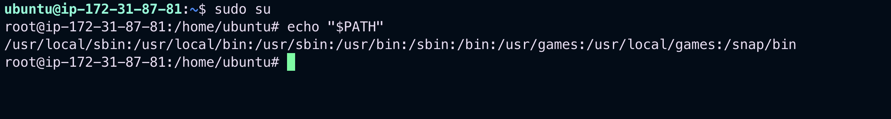

# Command Path

- A linux command that we type into a shell can be `built-in`, `function`, `an alias` or an external executable. We can find what it is and it's path with several linux utilities such as `which`, `command` `type`, `locate`, `whatis` and `whereis`.

## `PATH` environment variable

- Before we jump to explanation of the utilities, we need to know that the application, such as our shell, **finds(and execute) the command from the list of directories that are stored in an environment variable called PATH**. Each directory is separated by a colon character " : ".
- We can show what is inside this variable by calling the `echo` command:

```bash
echo $PATH
```


`O/P`

```bash

ubuntu@ip-172-31-87-81:~$ sudo su
root@ip-172-31-87-81:/home/ubuntu# echo "$PATH"
/usr/local/sbin:/usr/local/bin:/usr/sbin:/usr/bin:/sbin:/bin:/usr/games:/usr/local/games:/snap/bin
```

> This mean that we install a program on our system, to be able to call the executable from any directory from our shell, we need to ensure that the **_PATH variable_** has the PATH of the executable.

## We can update the PATH variable temporarily by running this command:

```bash
export PATH=$PATH: /sampledir/path

```

- The `PATH` will be reset on reboot.
- However we can update the `PATH` variable permanently by updating the `.bashrc` file

---

## `which` command

- Most linux base operating system have the `which` command installed. we can use this command to get the path of the linux command:

```bash
which docker

```

`O/P`

```bash
root@ip-172-31-87-81:/home/ubuntu# which ls
/usr/bin/ls
root@ip-172-31-87-81:/home/ubuntu# which cat
/usr/bin/cat
root@ip-172-31-87-81:/home/ubuntu# which telnet
/usr/bin/telnet
root@ip-172-31-87-81:/home/ubuntu#
```

- This shows that when we called `ls`,`cat` and `telnet` command. It will run the respective executable file in the `/usr/bin` directory.
- Moreover `which` command has a parameter `-a` which will print all matching path names:

```bash
which -a ls
which -a cat

```

`O/P`

```bash
root@ip-172-31-87-81:/home/ubuntu# which -a ls
/usr/bin/ls
/bin/ls
root@ip-172-31-87-81:/home/ubuntu# which -a cat
/usr/bin/cat
/bin/cat
root@ip-172-31-87-81:/home/ubuntu# which -a docker
root@ip-172-31-87-81:/home/ubuntu# which -a man
/usr/bin/man
/bin/man
```

- So we have two executable files in two different directories. The shell uses the one in **/usr/bin/** directory because **the directory appears first in PATH variable**, and the file has the right permissions. Otherwise, it will go to the next executable file in the `/bin/` directory.

```bash
root@ip-172-31-87-81:/home/ubuntu# echo $PATH
/usr/local/sbin:/usr/local/bin:/usr/sbin:/usr/bin:/sbin:/bin:/usr/games:/usr/local/games:/snap/bin
```

---

## `command` COMMAND

- The `command` command is another utility that we can use to find the path of a linux command. This utility tell us the the difference between the executable (docker) or an alias(**_ls_**)

```bash
command -v docker
/usr/bin/docker
command -V docker
docker is hashed (/usr/bin/docker)
```

- We need to pass the -v or -V parameter:

```bash
command -v ls
alias ls='ls --color=auto'
command -V ls
ls is aliased to `ls --color=auto'
```

```bash
root@ip-172-31-87-81:/home/ubuntu# command -V ls
ls is aliased to `ls --color=auto'
root@ip-172-31-87-81:/home/ubuntu# command -v ls
alias ls='ls --color=auto'
root@ip-172-31-87-81:/home/ubuntu# command -v cat
/usr/bin/cat
root@ip-172-31-87-81:/home/ubuntu# command -V cat
cat is /usr/bin/cat
```

- continue from the below link
  https://www.baeldung.com/linux/get-path-of-linux-command
-
