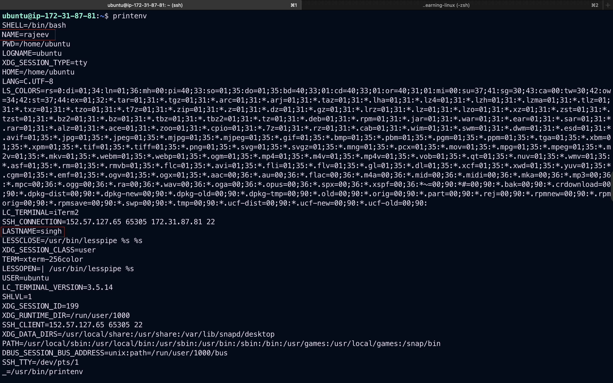

# Environment Variables in Detail

## What are Environment Variables?

Environment variables are dynamic values that the operating system and applications use to determine information such as configuration settings, system paths, and user preferences. They help keep configurations separate from code, which is especially useful in development, testing, and production environments.

---

## Why Use Environment Variables?

- **Security**: Keep secrets like API keys out of source code.
- **Configurability**: Easily change application behavior without modifying code.
- **Portability**: Make applications behave differently across environments (e.g., dev, test, prod).

---

## Common Environment Variables

| Variable | Description                                   |
| -------- | --------------------------------------------- |
| `PATH`   | Directories to search for executable programs |
| `HOME`   | Current user's home directory                 |
| `USER`   | Current logged-in user                        |
| `SHELL`  | The current shell being used                  |
| `EDITOR` | Default text editor                           |

---

## Setting Environment Variables

### On Linux/macOS (bash):

```bash
export APP_ENV=production
export API_KEY=123456abcdef
```

### On Windows (cmd):

```cmd
set APP_ENV=production
set API_KEY=123456abcdef
```

### On Windows (PowerShell):

```powershell
$env:APP_ENV="production"
$env:API_KEY="123456abcdef"
```

---

## Accessing Environment Variables

### In Bash:

```bash
echo $APP_ENV
```

### In Python:

```python
import os

app_env = os.getenv("APP_ENV")
print("Environment:", app_env)
```

### In Node.js:

```javascript
console.log("Environment:", process.env.APP_ENV);
```

---

## Using `.env` Files

A `.env` file is used to define environment variables in a file that can be loaded into your shell or application.

### Example `.env` File:

```
APP_ENV=production
DB_HOST=localhost
DB_USER=root
DB_PASS=secret
```

### Loading `.env` in Node.js (using dotenv):

```javascript
require("dotenv").config();

console.log(process.env.DB_HOST);
```

---

## Best Practices

- **Do not commit `.env` files with secrets to version control.**
- Use environment-specific `.env` files (`.env.dev`, `.env.prod`).
- Validate required environment variables at application startup.
- Use secret managers or encrypted storage for sensitive data in production.

---

```bash
printenv
```

```bash
ubuntu@ip-172-31-87-81:~$ printenv
SHELL=/bin/bash
PWD=/home/ubuntu
LOGNAME=ubuntu
XDG_SESSION_TYPE=tty
HOME=/home/ubuntu
LANG=C.UTF-8
LS_COLORS=rs=0:di=01;34:ln=01;36:mh=00:pi=40;33:so=01;35:do=01;35:bd=40;33;01:cd=40;33;01:or=40;31;01:mi=00:su=37;41:sg=30;43:ca=00:tw=30;42:ow=34;42:st=37;44:ex=01;32:*.tar=01;31:*.tgz=01;31:*.arc=01;31:*.arj=01;31:*.taz=01;31:*.lha=01;31:*.lz4=01;31:*.lzh=01;31:*.lzma=01;31:*.tlz=01;31:*.txz=01;31:*.tzo=01;31:*.t7z=01;31:*.zip=01;31:*.z=01;31:*.dz=01;31:*.gz=01;31:*.lrz=01;31:*.lz=01;31:*.lzo=01;31:*.xz=01;31:*.zst=01;31:*.tzst=01;31:*.bz2=01;31:*.bz=01;31:*.tbz=01;31:*.tbz2=01;31:*.tz=01;31:*.deb=01;31:*.rpm=01;31:*.jar=01;31:*.war=01;31:*.ear=01;31:*.sar=01;31:*.rar=01;31:*.alz=01;31:*.ace=01;31:*.zoo=01;31:*.cpio=01;31:*.7z=01;31:*.rz=01;31:*.cab=01;31:*.wim=01;31:*.swm=01;31:*.dwm=01;31:*.esd=01;31:*.avif=01;35:*.jpg=01;35:*.jpeg=01;35:*.mjpg=01;35:*.mjpeg=01;35:*.gif=01;35:*.bmp=01;35:*.pbm=01;35:*.pgm=01;35:*.ppm=01;35:*.tga=01;35:*.xbm=01;35:*.xpm=01;35:*.tif=01;35:*.tiff=01;35:*.png=01;35:*.svg=01;35:*.svgz=01;35:*.mng=01;35:*.pcx=01;35:*.mov=01;35:*.mpg=01;35:*.mpeg=01;35:*.m2v=01;35:*.mkv=01;35:*.webm=01;35:*.webp=01;35:*.ogm=01;35:*.mp4=01;35:*.m4v=01;35:*.mp4v=01;35:*.vob=01;35:*.qt=01;35:*.nuv=01;35:*.wmv=01;35:*.asf=01;35:*.rm=01;35:*.rmvb=01;35:*.flc=01;35:*.avi=01;35:*.fli=01;35:*.flv=01;35:*.gl=01;35:*.dl=01;35:*.xcf=01;35:*.xwd=01;35:*.yuv=01;35:*.cgm=01;35:*.emf=01;35:*.ogv=01;35:*.ogx=01;35:*.aac=00;36:*.au=00;36:*.flac=00;36:*.m4a=00;36:*.mid=00;36:*.midi=00;36:*.mka=00;36:*.mp3=00;36:*.mpc=00;36:*.ogg=00;36:*.ra=00;36:*.wav=00;36:*.oga=00;36:*.opus=00;36:*.spx=00;36:*.xspf=00;36:*~=00;90:*#=00;90:*.bak=00;90:*.crdownload=00;90:*.dpkg-dist=00;90:*.dpkg-new=00;90:*.dpkg-old=00;90:*.dpkg-tmp=00;90:*.old=00;90:*.orig=00;90:*.part=00;90:*.rej=00;90:*.rpmnew=00;90:*.rpmorig=00;90:*.rpmsave=00;90:*.swp=00;90:*.tmp=00;90:*.ucf-dist=00;90:*.ucf-new=00;90:*.ucf-old=00;90:
LC_TERMINAL=iTerm2
SSH_CONNECTION=152.57.127.65 65305 172.31.87.81 22
LESSCLOSE=/usr/bin/lesspipe %s %s
XDG_SESSION_CLASS=user
TERM=xterm-256color
LESSOPEN=| /usr/bin/lesspipe %s
USER=ubuntu
LC_TERMINAL_VERSION=3.5.14
SHLVL=1
XDG_SESSION_ID=199
XDG_RUNTIME_DIR=/run/user/1000
SSH_CLIENT=152.57.127.65 65305 22
XDG_DATA_DIRS=/usr/local/share:/usr/share:/var/lib/snapd/desktop
PATH=/usr/local/sbin:/usr/local/bin:/usr/sbin:/usr/bin:/sbin:/bin:/usr/games:/usr/local/games:/snap/bin
DBUS_SESSION_BUS_ADDRESS=unix:path=/run/user/1000/bus
SSH_TTY=/dev/pts/1
_=/usr/bin/printenv
```

---

## `set` COMMAND

- Lists all environment variables, encompassing both global and local variables.

```bash
set //display all the ENVs(global as well as local)

```

## Setting Global Environment Variables

- Global environment variables can be defined using either the export or set command. Both methods involve specifying the variable's name and value. For example:

```bash
ubuntu@ip-172-31-87-81:~$ export NAME=rajeev
ubuntu@ip-172-31-87-81:~$ export LASTNAME=singh
ubuntu@ip-172-31-87-81:~$ echo $NAME
rajeev
ubuntu@ip-172-31-87-81:~$ echo $LASTNAME
singh
ubuntu@ip-172-31-87-81:~$ set FIRSTNAME=RAJEEV
ubuntu@ip-172-31-87-81:~$ set LASTNAME=SINGH
ubuntu@ip-172-31-87-81:~$ echo $FIRSTNAME

ubuntu@ip-172-31-87-81:~$ echo $LASTNAME
singh
```



---

## Setting Local Environment Variable

- Local environment variables can be directly defined without the need for export commands. The syntax is as follows:

```bash
NAME=Value
```

## Summary

Environment variables provide a flexible and secure way to configure applications. They are widely used in modern DevOps, CI/CD pipelines, cloud deployments, and local development environments.

---

_Author: Rajeev Kumar Singh | Date: July 2025_
