# Day03 Task

1. Command Help
2. Redirects
3. Super User
4. 2025-07-07 - Working with Files

- [ ] Soft Links / Hard Links

---

## `1`. `help` COMMAND

- The help command used to displey information about shell built-in commands directly from the terminal. It's an equivalant tool for quickly learning how to use various commands without needing to leave the command line or search online. whether you're unsure of command options or need a quick reminder of it's syntax.
- Syntax of the help Command:

```bash
$help [-dms] [pattern ...]
```

Here, the `pattern` specified in the syntax above refers to the command about which you would like to know and if it is matched with any shell built-in command then `help` give details about it and if it is not matched then `help` prints the list of help topics for your convenience. And the `d`, `m` and `s` here are options that you can use with the help command.

## Using the 'help' command

- To make you understand more easily about what help command does let's try help command for finding out about help itself.

```bash
$help help
help: help [-dms] [pattern...]
    Display information about builtin commands.

    Displays brief summaries of builtin commands. If PATTERN IS
    specified, gives detailed help on all commands matching PATTERN,
    otherwise the list of help topics is printed.

    Options:
      -d        output short description for each topic
      -m        display usage in pseudo-manpage format
      -s        output only a short usage synopsis for each topic matching
        PATTERN

    Arguments:
      PATTERN   Pattern specifying a help topic

    Exit Status:
    Returns success unless PATTERN is not found or an invalid option is given.

/* so that's what help command
does telling everything
about the command and
helping you out */
```

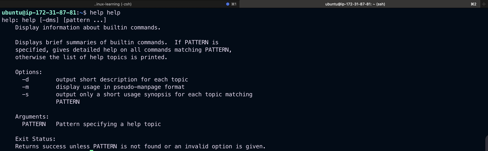

## Options for the 'help' command

- `-d` option : It is used when you just want to get an overview about any shell built-in command i.e. it only gives short description.
- `-m` option : It displays usage in pseudo-manpage format.
- `-s` option : It just displays only a short usage synopsis for each topic matching.
  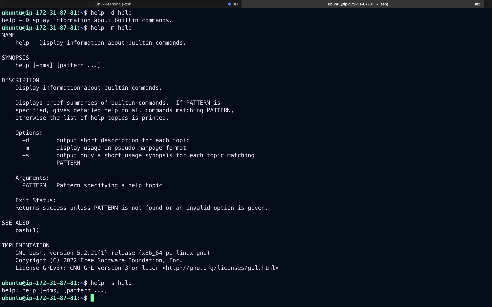

---

# `2`. `Redirects`

## Simple Redirection

### What are standard input and standard output?

- Most Linux commands read input, such as a file or another attribute for the command, and write output.By default, input is being given with the keyboard, and output is displayed on your screen.
- Your keyboard is your standard input (stdin) device, and the screen or a particular terminal window is the standard output (stdout) device.

### Output redirection with `>` and `|`

- Sometimes you will want to put output of a command in a file, or you may want to issue another command on the output of one command. This is known as redirecting output.
- Redirection is done using either the "`>`" (greater-than symbol), or using the "`|`" (pipe) operator which sends the standard output of one command to another command as standard input.

## 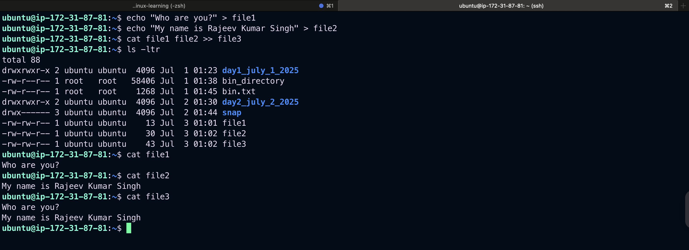

- As we saw before, the cat command concatenates files and puts them all together to the standard output. By redirecting this output to a file, this file name will be created - or overwritten if it already exists, so take care.
  > `Note`: Don't overwrite!
  > Be careful not to overwrite existing (important) files when redirecting output. Many shells, including Bash, have a built-in feature to protect you from that risk: `noclobber`. See the Info pages for more information. In Bash, you would want to add the `set -o noclobber` command to your `.bashrc` configuration file in order to prevent accidental overwriting of files.

### Redirecting "nothing" to an existing file is equal to emptying the file:

- Redirecting nothing to a file is equal to emptying the file.
  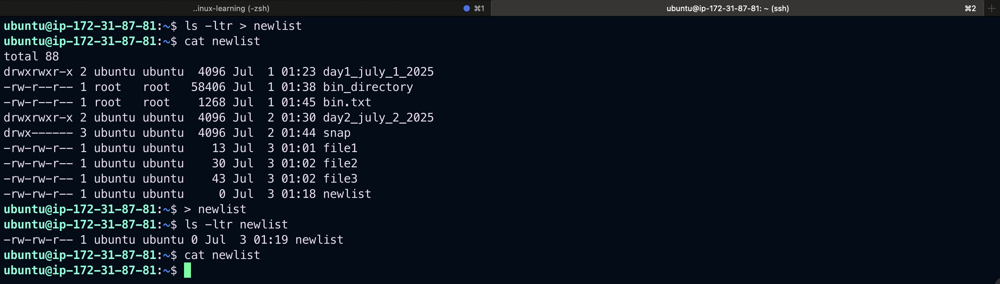

- This process is called `truncating`.
- The same redirection to an nonexistent file will create a new empty file with the given name:
  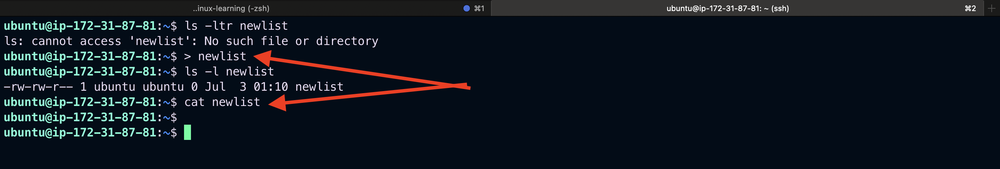

---

## Some examples using piping of commands:

- To find a word within some text, display all lines matching "pattern1", and exclude lines also matching "pattern2" from being displayed:

```bash
grep pattern1 file | grep -v pattern2

# To display output of a directory listing one page at a time:

ls -l | less
```

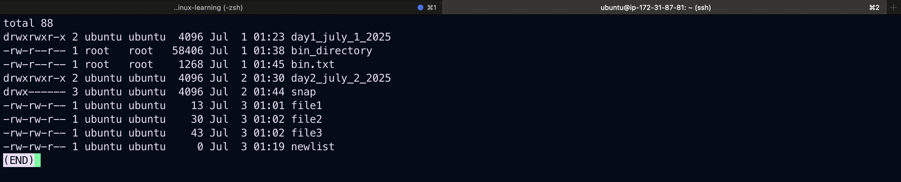

---

```bash
# To find a file in a directory:
ls -l | grep part_of_file_name


```

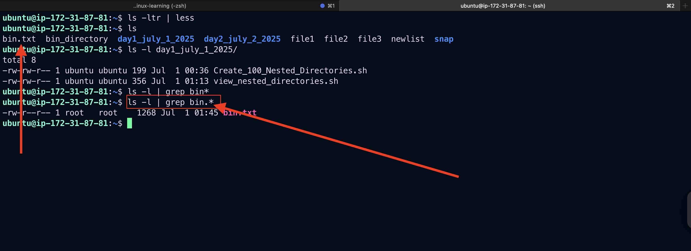

---

## `Input redirection`

- In another case, you may want a file to be the input for a command that normally wouldn't accept a file as an option. This redirecting of input is done using the "`<`" (less-than symbol) operator.
- Below is an example of sending a file to somebody, using input redirection.

```bash
mail mike@somewhere.org < to_do
```

### Combining redirections

- The following example combines input and output redirection. The file text.txt is first checked for spelling mistakes, and the output is redirected to an error log file:

```bash
spell < text.txt > error.log
```

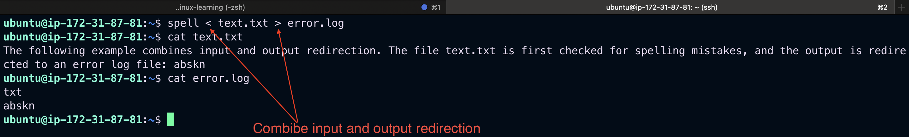
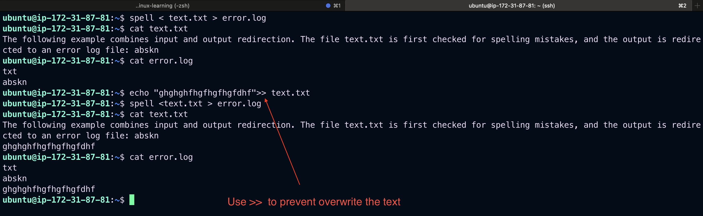

- The following command lists all commands that you can issue to examine another file when using less:

```bash
less --help | grep -i examine
```

```bash
less --help | grep -i examine
  :e [file]            Examine a new file.
  :n                *  Examine the (N-th) next file from the command line.
  :p                *  Examine the (N-th) previous file from the command line.
  :x                *  Examine the first (or N-th) file from the command line.
  +cmd                 Execute the less cmd each time a new file is examined.
```

- The `-i` option is used for case-insensitive searches - remember that UNIX systems are very case-sensitive.
- If you want to save output of this command for future reference, redirect the output to a file:

```bash
less --help | grep -i examine > examine-files-in-less
cat examine-files-in-less
```

reference of redirection - [`Redirection`](https://tldp.org/LDP/intro-linux/html/sect_05_01.html#:~:text=Redirection%20is%20done%20using%20either,together%20to%20the%20standard%20output.)

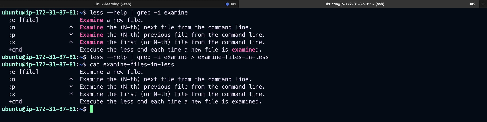

---

# `3. Super User`

## What Is a Superuser?

- A superuser is an account with broad privileges, making it useful for system administration. This account is known by other names as well, such as “`root`”, “`administrator`”, and “`supervisor`”.
- The superuser’s privileges are unrestricted and it can perform any available action on a system, including potentially dangerous ones like adding or deleting users or installing and removing software. Because of these broad privileges and the potential dangers that come with them, it’s generally considered good practice to create other, non-superuser accounts for regular work and avoid using the superuser account in day-to-day functions.
- On Unix-like systems, you can create non-superuser accounts that are members of the `sudo` group. Members of the `sudo` group have the ability to prepend any command with `sudo` to temporarily elevate their permissions to that of the superuser. This makes it possible to perform administrative tasks without having to switch to the `root` account.

## How To Add a Sudo-Enabled User

### ✅ Step-by-Step: Add a Sudo User

#### 🔐 1. Log in as root or a sudo user

If you're not already root:

```bash
sudo -i
```

or prefix every command below with sudo.

#### 👤 2. Add a New User

```bash
adduser rajeev

```

You'll be prompted to set a password and fill in optional info (you can press Enter to skip).

#### 🔑 3. Add the User to the sudo Group

- ubuntu/debian

```bash
usermod -aG sudo newusername

```

- CentOS / RHEL (use wheel group instead of sudo)

```bash
usermod -aG wheel newusername

```

#### ✅ 4. Verify the User Has Sudo Access

Switch to the new user:

```bash
su - rajeev

```

#### Run a test sudo command

```bash
sudo whoami
```

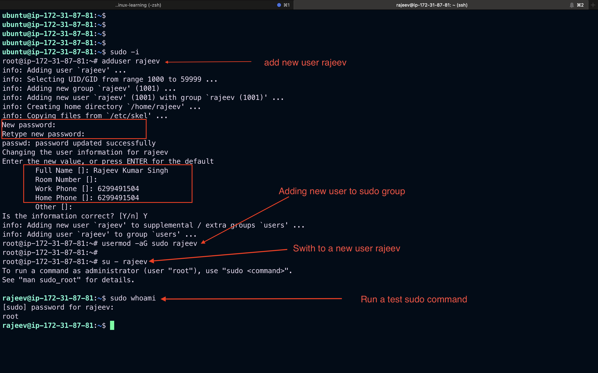

---

## 🛡️ Optional: Allow Passwordless Sudo (Not Recommended for Security)

Edit the sudoers file:

```bash
visudo
```

Add this line at the end:

```bash
rajeev ALL=(ALL) NOPASSWD:ALL
```

> ⚠️ Use with caution — this gives full sudo access without asking for a password.

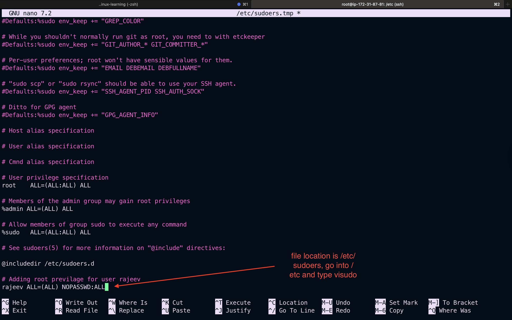

---

# 4 link - softlink /hard link

Please check soft_vs_hard_links.md file in the current directory.
