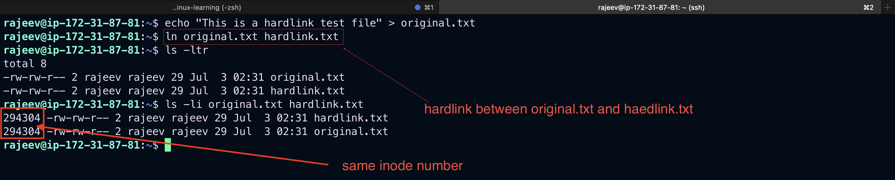
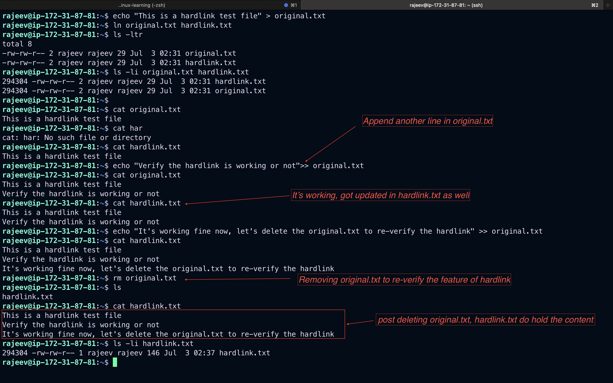
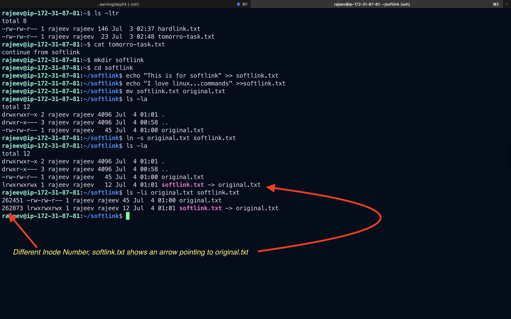
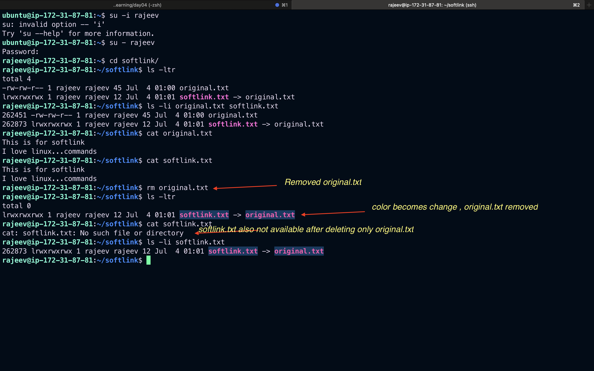
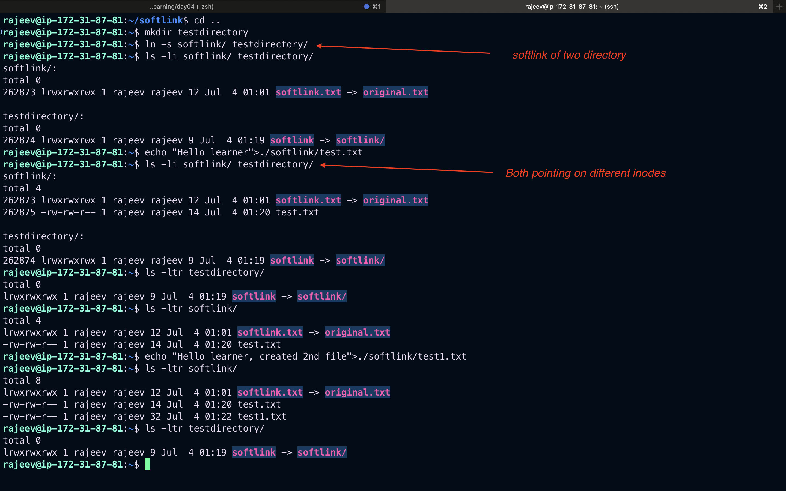

# Soft Links vs Hard Links in Linux

In Linux, both **soft links** (symbolic links) and **hard links** are ways to reference files, but they work differently at the filesystem level.

---

## 📁 Hard Links

### ✅ Characteristics:

- Point directly to the **inode** of a file.
- Share the same inode number as the original file.
- If the original file is deleted, the hard link **still works**.
- Cannot link to directories (for safety), and not allowed across different filesystems.

### 📌 Example:

```bash
echo "This is a test file" > original.txt
ln original.txt hardlink.txt
```

Now check:

```bash
ls -li original.txt hardlink.txt
```

You'll see the **same inode number**, indicating both point to the same file content.

If you remove `original.txt`:

```bash
rm original.txt
cat hardlink.txt
```


The content still exists.

---

## 🔗 Soft Links (Symbolic Links)

### ✅ Characteristics:

- Point to the **path** of the original file.
- Have a different inode number.
- If the original file is deleted, the soft link becomes **broken**.
- Can link to **directories** and **across filesystems**.

### 📌 Example:

```bash
ln -s original.txt softlink.txt
```

Now check:

```bash
ls -li original.txt softlink.txt
```



Different inode numbers, and `softlink.txt` shows an arrow pointing to `original.txt`.

If you delete the original:

```bash
rm original.txt
cat softlink.txt
```


This will result in an error: `No such file or directory`.

---

## Softlink between two directories

## 

## 🧾 Summary Table

| Feature                    | Hard Link | Soft Link |
| -------------------------- | --------- | --------- |
| Inode shared               | ✅ Yes    | ❌ No     |
| Survives original deletion | ✅ Yes    | ❌ No     |
| Can link to directory      | ❌ No     | ✅ Yes    |
| Across filesystems         | ❌ No     | ✅ Yes    |
| Command                    | `ln`      | `ln -s`   |

---

## 🔍 When to Use What?

- Use **hard links** when you want duplicate access to the **same data** with less risk of broken links.
- Use **soft links** when you want a **shortcut** to a file or directory, especially across directories or filesystems.
