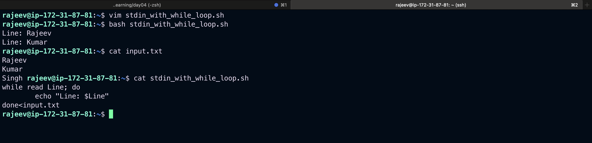
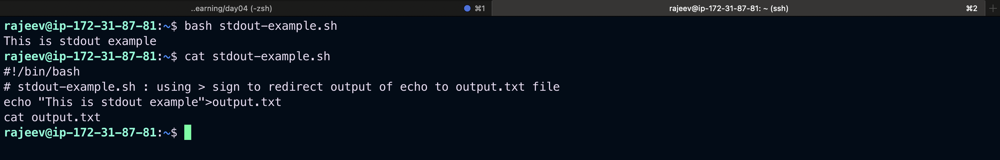
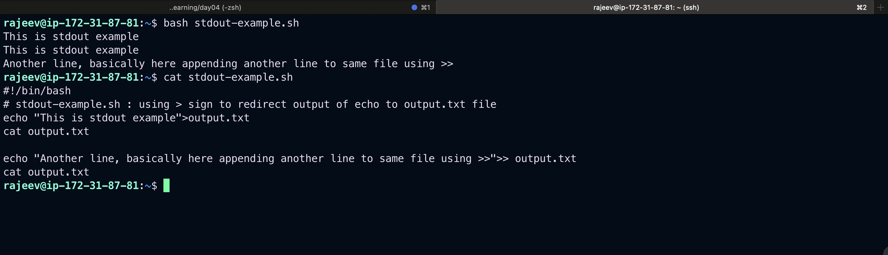
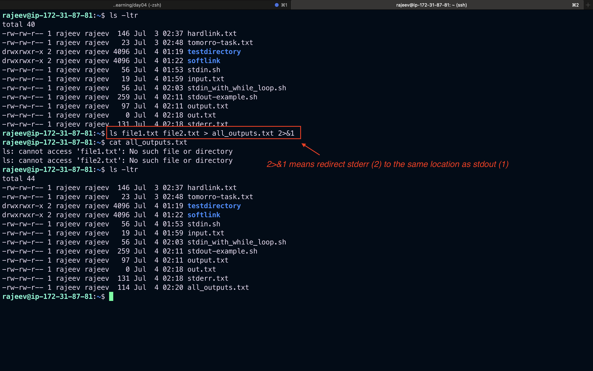
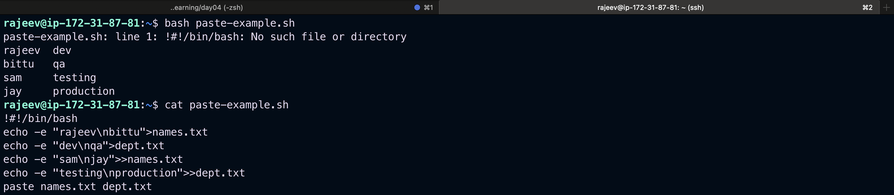
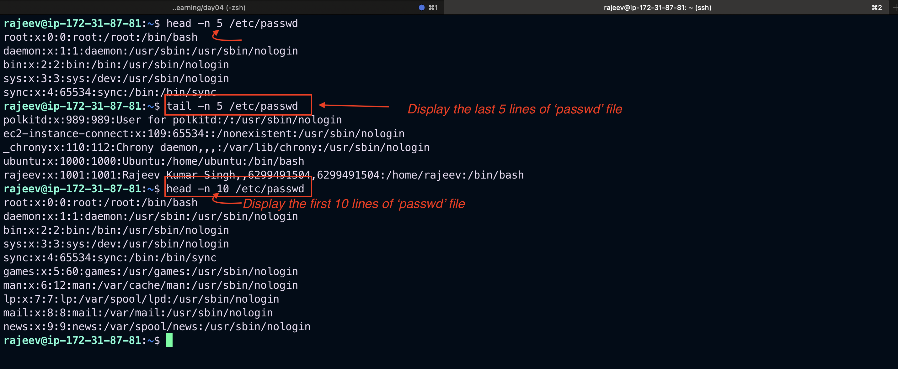
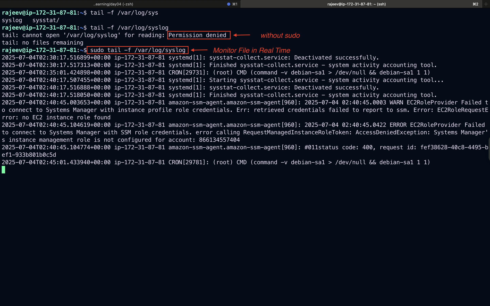
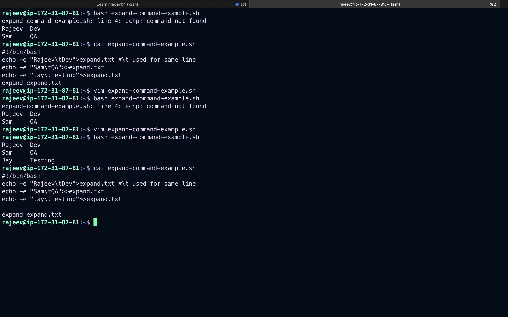

# Linux Text Processing Commands with Examples

This document explains the commonly used text processing commands in Linux: `stdout`, `stdin`, `stderr`, `cut`, `paste`, `head`, `tail`, and `expand` along with real examples.

---

## 🔁 Standard Streams in Linux

Linux has **three standard I/O streams** for every process:

| Stream   | Name            | Description                                   | File Descriptor |
| -------- | --------------- | --------------------------------------------- | --------------- |
| `stdin`  | Standard Input  | Input to a program (usually keyboard or file) | 0               |
| `stdout` | Standard Output | Normal output of a program (goes to terminal) | 1               |
| `stderr` | Standard Error  | Error messages (goes to terminal)             | 2               |

---

## 📥 1. `stdin` (Standard Input)

### 🔹 What it does:

- Accepts user input or file input for a program.
- By default, it reads from the keyboard unless redirected.

### 🧪 Example 1: Using `read` to get user input

```bash
echo "Enter your name:"
read name  # waits for user input from stdin
echo "Welcome, $name"
```


📌 `read` gets input from `stdin`, typically from the keyboard.

### 🧪 Example 2: Using a file as `stdin` for a script

```bash
cat > input.txt
Rajeev
Kumar
Singh
# Press Ctrl+D to save

while read line; do
  echo "Line: $line"
done < input.txt
```



📌 The `while` loop reads each line from `input.txt` via `stdin`.

---

## 📤 2. `stdout` (Standard Output)

### 🔹 What it does:

- Displays output from programs (like `echo`, `ls`, `cat`, etc.) to the terminal.
- Can be redirected to a file using `>` or `>>`.

### 🧪 Example 1: Redirecting output to a file

```bash
echo "This is stdout example" > output.txt
cat output.txt
# Output: This is stdout example
```



### 🧪 Example 2: Appending to a file

```bash
echo "Another line" >> output.txt
cat output.txt
# Output:
# This is stdout example
# Another line
```



---

## ❌ 3. `stderr` (Standard Error)

### 🔹 What it does:

- Outputs error messages separately from normal output.
- Useful for debugging or logging errors only.

### 🧪 Example 1: Redirect only `stderr` to a file

```bash
ls existing_file.txt nonexistent.txt 2> errors.txt
```


📌 `2>` redirects only the error (`stderr`) to `stderr.txt`.

### 🧪 Example 2: Redirect both `stdout` and `stderr` to different files

```bash
ls existing_file.txt nonexistent.txt > out.txt 2> err.txt
```

📌 Normal output goes to `out.txt`; error output goes to `err.txt`.

### 🧪 Example 3: Redirect both `stdout` and `stderr` to the same file

```bash
ls file1.txt file2.txt  > all_output.txt 2>&1
```

📌 `2>&1` means “redirect `stderr` (2) to the same location as `stdout` (1)”.


---

## 🎯 Summary Table (Standard I/O)

| Action                              | Command Example           | Description                   |
| ----------------------------------- | ------------------------- | ----------------------------- | --------------------------------- |
| Redirect stdout                     | `echo "hello" > file.txt` | Sends normal output to a file |
| Redirect stderr                     | `command 2> error.log`    | Sends error output to a file  |
| Redirect both stdout and stderr     | `command > out.txt 2>&1`  | Sends all output to one file  |
| Use file as stdin                   | `command < input.txt`     | Reads input from a file       |
| Pipe output to next command (stdin) | `ls                       | grep txt`                     | `grep` reads `ls` output via pipe |

---

## 4. `cut` Command

- Used to extract sections from each line of input.

### Syntax:

```bash
cut OPTION... [FILE...]
```

### Common Options:

- `-d` : Delimiter
- `-f` : Field number

### Example:

```bash
echo "raj,devops,engineer" | cut -d"," -f2
# Output: devops
```

## 

## 5. `paste` Command

- Merges lines of files side by side.

### Syntax:

```bash
paste [OPTION]... [FILE]...
```

### Example:

```bash
echo -e "raj\nsan" > names.txt
echo -e "dev\nqa" > dept.txt
paste names.txt dept.txt
# Output:
# raj	dev
# san	qa
```




## 6. `head` Command

- Displays the first N lines of a file.

### Syntax:

```bash
head [OPTION]... [FILE]...
```

### Example:

```bash
head -n 5 /etc/passwd  # First 5 lines
```

---

## 7. `tail` Command

- Displays the last N lines of a file.

### Syntax:

```bash
tail [OPTION]... [FILE]...
```

### Example:

```bash
tail -n 3 /etc/passwd  # Last 3 lines
```



### Monitor File in Real Time:

```bash
tail -f /var/log/syslog
```

## 

## 8. `expand` Command

- Converts tabs to spaces.

### Syntax:

```bash
expand [OPTION]... [FILE]...
```

### Example:

```bash
echo -e "Name\tRole" > test.txt
expand test.txt
# Output: Name    Role
```

## 

## Summary Table

| Command | Purpose                            |
| ------- | ---------------------------------- |
| stdin   | Accepts input                      |
| stdout  | Sends output                       |
| stderr  | Sends error messages               |
| cut     | Extracts text by delimiter/field   |
| paste   | Combines lines from multiple files |
| head    | Displays first N lines of a file   |
| tail    | Displays last N lines of a file    |
| expand  | Converts tab to spaces             |

---

_Created for learning Linux text processing commands with examples._
