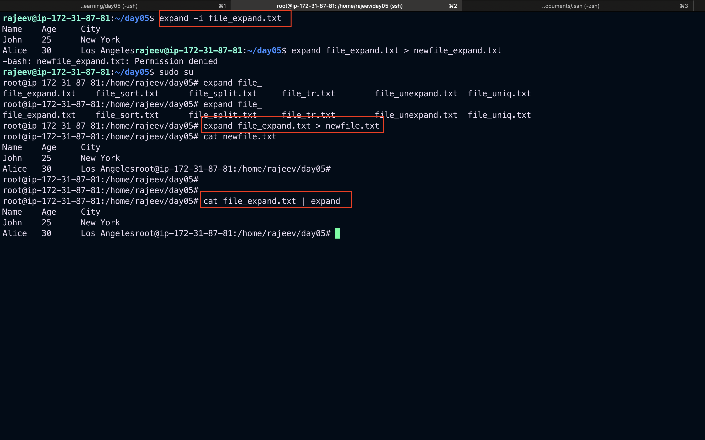

# Linux Text Processing Commands in Detail

This document provides detailed explanations and five practical examples for each of the following Linux text processing commands:

- `expand`
- `unexpand`
- `join`
- `split`
- `sort`
- `tr`
- `uniq`

---

## 1. `expand`

The `expand` command converts tabs in a file to spaces.

### Examples

```bash
# 1. Convert tabs to spaces in a file
expand file.txt

# 2. Specify the number of spaces per tab (e.g., 4)
expand -t 4 file.txt

# 3. Convert only initial tabs
expand -i file.txt

# 4. Convert and redirect output to a new file
expand file.txt > newfile.txt

# 5. Use with a pipe from another command
cat file.txt | expand
```




---

## 2. `unexpand`

The `unexpand` command converts spaces to tabs.

### Examples

```bash
# 1. Convert spaces to tabs
unexpand file.txt

# 2. Only convert leading spaces
unexpand -a file.txt

# 3. Convert using a tab stop of 4
unexpand -t 4 file.txt

# 4. Redirect output to another file
unexpand file.txt > tabbed.txt

# 5. Convert spaces from piped input
cat file.txt | unexpand
```


## 3. `join`

The `join` command joins lines of two files on a common field.

### Examples

```bash
# 1. Join two files on the first field
join file1.txt file2.txt

# 2. Specify join field for both files
join -1 1 -2 1 file1.txt file2.txt

# 3. Use different delimiters
join -t ":" file1.txt file2.txt

# 4. Show unpairable lines from both files
join -a1 -a2 file1.txt file2.txt

# 5. Join and redirect to a new file
join file1.txt file2.txt > joined.txt
```

## 

## 4. `split`

The `split` command splits a file into pieces.

### Examples

```bash
# 1. Split into 1000-line files
split file.txt

# 2. Split with custom line count (e.g., 10 lines)
split -l 10 file.txt

# 3. Use a custom prefix
split -l 5 file.txt part_

# 4. Split by bytes
split -b 1k file.txt

# 5. Split a file and keep numeric suffixes
split -d -l 10 file.txt part_
```

## 

## 5. `sort`

The `sort` command sorts lines of text files.

### Examples

```bash
# 1. Sort a file alphabetically
sort file.txt

# 2. Sort in reverse
sort -r file.txt

# 3. Sort numerically
sort -n numbers.txt

# 4. Sort by a specific field (e.g., 2nd column)
sort -k 2 file.txt

# 5. Remove duplicate lines while sorting
sort -u file.txt
```


## 6. `tr`

The `tr` command translates or deletes characters.

### Examples

```bash
# 1. Convert lowercase to uppercase
tr 'a-z' 'A-Z' < file.txt

# 2. Delete digits
tr -d '0-9' < file.txt

# 3. Squeeze repeated spaces
tr -s ' ' < file.txt

# 4. Replace spaces with newlines
tr ' ' '\n' < file.txt

# 5. Translate comma to tab
tr ',' '\t' < file.txt
```

## 

## 7. `uniq`

The `uniq` command filters out repeated lines.

### Examples

```bash
# 1. Remove adjacent duplicate lines
uniq file.txt

# 2. Count duplicate occurrences
uniq -c file.txt

# 3. Show only duplicates
uniq -d file.txt

# 4. Show only unique lines
uniq -u file.txt

# 5. Use with sort to remove all duplicates
sort file.txt | uniq
```


> **Note:** For best results with `uniq`, always sort the input file beforehand unless you're dealing with adjacent lines only.
