# Text Processing in Linux

This document explains commonly used text processing tools in Linux: `wc`, `nl`, `grep`, `awk`, `pipe`, and `tee`. Each section includes real-world examples and scripts.

---

## 1. `wc` (Word Count)

### Description:

`wc` is used to count lines, words, characters, and bytes in files.

### Common Options:

- `-l` : Count lines
- `-w` : Count words
- `-c` : Count bytes
- `-m` : Count characters

### Example:

```bash
# Count lines, words, and characters in a file
wc -lwm /var/log/syslog
```


### Real-World Script:

```bash
#!/bin/bash
log_file="/var/log/syslog"
echo "File Stats for $log_file:"
wc -lwm $log_file
```

## 

## 2. `nl` (Number Lines)

### Description:

`nl` adds line numbers to the content of a file.

### Example:

```bash
# Add line numbers to a configuration file
nl /etc/passwd
```

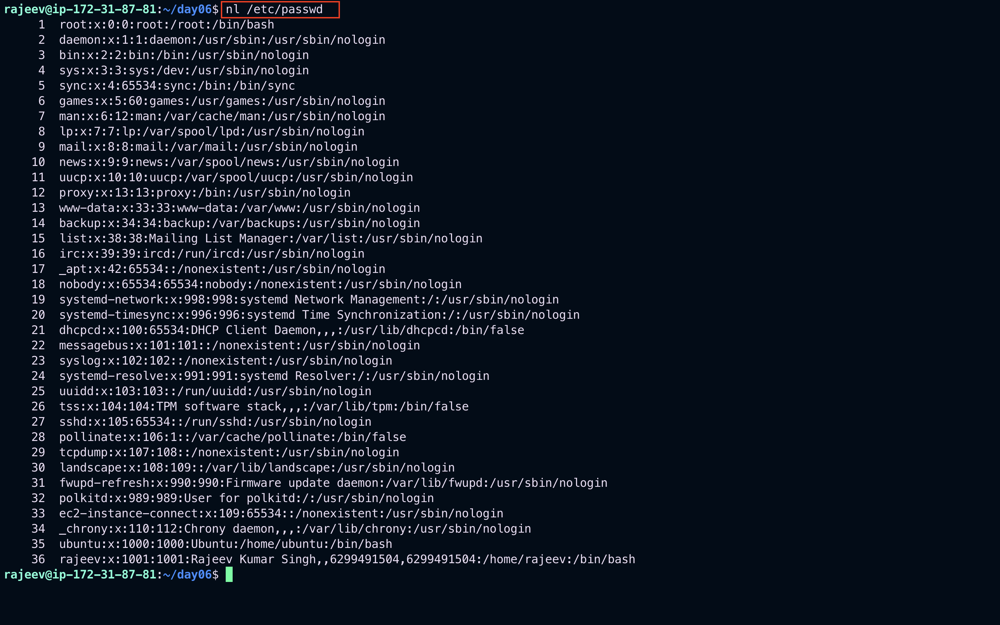

### Real-World Script:

```bash
#!/bin/bash
file="/etc/passwd"
nl $file > numbered_passwd.txt
echo "Numbered lines saved to numbered_passwd.txt"
```

## 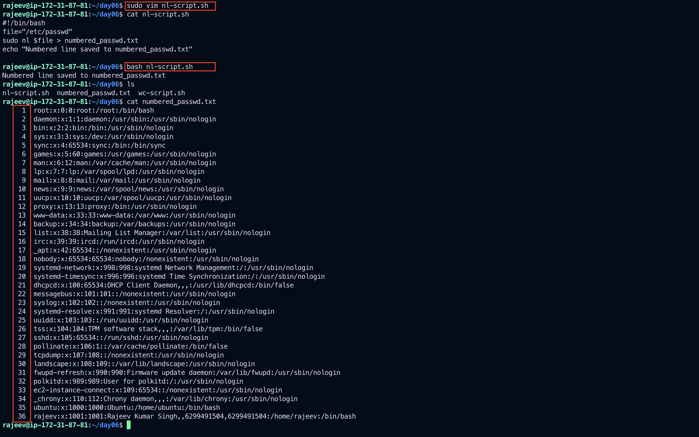

## 3. `grep` (Global Regular Expression Print)

### Description:

`grep` is used for searching plain-text data for lines matching a regular expression.

### Common Options:

- `-i` : Ignore case
- `-r` : Recursive
- `-v` : Invert match
- `-n` : Show line number

### Example:

```bash
# Search for 'error' in syslog
grep -i "error" /var/log/syslog
```

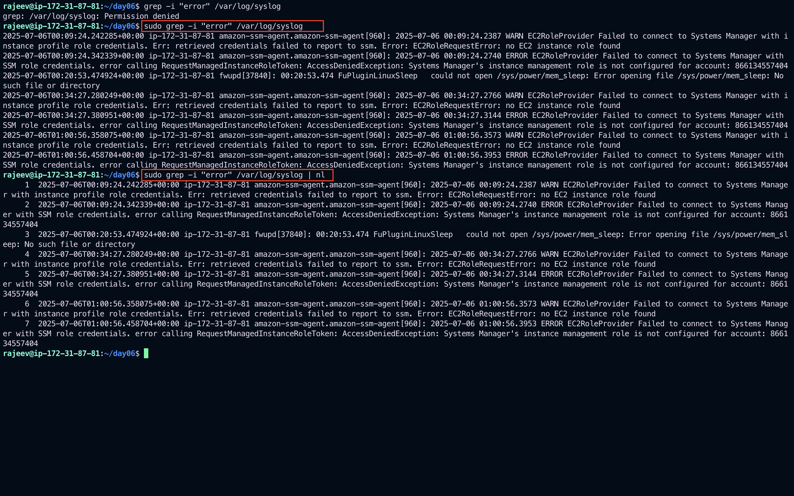

### Real-World Script:

```bash
#!/bin/bash
keyword="error"
log_file="/var/log/syslog"
grep -in "$keyword" $log_file > error_log.txt
echo "Error lines saved to error_log.txt"
```

## 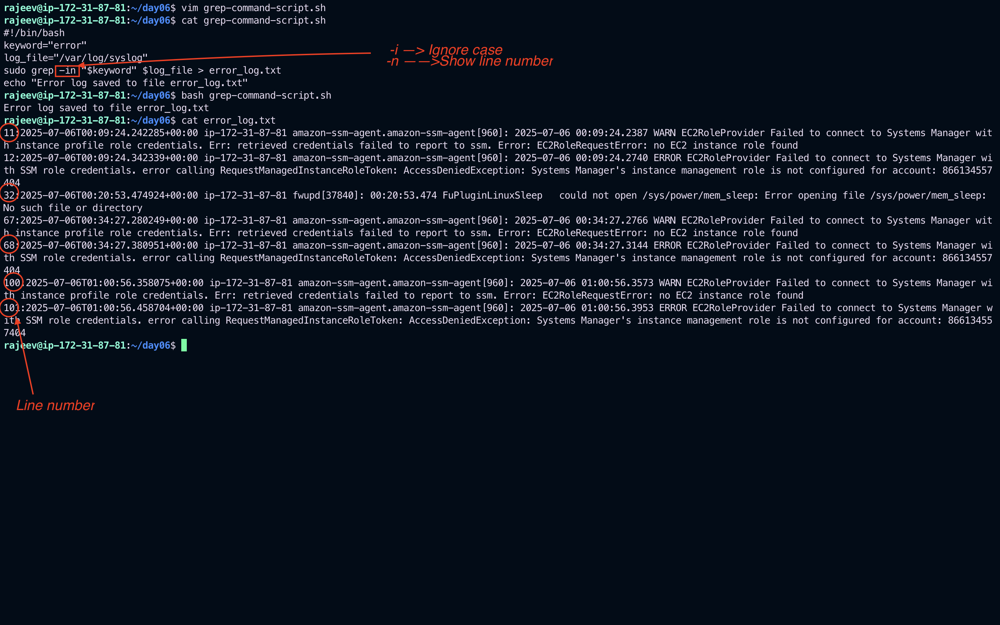

## 4. `awk`

### Description:

`awk` is a powerful text processing tool used for pattern scanning and processing.

### Basic Syntax:

```bash
awk '{print $1, $3}' file.txt
```

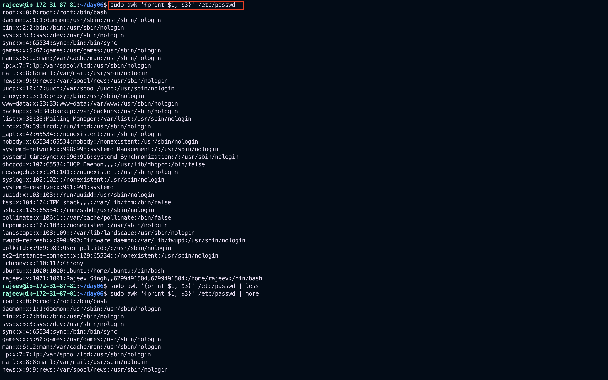

### Real-World Example:

```bash
# Print username and shell from /etc/passwd
awk -F":" '{print $1, $7}' /etc/passwd
```


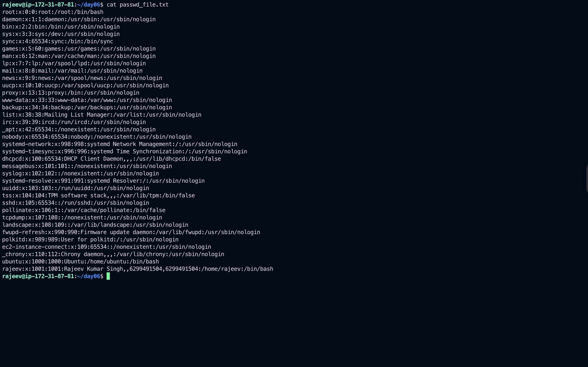

### Real-World Script:

```bash
#!/bin/bash
awk -F":" '{printf "User: %-10s Shell: %s\n", $1, $7}' /etc/passwd
```

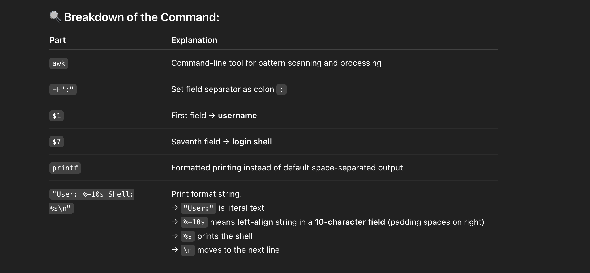
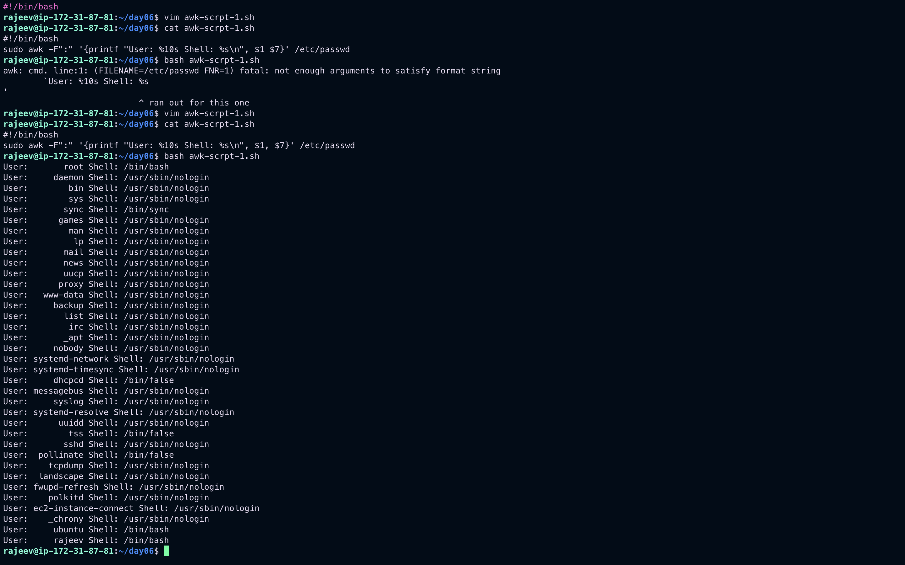

## 5. Pipes `|`

### Description:

A pipe `|` allows the output of one command to be used as input to another.

### Example:

```bash
# Count the number of users running bash shell
cat /etc/passwd | grep "/bin/bash" | wc -l
```

## 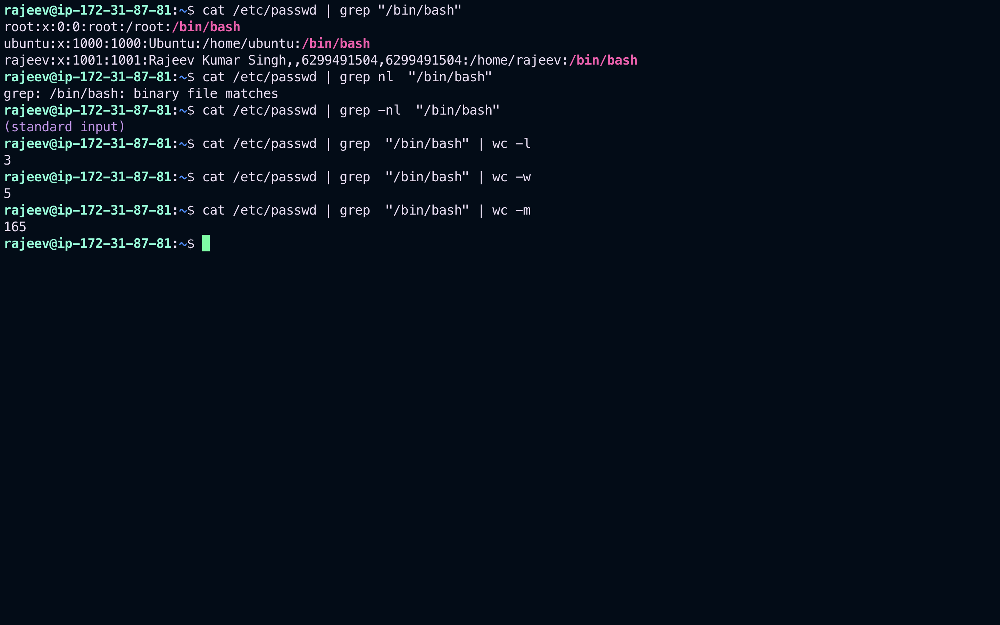

## 6. `tee`

### Description:

`tee` reads from standard input and writes to standard output and files simultaneously.

### Example:

```bash
# Log uptime to a file while displaying it
uptime | tee uptime_log.txt
```


### Real-World Script:

```bash
#!/bin/bash
log_file="system_info.log"
echo "System Report:"
echo "Date: $(date)" | tee -a $log_file
uptime | tee -a $log_file
free -h | tee -a $log_file
```

---

```bash
#!/bin/bash

log_file="system_info.log"

# Print and log heading
echo "======================" | tee -a $log_file
echo "System Report" | tee -a $log_file
echo "Date: $(date)" | tee -a $log_file
echo "Hostname: $(hostname)" | tee -a $log_file
echo "======================" | tee -a $log_file

# System uptime
echo -e "\n>> Uptime:" | tee -a $log_file
uptime | tee -a $log_file

# Memory usage
echo -e "\n>> Memory (free -h):" | tee -a $log_file
free -h | tee -a $log_file

# Disk usage
echo -e "\n>> Disk Usage (df -h):" | tee -a $log_file
df -h | tee -a $log_file

# CPU info (top 5 processes by CPU)
echo -e "\n>> Top 5 Processes by CPU:" | tee -a $log_file
ps -eo pid,ppid,cmd,%mem,%cpu --sort=-%cpu | head -n 6 | tee -a $log_file

echo -e "\nReport saved to $log_file"

```

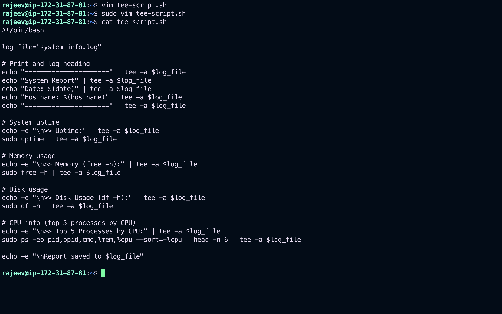
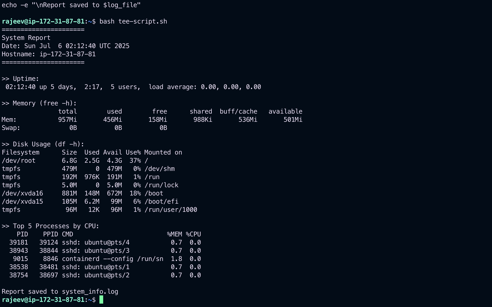
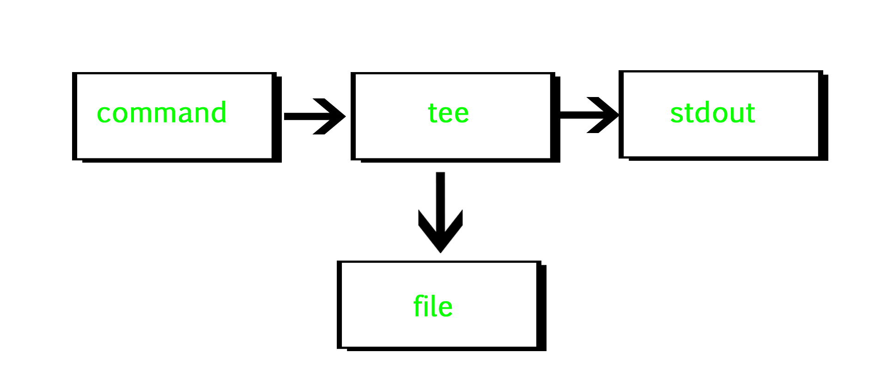

## Summary Table

| Command | Description               | Real-World Use Case                 |
| ------- | ------------------------- | ----------------------------------- | ---------------- |
| `wc`    | Count words/lines/chars   | Analyze log file size               |
| `nl`    | Number lines              | Prepare readable file dump          |
| `grep`  | Search patterns           | Error search in logs                |
| `awk`   | Pattern scan              | Extract fields from structured data |
| `       | `                         | Pipe output                         | Combine commands |
| `tee`   | Output to file and screen | Logging + Display                   |

---

> Use `chmod +x script.sh` to make any script executable.
