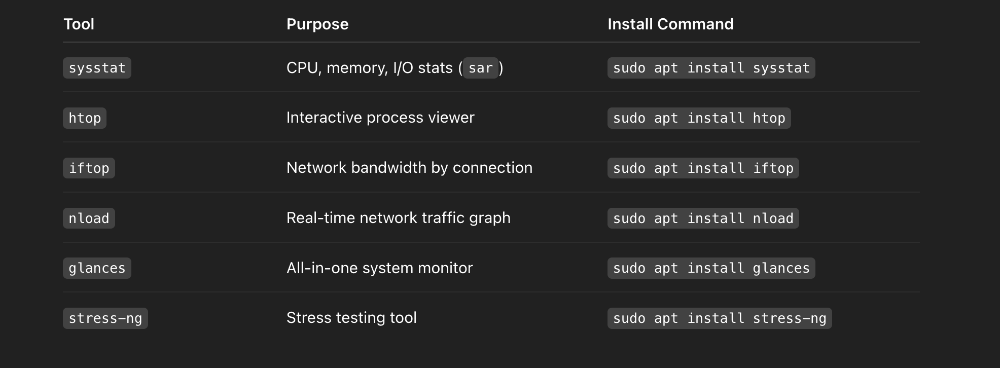
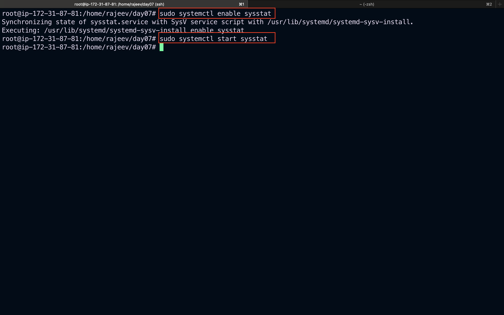
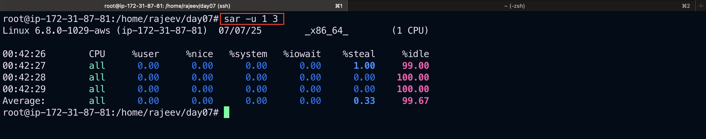

# Linux System Monitoring: Hands-on Lab Guide with Checklist and Stress Testing

This structured lab enables you to **build confidence in system monitoring** on your local VM, AWS EC2, or Proxmox VM.

## ✅ Lab Steps

1️⃣ **Launch** an Ubuntu/Debian VM or EC2 instance. 2️⃣ **Update and install tools:**



```bash
sudo apt update && sudo apt install sysstat htop iftop nload glances stress-ng -y
```

## Try installing sysstat, which is the correct package for tools like sar, iostat, mpstat, etc.

```bash
sudo apt install sysstat
```

## Then enable and start the data collection service

```bash
sudo systemctl enable sysstat
sudo systemctl start sysstat

```



### Read more about `sar` - [sar command:click me to read more](https://www.softprayog.in/tutorials/sar-in-linux)

`Verify it's working`

```bash
sar -u 1 3

```

> `Note`:The above command gives the CPU utilization at an interval of 1 seconds 3 (count) times.
> 

- The `sar` command produces system utilization reports based on the data collected by sadc. As configured in Red Hat Enterprise Linux, `sar` is automatically run to process the files automatically collected by `sadc`. The report files are written to `/var/log/sa/` and are named `sar<dd>`, where `<dd>` is the two-digit representations of the previous day's two-digit date.
- `sar` is normally run by the sa2 script. This script is periodically invoked by cron via the file `sysstat`, which is located in `/etc/cron.d/`. By default, cron runs `sa2` once a day at `23:53`, allowing it to produce a report for the entire day's data.

  3️⃣ **Practice commands section-wise:**

- CPU: `top`, `htop`, `mpstat`, `uptime`
- Memory: `free`, `vmstat`
- Disk: `df`, `du`, `iostat`
- Network: `ip`, `ss`, `iftop`, `nload`
- Logs: `journalctl`, `/var/log/`
- All-in-one: `glances`

4️⃣ **Record observations:** Note CPU %, memory usage, disk I/O, network usage, and active processes.

5️⃣ **(Optional) Load Testing:** Simulate CPU, memory, and I/O load:

```bash
stress-ng --cpu 2 --vm 2 --vm-bytes 512M --timeout 60s
```

Monitor in `htop` and `glances` while the stress test runs.

## 📝 Practice Checklist

-

## 🎯 Goal

By completing this lab, you will: ✅ Understand real-time system behavior under normal and load conditions. ✅ Build confidence in interpreting Linux monitoring outputs. ✅ Prepare for on-call and root cause analysis tasks systematically.
