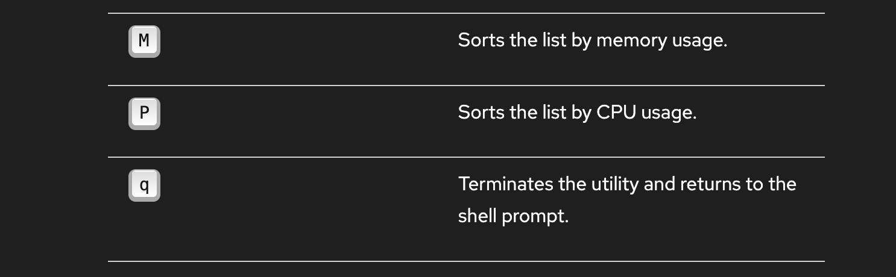
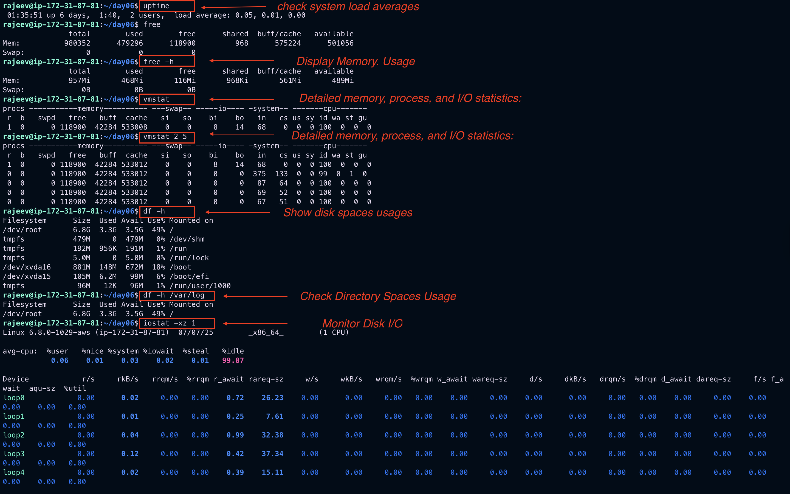
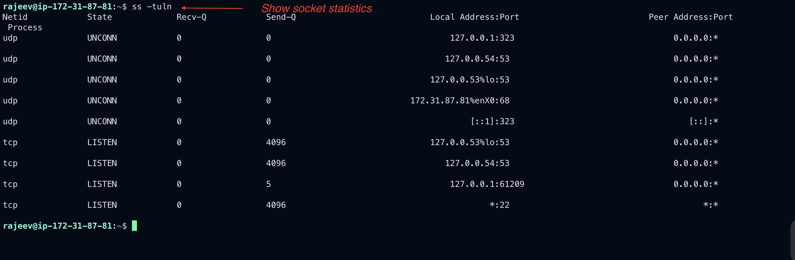
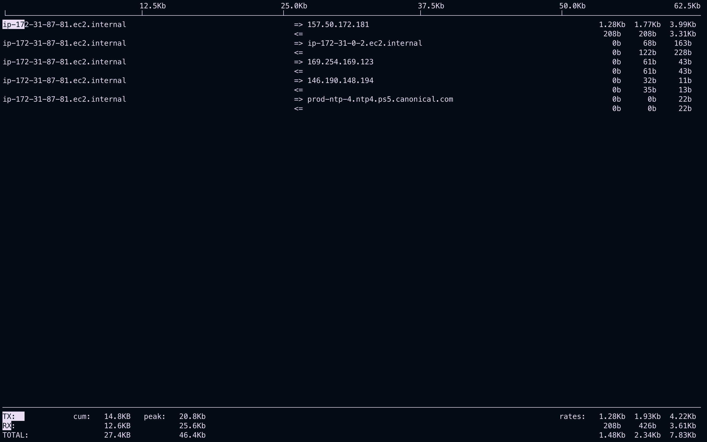
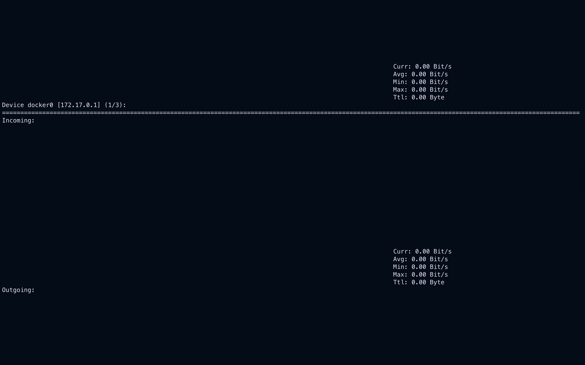
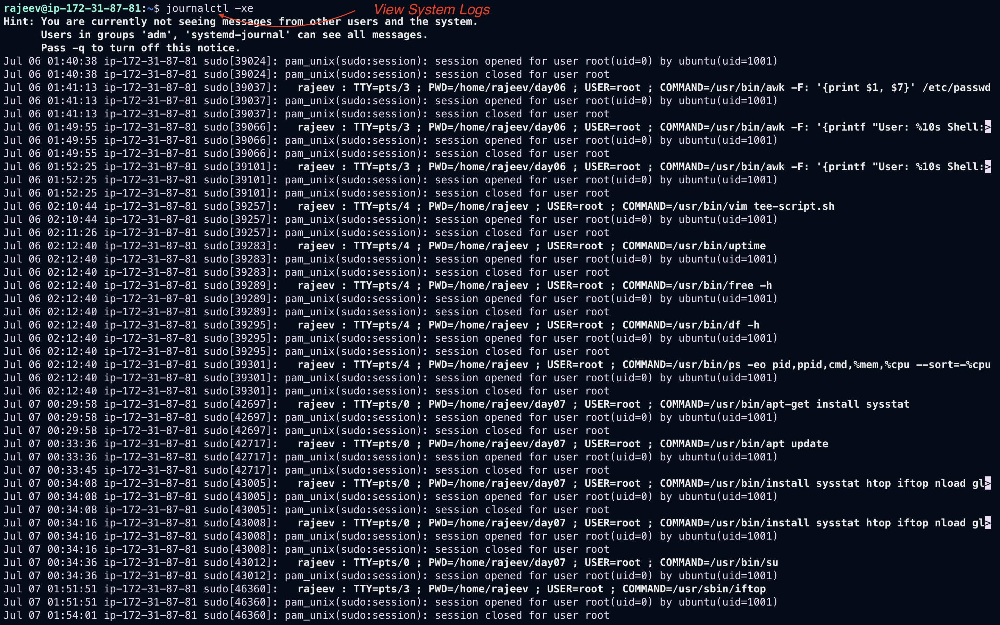
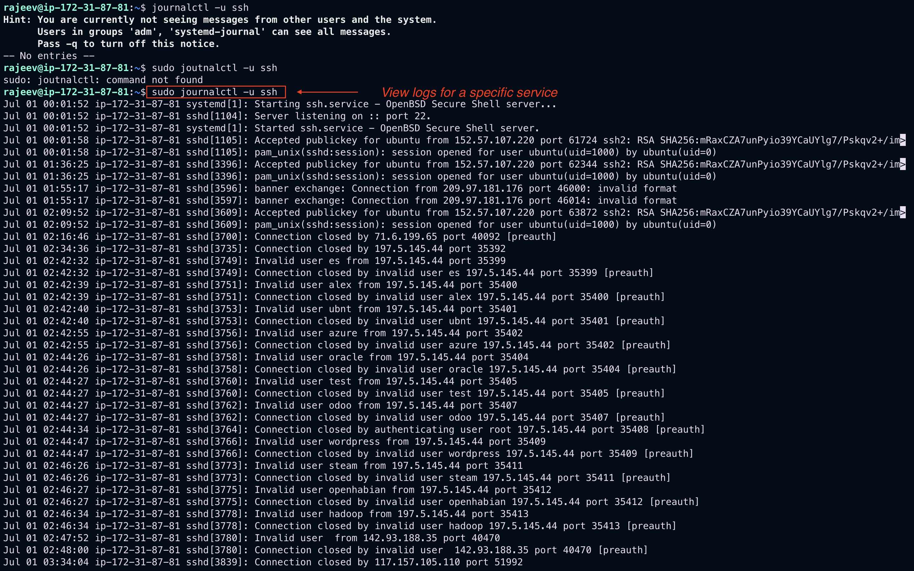
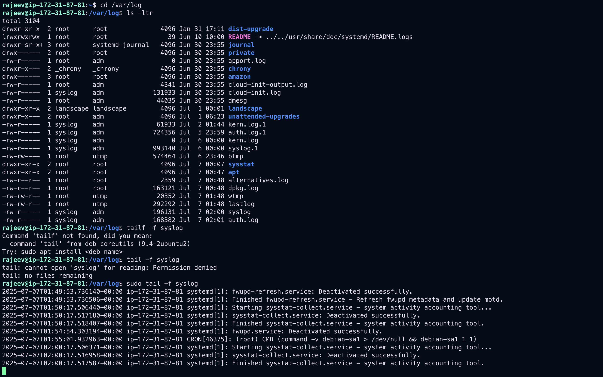
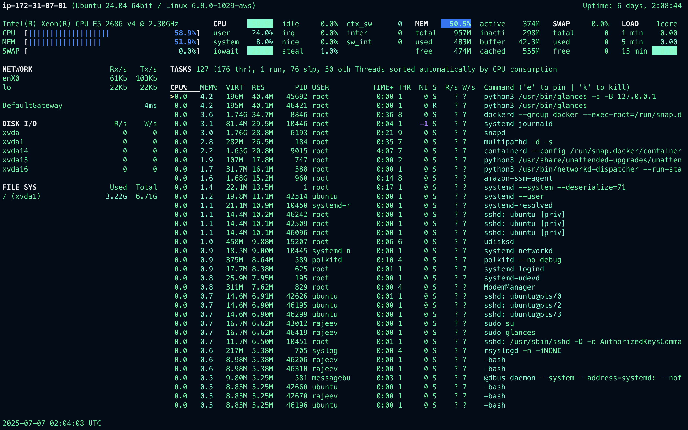

# System Monitoring in Linux: Commands and Examples

Effective system monitoring in Linux helps you maintain performance, detect issues early, and plan for capacity. This guide covers essential monitoring aspects:

- CPU Usage
- Memory Usage
- Disk Usage and I/O
- Network Monitoring
- System Logs
- Real-Time Process Monitoring

---

## 1️⃣ CPU Usage

### `top`

Real-time view of CPU usage and processes:

```bash
top
```

Press:

- `P` to sort by CPU usage.
- `q` to quit.

### **Interactive top commands**




### `mpstat`

CPU usage per processor:

```bash
mpstat -P ALL 1
```

Install via:

```bash
sudo apt install sysstat
```

### `uptime`

Check system load averages:

```bash
uptime
```

Example output:

```
14:02:11 up 3 days,  4:15,  2 users,  load average: 0.15, 0.10, 0.05
```

---

## 2️⃣ Memory Usage

### `free`

Display memory usage:

```bash
free -h
```

### `vmstat`

Detailed memory, process, and I/O statistics:

```bash
vmstat 2 5
```

### `top`

Also shows memory usage per process.

---

## 3️⃣ Disk Usage and I/O

### `df`

Show disk space usage:

```bash
df -h
```

### `du`

Check directory space usage:

```bash
du -sh /var/log
```

### `iostat`

Monitor disk I/O:

```bash
iostat -xz 1
```


Install:

```bash
sudo apt install sysstat
```

---

## 4️⃣ Network Monitoring

### `ifconfig` / `ip`

Show network interface configurations:

```bash
ip a
```

### `ss`

Show socket statistics:

```bash
ss -tuln
```



### `iftop`

Real-time bandwidth usage:

```bash
sudo iftop
```


Install:

```bash
sudo apt install iftop
```

### `nload`

Visualize network traffic:

```bash
sudo nload
```


Install:

```bash
sudo apt install nload
```

---

## 5️⃣ System Logs

### `journalctl`

View system logs:

```bash
journalctl -xe
```


View logs for a specific service:

```bash
journalctl -u ssh
```



### `/var/log/`

Explore logs manually:

```bash
cd /var/log
tail -f syslog
```

## 

## 6️⃣ Real-Time Process Monitoring

### `htop`

Interactive process viewer with a better interface than `top`:

```bash
htop
```

Install:

```bash
sudo apt install htop
```

---

## 7️⃣ Monitoring Tools for Continuous Monitoring

- **Nagios** – Infrastructure monitoring and alerting.
- **Prometheus + Grafana** – Time-series monitoring with alerting and visual dashboards.
- **Glances** – Cross-platform monitoring tool.

Example to install Glances:

```bash
sudo apt install glances
```

Run:

```bash
glances
```

## 

## Summary Table

| Command                      | Purpose                           |
| ---------------------------- | --------------------------------- |
| `top` / `htop`               | Real-time CPU & memory monitoring |
| `mpstat`, `vmstat`, `iostat` | Detailed CPU, memory, I/O stats   |
| `free`, `df`, `du`           | Memory and disk usage             |
| `ip`, `ss`, `iftop`, `nload` | Network monitoring                |
| `journalctl`, `/var/log/`    | System logs                       |
| `glances`                    | All-in-one monitoring             |

---

By consistently using these Linux system monitoring commands, you will: ✅ Identify bottlenecks early. ✅ Ensure system health. ✅ Optimize resources and plan capacity effectively.
