# `ps` COMMAND

- The `ps` command allows you to display information about running processes. It produces a static list, that is, a snapshot of what is running when you execute the command. If you want a constantly updated list of running processes, use the top command or the **System Monitor** application instead.

```bash
ps
ps ax
ps aux
```

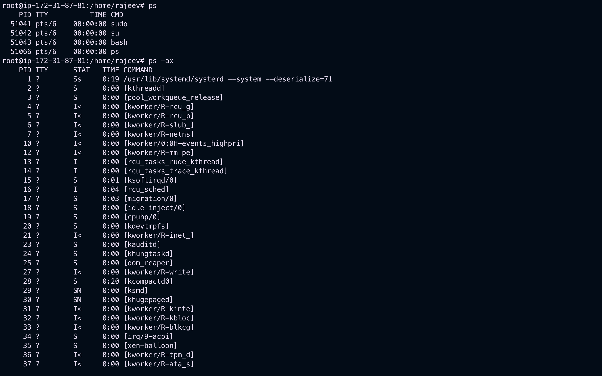
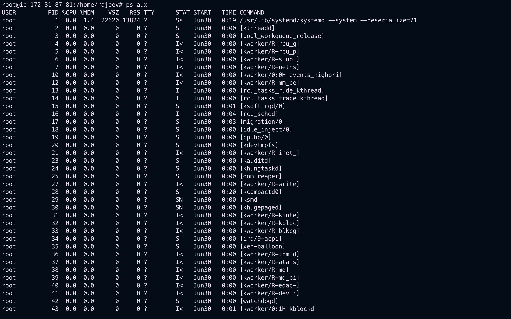

---

# `top` COMMAND

- The `top` command displays a real-time list of processes that are running on the system. It also displays additional information about the system uptime, current CPU and memory usage, or total number of running processes, and allows you to perform actions such as sorting the list or killing a process.
- For each listed process, the `top` command displays the process ID (`PID`), the effective user name of the process owner (`USER`), the priority (PR), the nice value (`NI`), the amount of virtual memory the process uses (`VIRT`), the amount of non-swapped physical memory the process uses (`RES`), the amount of shared memory the process uses (SHR), the process status field S), the percentage of the CPU (`%CPU`) and memory (`%MEM`) usage, the cumulated CPU time (`TIME+`), and the name of the executable file (COMMAND).
  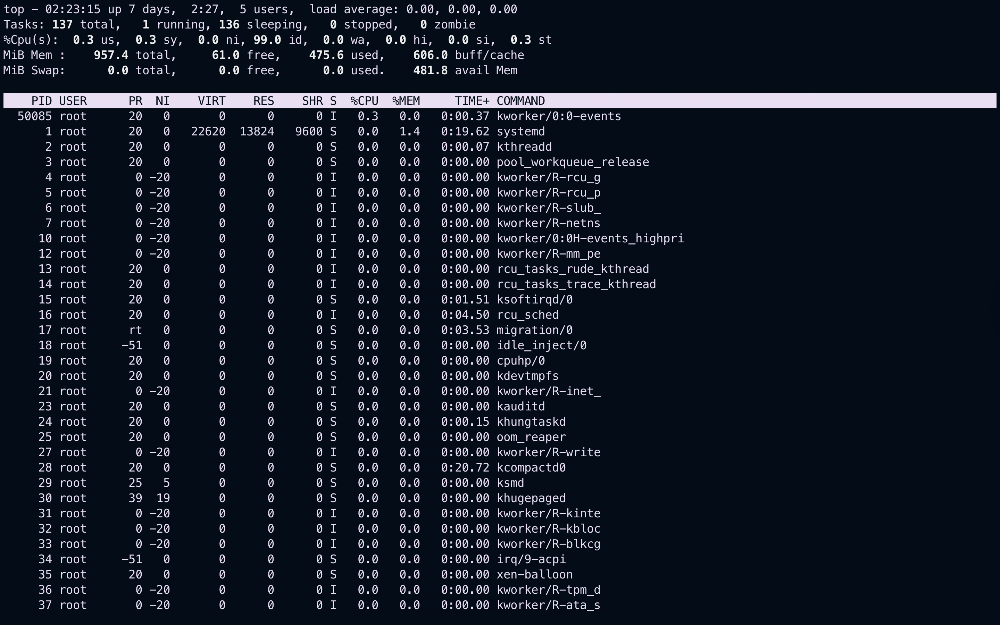

## Interactive top commands

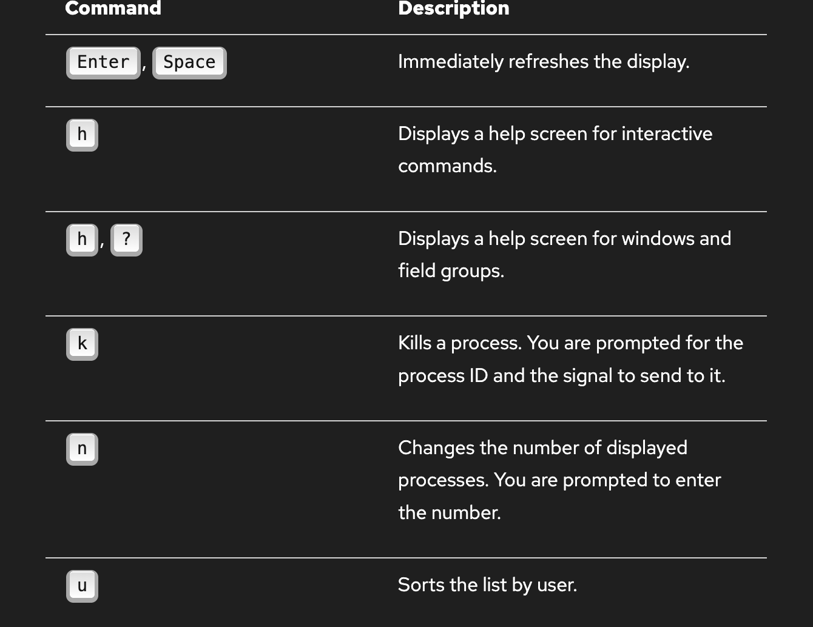
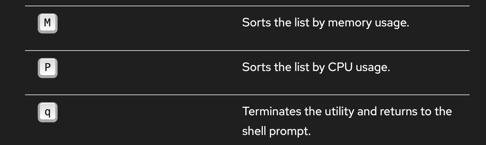

---

# Using the system monitoring tool

- The Processes tab of the System Monitor tool allows you to view, search for, change the priority of, and kill processes from the graphical user interface.
- To start the **System Monitor** tool from the command line, type `gnome-system-monitor` at a shell prompt. The **System Monitor** tool appears. Alternatively, if using the **GNOME** desktop, press the `Super` key to enter the Activities Overview, type System Monitor and then press `Enter`. The **System Monitor** tool appears. The `Super` key appears in a variety of guises, depending on the keyboard and other hardware, but often as either the Windows or Command key, and typically to the left of the `Spacebar`.

- Click the `Processes` tab to view the list of running processes.
  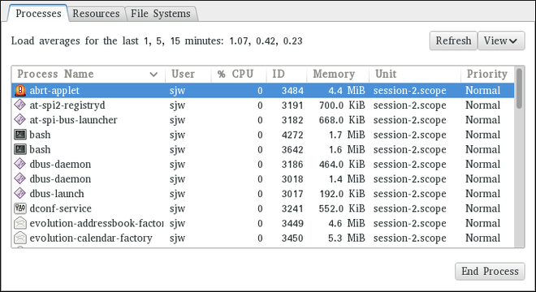
- By default, the System Monitor tool displays a list of processes that are owned by the current user. Selecting various options from the View menu allows you to:

  - view only active processes,
  - view all processes,
  - view your processes,
  - view process dependencies,

- Additionally, two buttons enable you to:

  - refresh the list of processes,
  - end a process by selecting it from the list and then clicking the `End Process` button.

---

# Viewing Memory Usage

## Using the `free` command

- The free command allows you to display the amount of free and used memory on the system.

```bash
free
```

- The `free` command provides information about both the physical memory (`Mem`) and swap space (`Swap`). It displays the total amount of memory (`total`), as well as the amount of memory that is in use (`used`), free (`free`), shared (`shared`), sum of buffers and cached (`buff/cache`), and available (`available`).
  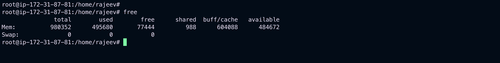
- By default, `free` displays the values in kilobytes. To display the values in megabytes, supply the `-m` command line option:

```bash
free -m
```

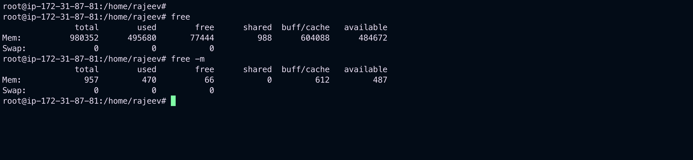

# Viewing Block Device and File System

## Using the `lsblk` command

- The `lsblk` command allows you to display a list of available block devices. It provides more information and better control on output formatting than the `blkid` command. It reads information from `udev`, therefore it is usable by `non-root` users.
- For each listed block device, the `lsblk` command displays the device name (`NAME`), major and minor device number (`MAJ:MIN`), if the device is removable (`RM`), its size (`SIZE`), if the device is read-only (`RO`), what type it is (`TYPE`), and where the device is mounted (`MOUNTPOINT`).

```bash
lsblk
```

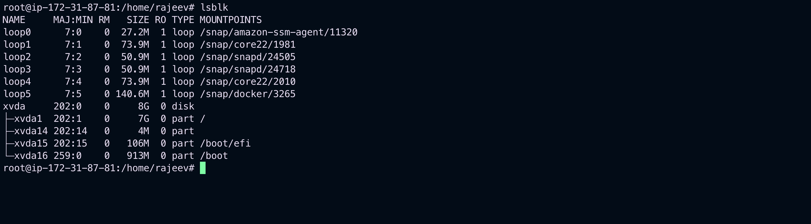

- By default, lsblk lists block devices in a tree-like format. To display the information as an ordinary list, add the -l command line option:

```bash
lsblk -l
```

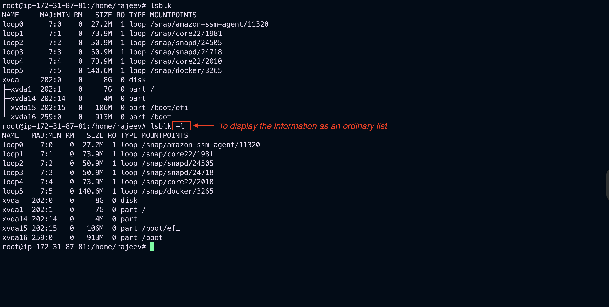

## Using the `blkid` command

- The `blkid` command allows you to display low-level information about available block devices. It requires `root` privileges, therefore **non-root** users should use the `lsblk` command.

```bash
blkid
```

- For each listed block device, the `blkid` command displays available attributes such as its universally unique identifier (`UUID`), file system type (`TYPE`), or volume label (`LABEL`).
  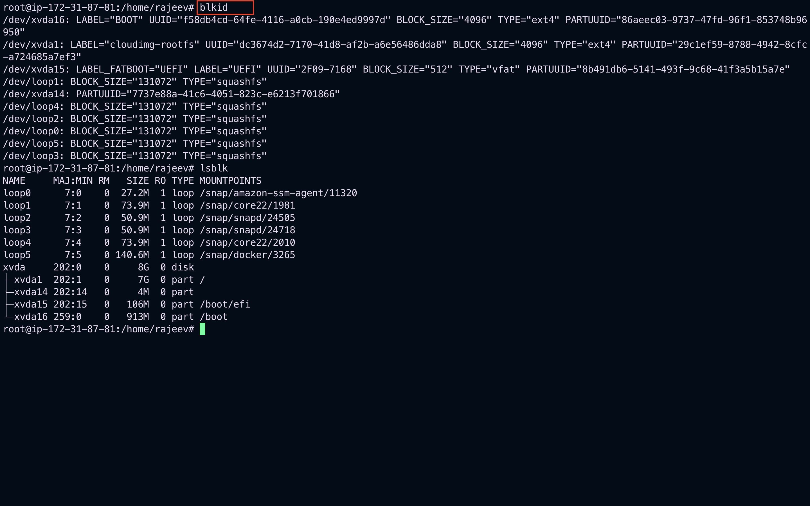
- By default, the `blkid` command lists all available block devices. To display information about a particular device only, specify the device name on the command line:

```bash
blkid device_name
```

```bash
blkid /dev/xvda1
blkid /dev/xvda15
```

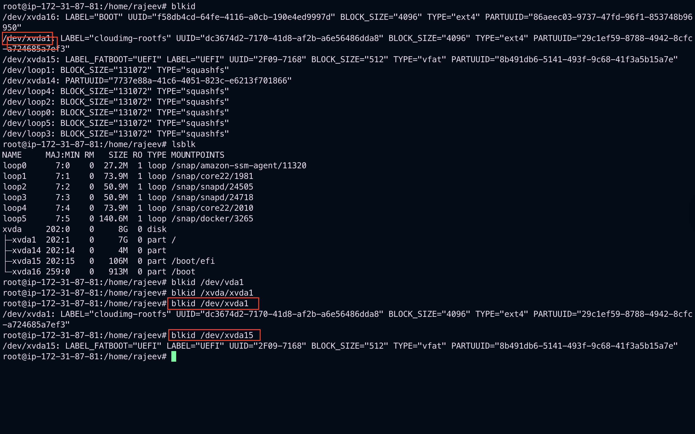

- You can also use the above command with the `-p` and `-o` udev command line options to obtain more detailed information. Note that root privileges are required to run this command:

```bash
blkid -po /dev/xvda15
```

# Using the `findmnt` command

- The findmnt command allows you to display a list of currently mounted file systems.

```bash
findmnt
```

- For each listed file system, the findmnt command displays the target mount point (`TARGET`), source device (`SOURCE`), file system type (`FSTYPE`), and relevant mount options (`OPTIONS`). For example:
  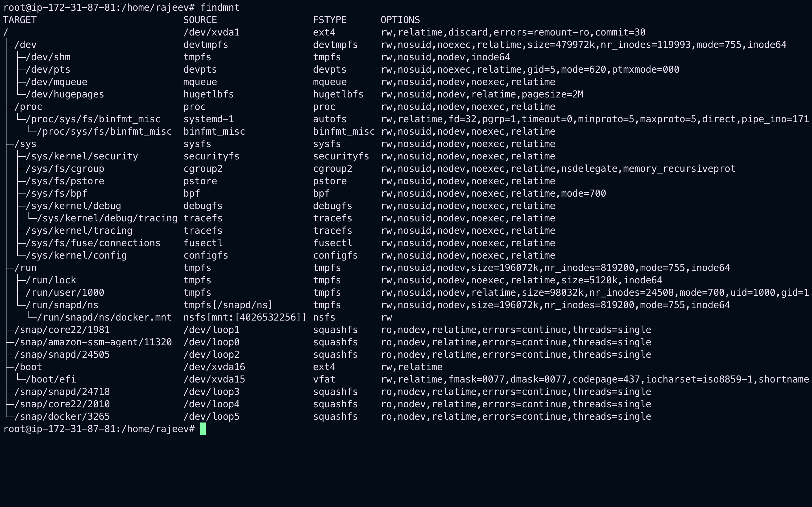
- By default, `findmnt` lists file systems in a tree-like format. To display the information as an ordinary list, add the `-l` command line option:

```bash
findmnt -l
```

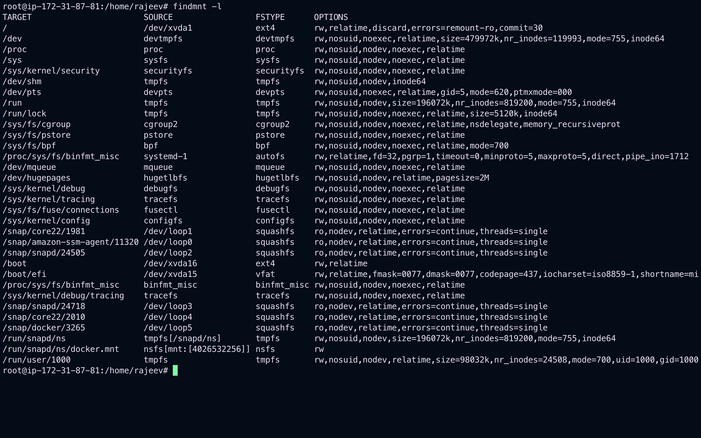

- You can also choose to list only file systems of a particular type. To do so, add the `-t` command line option followed by a file system type:

```bash
findmnt -t type
```

- For example, to all list `xfs` file systems, type:

```bash
findmnt -t xfs
```

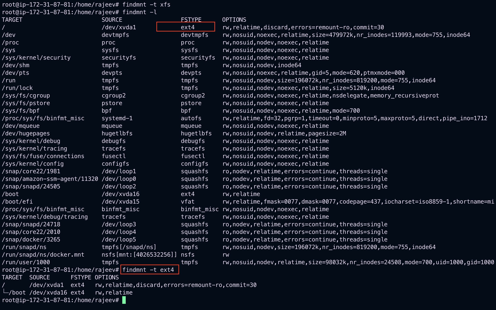
