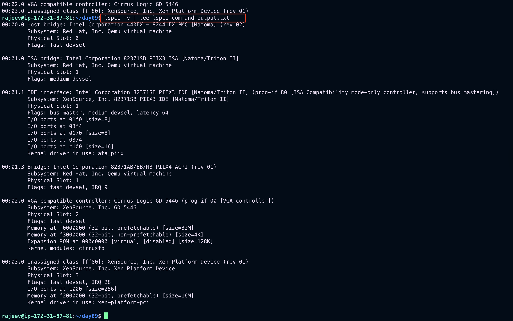

# Day-08: Task

1. Using the `df` command
2. Using the `du` command
3. Viewing Hardware information

- lspci
- lspci -v|-vv
- lsusb
- lsusb -v
- lscpu

4. Checking for Hardware errors

- rasdaemon insatllation
- ras-mc-ctl different options
  - ras-mc-ctl --help
  - ras-mc-ctl --summary
  - ras-mc-ctl --errors

5.  Monitoring Performance with Net-SNMP

---

# Using the `df` command

- The `df` command allows you to display a detailed report on the system’s disk space usage.

```bash
df
```

- For each listed file system, the df command displays its name (`Filesystem`), size (`1K-blocks or Size`), how much space is used (`Used`), how much space is still available (`Available`), the percentage of space usage (`Use%`), and where is the file system mounted (Mounted on). For example:
  
- By default, the df command shows the partition size in 1 kilobyte blocks and the amount of used and available disk space in kilobytes. To view the information in megabytes and gigabytes, supply the `-h` command line option, which causes df to display the values in a human-readable format:

```bash
df -h
```


---

# Using the `du` command

- The `du` command allows you to displays the amount of space that is being used by files in a directory. To display the disk usage for each of the subdirectories in the current working directory, run the command with no additional command line options:

```bash
du
```


- By default, the `du` command displays the disk usage in **kilobytes**. To view the information in megabytes and gigabytes, supply the `-h` command line option, which causes the utility to display the values in a **human-readable** format:

```bash
du -h
```


- At the end of the list, the du command always shows the grand total for the current directory. To display only this information, supply the -s command line option:
  

---

# Viewing HARDWARE information

## Using the `lspci` command

- The lspci command allows you to display information about PCI buses and devices that are attached to them. To list all PCI devices that are in the system, type the following at a shell prompt:

```bash
lspci
```

This displays a simple list of devices, for example:


- You can also use the `-v` command line option to display more verbose output, or `-vv` for very verbose output:

```bash
lspci -v | tee lspci-command.txt
```




```bash
lspci -v|-vv
```


## Using `lsusb` command

- The `lsusb` command allows you to display information about `USB` buses and `devices` that are attached to them.

```bash
lsusb
```

This displays a simple list of devices, for example:


- You can also use the -v command line option to display more verbose output:

```bash
lsusb -v
```

## Using the `lscpu` command

- The lscpu command allows you to list information about CPUs that are present in the system, including the number of CPUs, their architecture, vendor, family, model, CPU caches, etc. To do so, type the following at a shell prompt:

```bash
lscpu
```


## Checking for Hardware errors

- Red Hat Enterprise Linux 7 introduced the new hardware event report mechanism (`HERM`.) This mechanism gathers system-reported memory errors as well as errors reported by the error detection and correction (`EDAC`) mechanism for dual in-line memory modules (`DIMMs`) and reports them to user space. The user-space daemon rasdaemon, catches and handles all reliability, availability, and serviceability (`RAS`) error events that come from the kernel tracing mechanism, and logs them. The functions previously provided by `edac-utils` are now replaced by rasdaemon.
- To install `rasdaemon`, enter the following command as root:

```bash
yum install rasdaemon

apt install rasdaemon
```

Start the service as follows:

```bash
systemctl start rasdaemon
```

To make the service run at system start, enter the following command:

```bash
systemctl enable rasdaemon
```

`O/P`

```bash
systemctl enable rasdaemon
Synchronizing state of rasdaemon.service with SysV service script with /usr/lib/systemd/systemd-sysv-install.
Executing: /usr/lib/systemd/systemd-sysv-install enable rasdaemon
```

The `ras-mc-ctl` utility provides a means to work with EDAC drivers. Enter the following command to see a list of command options:

```bash
ras-mc-ctl --help
```


To view a summary of memory controller events, run as root:

```bash
ras-mc-ctl --summary
```


To view a list of errors reported by the memory controller, run as root:

```bash
ras-mc-ctl --errors
```


---

# Monitoring Performance with Net-SNMP

- Red Hat Enterprise Linux 7 includes the Net-SNMP software suite, which includes a flexible and extensible simple network management protocol (`SNMP`) agent. This agent and its associated utilities can be used to provide performance data from a large number of systems to a variety of tools which support polling over the `SNMP` protocol.

## Installing Net-SNMP (Simple Network Management Tool)

- The Net-SNMP software suite is available as a set of RPM packages in the Red Hat Enterprise Linux software distribution.
  | Package | Provider|
  | ----- | ------|
  | net-snmp | The SNMP Agent Daemon and documentation. This package is required for exporting performance data.|
  | net-snmp-libs | The netsnmp library and the bundled management information bases (MIBs). This package is required for exporting performance data.|
  | net-snmp-utils | SNMP clients such as snmpget and snmpwalk. This package is required in order to query a system’s performance data over SNMP.|
  | net-snmp-perl | The mib2c utility and the NetSNMP Perl module. Note that this package is provided by the Optional channel. |
  | net-snmp-python | An SNMP client library for Python. Note that this package is provided by the Optional channel. |
- To install any of these packages, use the `yum` or `apt`(for ubuntu linux) command in the following form:

```bash
apt install package&&hellip;
```

For example, to install the SNMP Agent Daemon and SNMP clients used in the rest of this section, type the following at a shell prompt as root:

```bash
yum install net-snmp net-snmp-libs net-snmp-utils

apt install net-snmp net-snmp-libs net-snmp-utils # For ubuntu user
```

### Starting the service

```bash
systemctl start snmpd.service
```

To configure the service to be automatically started at boot time, use the following command:

```bash
systemctl enable snmpd.service
```

### Stopping the service

```bash
systemctl stop snmpd.service
```

To disable starting the service at boot time, use the following command:

```bash
systemctl disable snmpd.service
```

### Restarting the service

```bash
systemctl restart snmpd.service
```

This command stops the service and starts it again in quick succession. To only reload the configuration without stopping the service, run the following command instead:

```bash
systemctl reload snmpd.service
```
