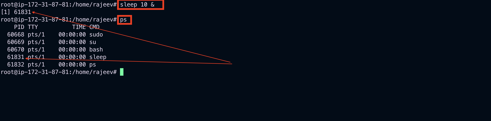
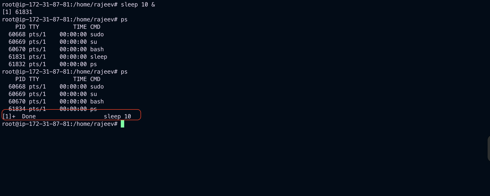
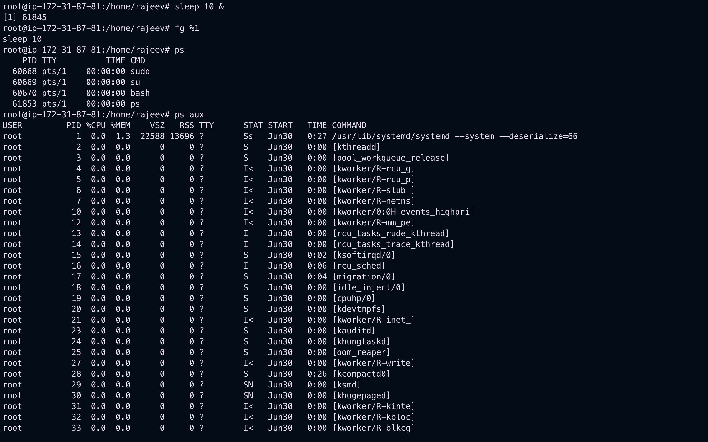

# Process Management

## Background / Foreground Processes

In Unix-like systems, processes can run in the foreground or background.

### Foreground Process

A foreground process runs directly under the control of the terminal. You have to wait for it to finish before you can use the terminal again.

**Example:**

```bash
sleep 10
```

This command will make the terminal wait for 10 seconds.


### Background Process

A background process runs independently of the terminal. You can use the terminal while it runs.

**Example:**

```bash
sleep 10 &
```

The `&` symbol sends the process to the background.



---

**Bring a background process to the foreground:**

```bash
fg %1
```


**Send a running foreground process to the background:**
Press `Ctrl+Z` to pause, then:

```bash
bg %1
```

## Listing / Finding Processes

You can view and search running processes using the following commands:

### `ps` command

Lists current running processes.

```bash
ps aux
```



### `top` or `htop`

Interactive process viewer.

```bash
top
```

(Use `htop` for a user-friendly interface — install it if not available.)

### `pgrep`

Find process by name.

```bash
pgrep nginx
```

### `pidof`

Find process ID of a program.

```bash
pidof sshd
```


### `ps` with `grep`

Search for a process.

```bash
ps aux | grep apache
```


## Process Signals

Processes can be controlled using signals. The most commonly used command is `kill`.

### Common Signals:

- `SIGTERM` (15): Terminate process gracefully
- `SIGKILL` (9): Forcefully kill process
- `SIGHUP` (1): Reload process
- `SIGSTOP` (19): Stop (pause) process
- `SIGCONT` (18): Continue stopped process

### Sending Signals

**Using `kill`:**

```bash
kill -15 <pid>    # Graceful termination
kill -9 <pid>     # Force kill
```

**Using `killall`:**

```bash
killall firefox
```

**Using `pkill`:**

```bash
pkill -9 firefox
```

**Using `xkill`:**
Click on a window to kill its process (for GUI environments).

```bash
xkill
```

## Summary

- Use `&` to run in background, `fg`/`bg` to control jobs.
- Use `ps`, `top`, `pgrep`, `pidof` to find processes.
- Use `kill`, `killall`, `pkill` to manage processes with signals.
