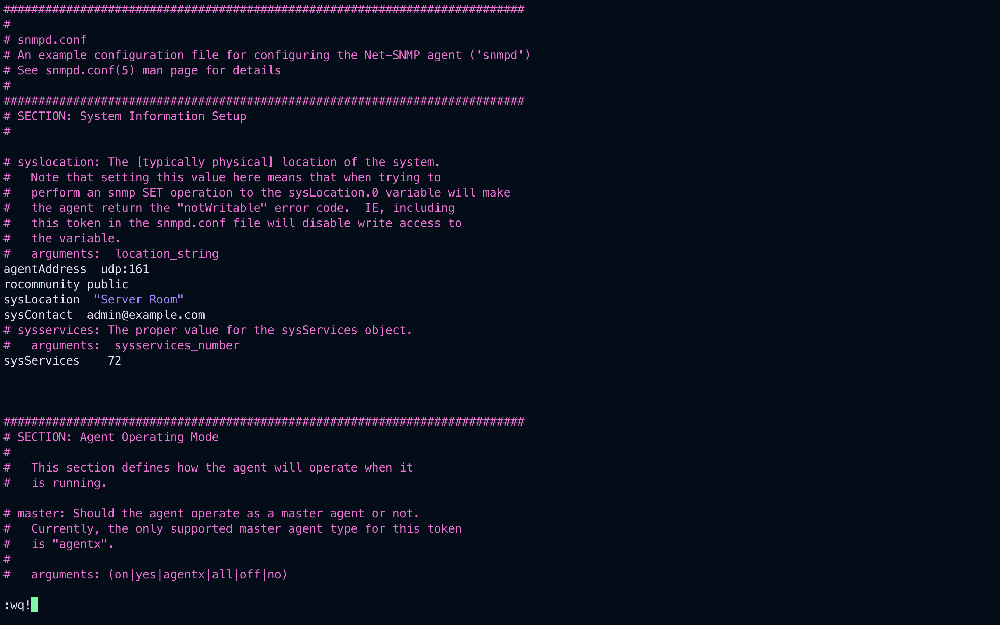

# SNMP (Simple Network Management Protocol)

## What is SNMP?

Simple Network Management Protocol (SNMP) is a protocol used for network management. It is used for collecting information and configuring network devices such as servers, printers, hubs, switches, and routers on an Internet Protocol (IP) network.

## Components of SNMP

1. **Managed Device**: Network nodes with an SNMP agent that collect and store management information.
2. **Agent**: A software module within a device that maintains the data for the device and reports these, as needed, to managing systems.
3. **Network Management System (NMS)**: A system used to monitor and control SNMP-managed devices.

## SNMP Versions

- SNMPv1: Original version, uses community strings for authentication.
- SNMPv2c: Enhanced version of v1, also uses community strings.
- SNMPv3: Secure version with authentication and encryption.

## SNMP Structure

- **MIB (Management Information Base)**: A collection of information organized hierarchically. These are accessed using a protocol such as SNMP.
- **OIDs (Object Identifiers)**: Used to identify each variable uniquely in the MIB hierarchy.

## Installing SNMP on Ubuntu

```bash
sudo apt update
sudo apt install snmp snmpd
```

## Configuring SNMP (v2c) Agent

Edit the SNMP daemon configuration file:

```bash
sudo nano /etc/snmp/snmpd.conf
```

Change or add the following lines:

```conf
agentAddress  udp:161
rocommunity public
sysLocation  "Server Room"
sysContact  admin@example.com
```


Restart the SNMP service:

```bash
sudo systemctl restart snmpd
```

`Solving Error`

## Using SNMP Commands

### 1. Get system description

```bash
snmpget -v2c -c public localhost SNMPv2-MIB::sysDescr.0
```

### 2. Walk through the system MIB

```bash
snmpwalk -v2c -c public localhost system
```

### 3. Fetch specific OID

```bash
snmpget -v2c -c public localhost .1.3.6.1.2.1.1.5.0
```

## Real World Example

You can use SNMP to monitor network devices using tools like **Nagios**, **Cacti**, **Zabbix**, or **LibreNMS**. These tools query devices for metrics like CPU usage, bandwidth, disk utilization, etc., via SNMP.

## SNMP Security Tip

If using SNMPv2c, avoid using default community strings like `public`. Use SNMPv3 for better security (authentication and encryption).

## References

- [SNMP Wikipedia](https://en.wikipedia.org/wiki/Simple_Network_Management_Protocol)
- [net-snmp documentation](http://www.net-snmp.org/docs/)

---
