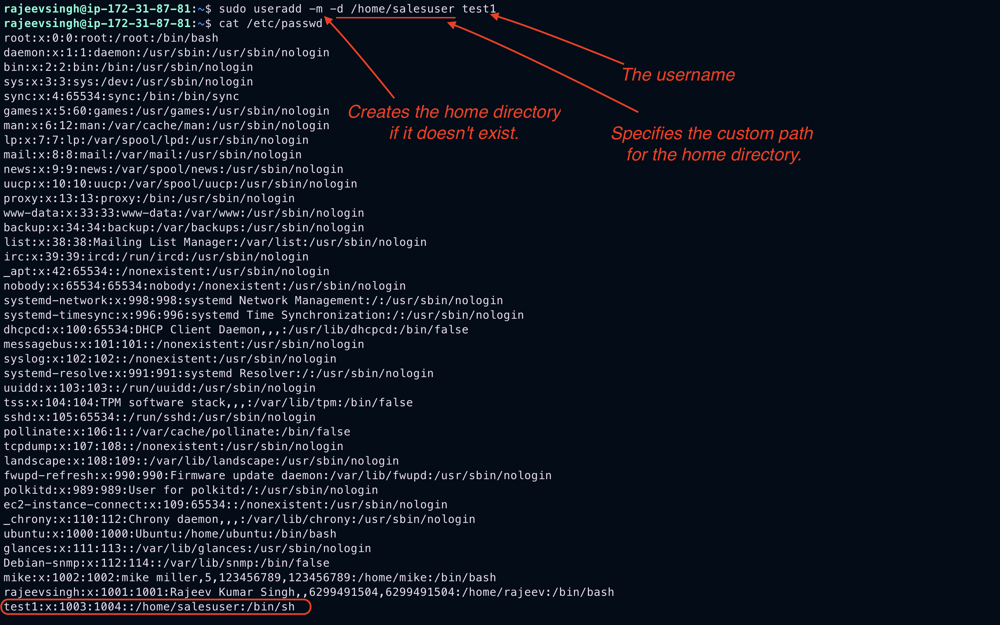
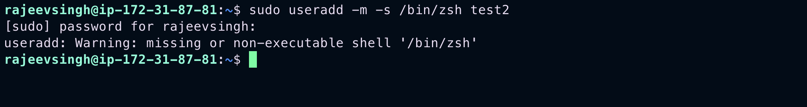
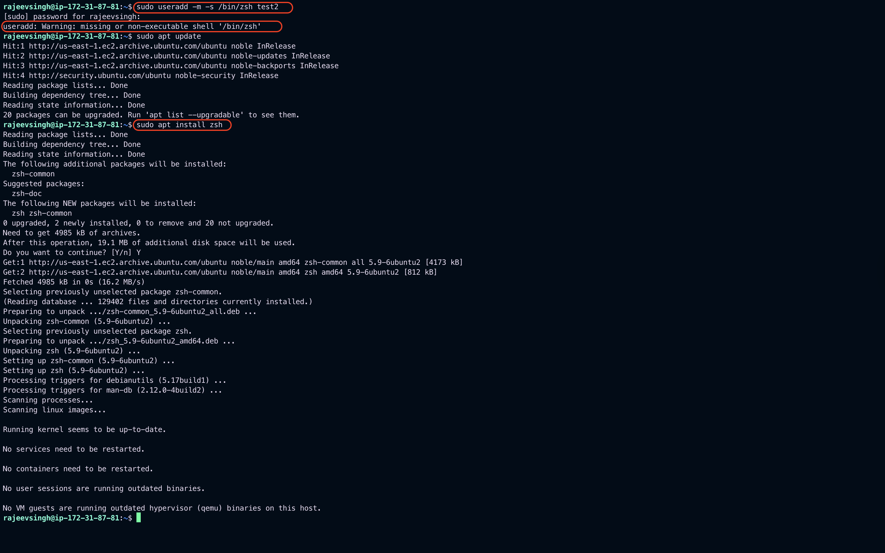
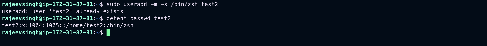
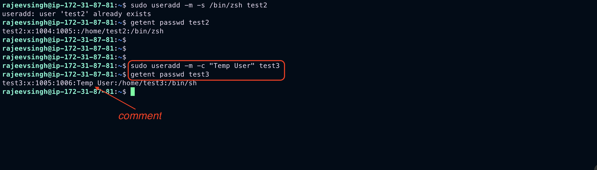

# Day-10: Tasks

1. 3. User Management

- [ ] Users and Groups
- [ ] Managing Permissions
- [ ] Create / Delete / Update

---

# What three things must you do to manage user accounts?

- Create Accounts
- Modify Accounts
- Delete Accounts

---

## Use the `useradd` command to create accounts:

```bash
sudo useradd mile
```

- ## That's enough to create the account. However, there are some options you can add. As always, review the associated man page for details. Here are a few common options:
  - `--create-home` (`-m`): Adds a home directory (this is a default on some distributions)
  - `--shell` (`-s`): Sets the user's preferred shell if it's different from `/bin/bash`
  - `--uid` (`-u`): Specifies a particular user ID (`UID`)
  - `--comment` (`-c`): Populates the comment field (usually with the user's full name enclosed in quotes)
    > `Note`: Settings for the useradd command are stored in the /etc/defaults/useradd file.
- Also, don't forget to set a password for the account by using the `passwd` command.

### Try a few exercises to test these commands:

1. Create a user named **test1** with a home directory named `/home/salesuser`.

```bash
sudo useradd -m -d /home/salesuser test1
```



---

2. Create a user named **test2** with `zsh` as the default shell.

```bash
sudo useradd -m -s /bin/zsh test2
```



```bash
sudo apt update
sudo apt install zsh
```



## Confirm default shell

```bash
getent passwd test2
```



---

3. Create a user named **test3** with "**Temp User**" in the comment field.



---

> `Note`: These commands require root or administrative privileges, so use the sudo before each command.

# usermod

- Now that some user accounts exist on the system, you can modify their settings. You accomplish this with the `usermod` command and its related options. Modifications may be necessary when users change names, request different shells, or need updated password information.
- Standard options for `usermod` include:
  - `--comment` (`-c`): Modifies the comment field
  - `--home` (`-d`): Modifies home directory information
  - `--expiredate` (`-d`): Changes account-expiration settings
  - `--login` (`-l`): Modifies the username
  - `--lock` (`-L`): Locks a user account
  - `--unlock` (`-U`): Unlocks a user account
- A user requests an account name change from test2 to testtwo. The command looks like this

```bash
sudo usemod -l testtwo test2 \
sudo usermod -c "Test Two" test2
```

- Maybe a user is taking a leave of absence. The user will return, but the account should be inaccessible in the meantime. If an administrator deletes the account, the user's data, group memberships, and other unique information may be lost or more difficult to access. It's better to lock the account until their return.

## Lock a user account by using the usermod command:

```bash
sudo usemod -L test1

or
sudo usermod --lock test1
```

### Upon the user's return, unlock the account:

```bash
sudo usemod --unlock test1
```

- Interestingly, adding a user to a group modifies the user, not the group. Therefore, you manage group membership with the usermod command.

### The two primary group membership scenarios are:

1. Add a user to a group and remove the user from all other groups

```bash
sudo usermod -G dev test1
```

2. Add a user to a group and retain the user's membership in all other groups

```bash
sudo usermod -a -G dev test2
```

- Use the `--groups` (`-G` for short) option with `usermod` to accomplish the **_first scenario_** (**_add a user to a group and remove them from other groups_**). The `--append` (`-a` for short) option appends a group to the user, and when combined with `-G`, it retains its membership in other groups.

# userdel

Finally, you might want to remove an account representing a user whose role has changed or is no longer with the organization.

## To delete the account, type:

```bash
sudo userdel test3
```

However, before deleting the account, don't forget about resources such as the user's home directory or system mail. You will want to ensure those resources get handled according to the organization's written security policy.

- Here are some common options for userdel that address these resources:

  - `--force` (`-f`): Deletes the account (including mail and home directory), even if the user is still logged in
  - `--remove` (`-r`): Deletes the account (including mail and home directory), but the user must be logged out.

- The `userdel` command is pretty simple. There aren't many options, but they can be displayed by typing `userdel --help`.

# Wrap up

- New Linux users sometimes have difficulty wrapping their heads around how many commands exist and how many of them sysadmins memorize. That memorization comes from years of use and experience. It's handy, however, when some commands have logical names and simple options.
- In RHEL, it doesn't get much easier than:
  - Add a user: `useradd`
  - Modify a user: `usermod`
  - Delete a user: `userdel`
- It's worth noting that some Linux distributions provide front end commands to perform the same tasks. For example, the `adduser` command steps the sysadmin through a series of interactive prompts to create a new user. On a Linux system running a graphical desktop, there are also GUI applications to help manage user accounts.

# 3 basic Linux group management commands

The three commands used to manage group accounts on Red Hat Enterprise Linux (RHEL) and RHEL-like distributions fit this description nicely:

1. Add a group: `groupadd`
2. Modify a group: `groupmod`
3. Delete a group: `groupdel`

## groupadd

- Sysadmins are likely to add groups that represent specific and varied needs to Linux servers. Most of these needs center on controlling access to files, directories, or other resources. You can even use groups help manage `sudo` access.
- To create a group, use the following command:

```bash
sudo groupadd projectA
```

> `Note`: These commands require root or administrative privileges.

- This command adds projectA to the `/etc/group` file. The file contains the group name, password (if any), group ID, and a list of existing members. The group membership is empty by default. The fields are separated by colons.
- There are a few options for groupadd, but a common one is `--gid` (`-g` for short), to specify a group ID (`GID`) number.

## groupmod

Creating a group is only the first step. You might also need to modify the group by using the `groupmod` command. The most common group modifications consist of name changes.

> `Note`: Adding or removing a user from a group modifies the user, not the group, by using the usermod command.

### Group modification options include:

- `--gid` (`-g`): Change the `GID`
- `--new-name` (`-n`): Change the group name
- Therefore, if you need to update a group name from projectA to projectZ, use:

```bash
sudo groupmod -n projectZ projectA
```

The **_projectA_** string is the command's argument.

After modifying the group, use the `tail` or `cat` commands to check the `/etc/group` file contents to ensure the desired settings are in place.

## groupdel

- You may need to delete a group. Deleting a group does not delete the user accounts that are members of the group.
- To delete the projectA group, type:

```bash
sudo groupdel projectA
```

Other than the `--help` option for help, the other option sysadmins commonly use is `--force`, which forces the group deletion.

# Wrap up

The three commands used to manage groups are quite similar to the user management commands. There are few options to remember, yet these six commands to manage users and groups are logical and straightforward.

- Add a group: `groupadd`

- Modify a group: `groupmod`

- Delete a group: `groupdel`

### To manage users, use:

- Add a user: `useradd`

- Modify a user: `usermod`

- Delete a user: `userdel`
