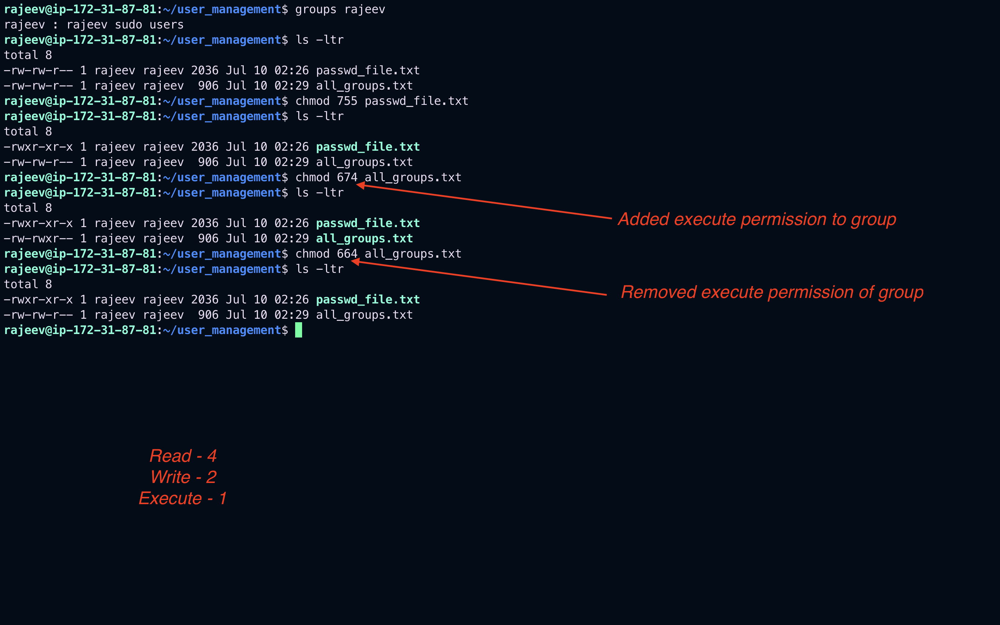
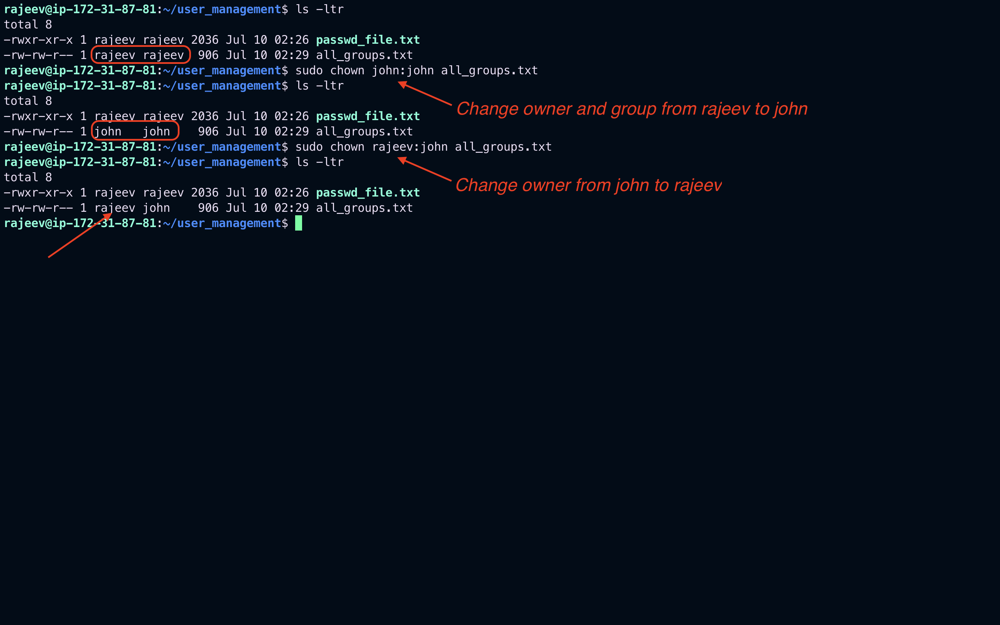
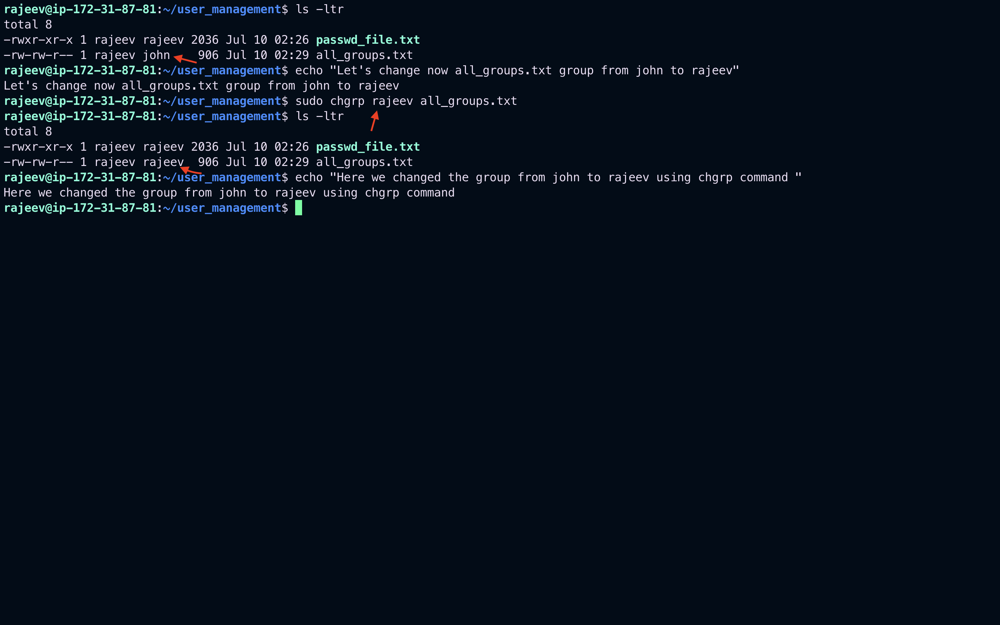
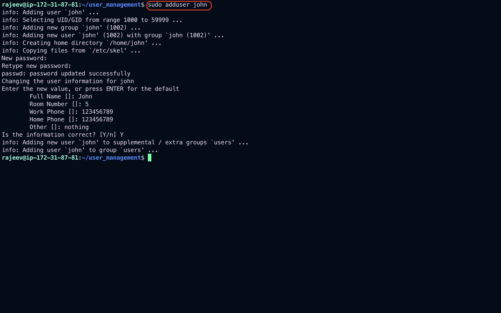
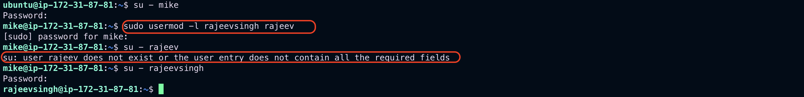
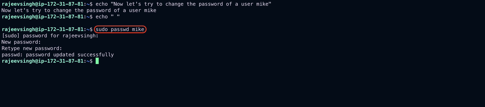
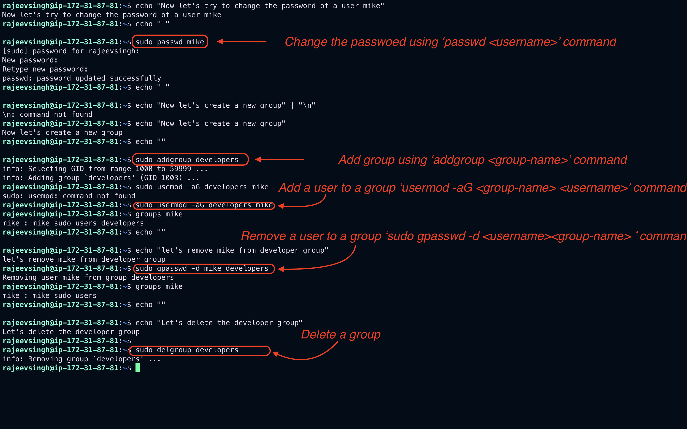

# User Management

## Users and Groups

In Linux, every user has a unique UID (User ID) and is associated with at least one group. Groups allow for easier management of permissions for multiple users.

### View Current User

```bash
whoami
```


### List All Users

```bash
cat /etc/passwd
```


### List All Groups

```bash
cat /etc/group
```


### View Group(s) of a User

```bash
groups <username>
```


## Managing Permissions

Linux uses a permission system to control who can read, write, or execute a file or directory.

### File Permission Structure

```
-rwxr-xr-- 1 user group 1234 Jan 01 12:00 file.txt
```

- First character: type (`-` for file, `d` for directory, `l` for link)
- Next 3: owner permissions (rwx)
- Next 3: group permissions (r-x)
- Next 3: others (r--)

### Change File Permissions

#### Using `chmod`

```bash
chmod 755 file.sh   # rwxr-xr-x
chmod u+x file.sh   # add execute for user
```



#### Using `chown` (Change ownership)

```bash
chown user:group file.txt
```



#### Using `chgrp` (Change group)

```bash
chgrp developers file.txt
```



## Create / Delete / Update Users and Groups

### Create a New User

```bash
sudo adduser john
```



### Delete a User

```bash
sudo deluser john
```


### Modify a User

```bash
sudo usermod -aG sudo john  # Add to 'sudo' group
sudo usermod -l newname oldname  # Change username
```




### Change User Password

```bash
sudo passwd mike
```



### Create a New Group

```bash
sudo addgroup developers
```

### Add User to Group

```bash
sudo usermod -aG developers john
```

### Remove User from Group

```bash
sudo gpasswd -d john developers
```

### Delete a Group

```bash
sudo delgroup developers
```



## Summary

- Users and groups help manage access control in Linux.
- Use `chmod`, `chown`, `chgrp` to manage file permissions.
- Use `adduser`, `deluser`, `usermod` for user account management.
