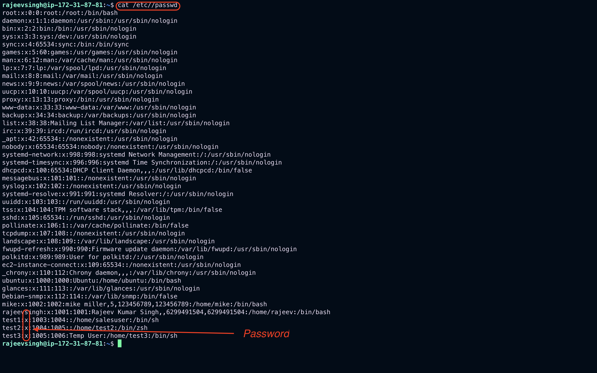
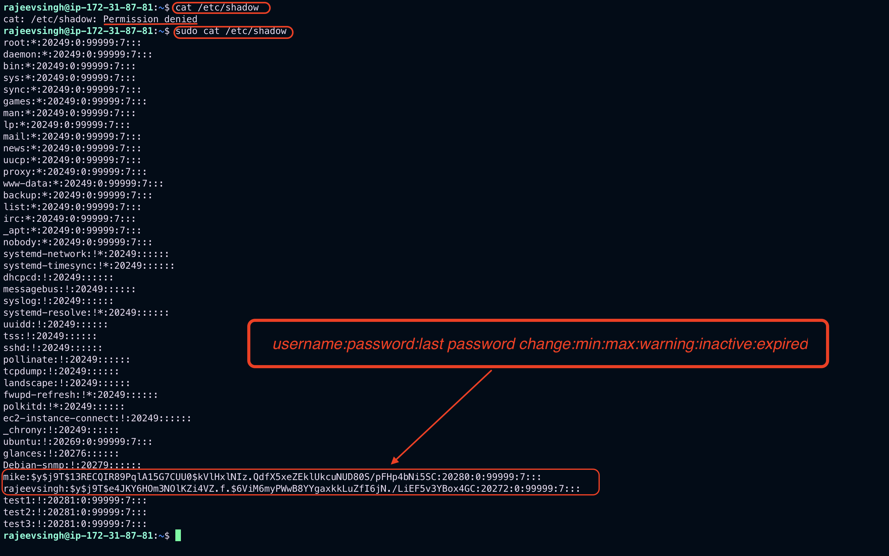
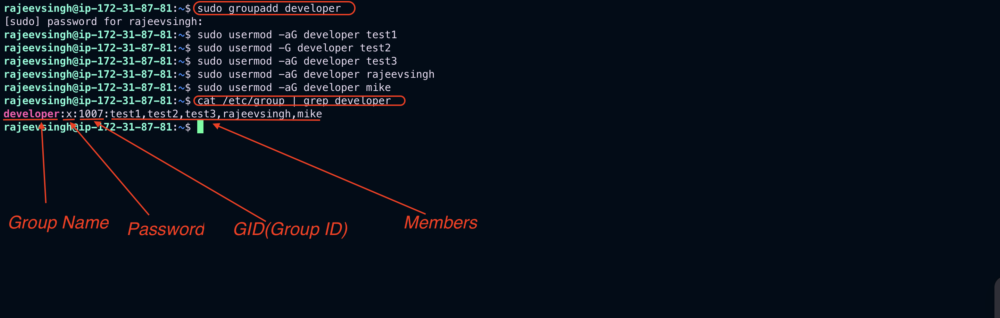

# Day-11: Tasks

1. How to manage users and groups in Linux

---

The commands below are written for Red Hat Enterprise Linux (RHEL) and RHEL-like distributions, but the concepts apply to any distribution of Linux. Knowing the skills and commands outlined here (and its two follow-up pieces, which dive deeper into user admin and group admin) helps ensure you're ready for the day-to-day user and group administration tasks a sysadmin is called on to do.

# Managing users

Users must authenticate to any system they need to use. This authentication provides access to resources and a customized, user-specific environment. The user's identity is based on their user account. What skills do sysadmins need to manage user accounts?

## 1. Understand the `/etc/passwd` file

User account information is stored in the `/etc/passwd` file. This information includes the **account name**, **home directory location**, and **default shell**, among other values. Linux sysadmins should be able to recognize these fields.

- Each field is separated by a `:` character, and not all fields must be populated, but you must delineate them.
- Here's an example of the /etc/passwd fields:

```bash
username:password:UID:GID:comment:home:shell

```

In this example, the comment field is empty:

```bash
dgarn:x:1001:1001::/home/dgarn:/bin/bash
# Observe how the two colons still exist to delineate the comment field.
```

Here is an example with the comment field populated:

```bash
dgarn:x:1001:1001:Damon Garn:/home/dgarn:/bin/bash

```

## 2. Understand the /etc/shadow file

- Long ago, password hashes were stored in the `/etc/passwd` file. This file was world-readable, allowing inquisitive users to pull password hashes for other accounts from the file and run them through password-cracking utilities. Eventually, the password hashes were moved to a file readable only by `root`: `/etc/shadow`. Today, the password field in the `/etc/passwd` file is marked with an `x`.
- Administrators should recognize each field in /etc/shadow. Several of the fields pertain to password requirements.

> Here's an example of /etc/shadow fields:

```bash
username:password:last password change:min:max:warning:inactive:expired

```



The first two fields identify the user and a hashed version of the password, while the remaining six fields represent password change information. The password information is manipulated with the `chage` command.

- Look at these articles for additional details:
  - [`The effects of adding users to a Linux system`](https://sysadmin.prod.acquia-sites.com/sysadmin/creating-script-add-users)
  - [`Forcing Linux system password changes with the chage command`](https://sysadmin.prod.acquia-sites.com/sysadmin/password-changes-chage-command)

---

## 3. Create, modify, and delete user accounts

- The process for managing user accounts is very straightforward. Sysadmins either add, modify, or delete users, and the related commands are quite intuitive.
- The commands to manage user accounts on RHEL and RHEL-like distributions are:
  - `useradd`
  - `usermod`
  - `userdel`

## 4. Manage password requirements

- Many organizations rely on password policies to define appropriate password requirements. Sysadmins can enforce those requirements by using various mechanisms on Linux.
- Two common ways of managing password settings are using the `/etc/login.defs` file or Pluggable Authentication Module (PAM) settings. Be sure to understand the options, fields, and settings for this important security configuration.

# Managing groups

- It's more efficient to group user accounts with similar access requirements than to manage permissions on a user-by-user basis. Therefore, sysadmins need to be comfortable with the process of creating, modifying, and deleting groups.

## 1. Understand the /etc/group file

- Similar to the `/etc/passwd` file above, the `/etc/group` file contains group account information. This information can be essential for **troubleshooting**, security audits, and ensuring users can access the resources they need.
- Understand each field of the file to make life easier as a sysadmin.
- The fields in the `/etc/group` file are:

```bash
groupname:password:GID:group members

```



---

## 2. Create, modify, and delete groups

Like the user account commands described above, the group management commands are very intuitive and provide a lot of flexibility. There is an easy-to-remember command for each function you might need to carry out for a group:

- `groupadd`
- `groupmod`
- `groupdel`

## 3. Manage group membership

Adding users to a group simplifies permissions management. Many people find the process a little unintuitive: Adding a user to a group modifies the user, not the group. Therefore, the necessary command is the `usermod` command.

- Here are some commands to display group information:
  - `usermod`: Update group membership
  - `id`: Display a list of groups the user is a member of
  - `cat /etc/group`: Show a list of existing groups, with membership displayed in the last field
