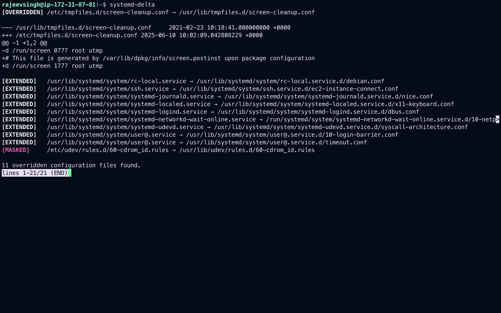

# Managing Services with systemd

## Introduction to systemd

- Systemd is a system and service manager for Linux operating systems. It is designed to be backwards compatible with SysV init scripts, and provides a number of features such as parallel startup of system services at boot time, on-demand activation of daemons, or dependency-based service control logic. In Red Hat Enterprise Linux 7, systemd replaces Upstart as the default init system.
- Systemd introduces the concept of **_systemd units_**. These units are represented by unit configuration files located in one of the directories listed in:

### Systemd Unit Files Locations

| Directory                  | Description                                                                                                                                                                     |
| -------------------------- | ------------------------------------------------------------------------------------------------------------------------------------------------------------------------------- |
| `/usr/lib/systemd/system/` | Systemd unit files distributed with installed RPM packages.                                                                                                                     |
| `/run/systemd/system/`     | Systemd unit files created at run time. This directory takes precedence over the directory with installed service unit files.                                                   |
| `/etc/systemd/system/`     | Systemd unit files created by systemctl enable as well as unit files added for extending a service. This directory takes precedence over the directory with runtime unit files. |
|                            |                                                                                                                                                                                 |

---

and encapsulate information about system services, listening sockets,and other objects that are relevant to the init system.

- For a complete list of available systemd unit types:

| Unit Type      | File Extension | Description                                                             |
| -------------- | -------------- | ----------------------------------------------------------------------- |
| Service unit   | .service       | A system service.                                                       |
| Target unit    | .target        | A group of systemd units.                                               |
| Automount unit | .automount     | A file system automount point.                                          |
| Device unit    | .device        | A device file recognized by the kernel.                                 |
| Mount unit     | .mount         | A file system mount point.                                              |
| Path unit      | .path          | A file or directory in a file system.                                   |
| Scope unit     | .scope         | An externally created process.                                          |
| Slice unit     | .slice         | A group of hierarchically organized units that manage system processes. |
| Snapshot unit  | .snapshot      | A saved state of the systemd manager.                                   |
| Socket unit    | .socket        | An inter-process communication socket.                                  |
| Swap unit      | .swap          | A swap device or a swap file.                                           |
| Timer unit     | .timer         | A systemd timer.                                                        |

---

# Overriding the Default systemd Configuration Using `system.conf`

- The default configuration of systemd is defined during the compilation and it can be found in systemd configuration file at `/etc/systemd/system.conf`. Use this file if you want to deviate from those defaults and override selected default values for systemd units globally.
- For example, to override the default value of the timeout limit, which is set to 90 seconds, use the DefaultTimeoutStartSec parameter to input the required value in seconds.

```bash
DefaultTimeoutStartSec=required value
```

- to extend timeout limit for the httpd service:

1. Copy the `httpd` unit file to the `/etc/systemd/system/` directory:

```bash
cp /usr/lib/systemd/system/httpd.service /etc/systemd/system/httpd.service
```

2. Open file `/etc/systemd/system/httpd.service` and specify the TimeoutStartSec value in the [Service] section:

```bash
...
[Service]
...
PrivateTmp=true
TimeoutStartSec=10

[Install]
WantedBy=multi-user.target
...
```

3. Reload the systemd daemon:

```bash
systemctl daemon-reload
```

4. Optional. Verify the new timeout value:

```bash
systemctl show httpd -p TimeoutStartUSec
```

## Monitoring Overriden Units

- To display an overview of overridden or modified unit files, use the following command:

```bash
systemd-delta
```



---

### systemd-delta Difference Types

| Type           | Description                                                                                                |
| -------------- | ---------------------------------------------------------------------------------------------------------- |
| [`MASKED`]     | Masked unit files                                                                                          |
| [`EQUIVALENT`] | Unmodified copies that override the original files but do not differ in content, typically symbolic links. |
| [`REDIRECTED`] | Files that are redirected to another file.                                                                 |
| [`OVERRIDEN`]  | Overridden and changed files.                                                                              |
| [`EXTENDED`]   | Files that are extended with .conf files in the `/etc/systemd/system/unit.d/` directory.                   |
| [UNCHANGED]    | Unmodified files are displayed only when the `--type=unchanged` option is used.                            |

---

- `system-delta` different types lists override types that can appear in the output of `systemd-delta`. Note that if a file is overridden, `systemd-delta` by default displays a summary of changes similar to the output of the `diff` command.
- It is good practice to run `systemd-delta` after system update to check if there are any updates to the default units that are currently overridden by custom configuration. It is also possible to limit the output only to a certain difference type. For example, to view just the overridden units, execute:

```bash
systemd-delta --type=overridden
```

---

> Continue tommorow - https://docs.redhat.com/en/documentation/red_hat_enterprise_linux/7/html/system_administrators_guide/chap-Managing_Services_with_systemd#Overriding_Unit_Mod-Change-timout-limit
