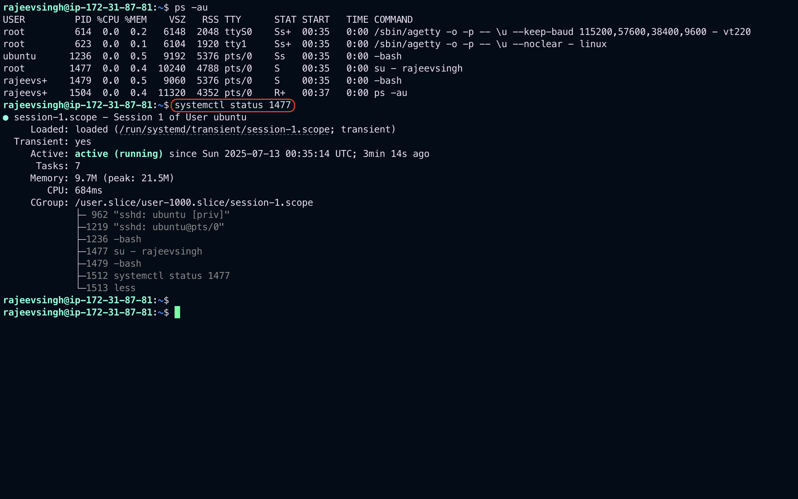

# Linux Service Management

## 1. What is Service Management?

Service management refers to the process of controlling system services (daemons) such as starting, stopping, enabling, disabling, and checking their status. It ensures that essential services are running as expected.

Linux uses different service managers like:

- `systemd` (`systemctl` command) — modern and widely used.
- `SysVinit` (`service` command) — older and still used in some distributions.

---

## 2. Checking Service Status

### Command:

```bash
systemctl status <service-name>
```

### Example:

```bash
systemctl status sshd
```

This displays the current status of the SSH daemon, including whether it's active, enabled at boot, and recent logs.

```bash
ps -au
systemctl status 1477
```

`Output should be like`


---

## 3. Start / Stop / Restart / Reload Services

### Commands:

```bash
# Start a service
sudo systemctl start <service-name>

# Stop a service
sudo systemctl stop <service-name>

# Restart a service
sudo systemctl restart <service-name>

# Reload configuration without restarting
sudo systemctl reload <service-name>
```

### Example:

```bash
sudo systemctl restart apache2
```

---

## 4. Enable / Disable Services at Boot

### Commands:

```bash
# Enable service at boot
sudo systemctl enable <service-name>

# Disable service at boot
sudo systemctl disable <service-name>

# Check if enabled
systemctl is-enabled <service-name>
```

### Example:

```bash
sudo systemctl enable nginx
```

---

## 5. Checking Service Logs

### Command:

```bash
journalctl -u <service-name>
```

```bash
journalctl -u 1477
```


### Example:

```bash
journalctl -u docker
```

You can add `-f` to follow the logs in real time:

```bash
journalctl -u docker -f
```

---

## 6. Creating a New Service

You can create a custom systemd service by creating a `.service` file in `/etc/systemd/system/`.

### Example: Create a custom service to run a Python script

1. **Create the script**

```bash
nano /opt/myscript.py
```

```python
#!/usr/bin/env python3
print("Service is running")
```

2. **Make it executable**

```bash
chmod +x /opt/myscript.py
```

3. **Create the service file**

```bash
sudo nano /etc/systemd/system/myscript.service
```

```ini
[Unit]
Description=My Custom Python Script Service
After=network.target

[Service]
ExecStart=/usr/bin/python3 /opt/myscript.py
Restart=always
User=root

[Install]
WantedBy=multi-user.target
```

4. **Enable and Start the Service**

```bash
sudo systemctl daemon-reload
sudo systemctl enable myscript.service
sudo systemctl start myscript.service
```

5. **Check Status and Logs**

```bash
systemctl status myscript.service
journalctl -u myscript.service
```

---

## Summary of Common Commands

| Action             | Command Syntax                     |
| ------------------ | ---------------------------------- |
| Check status       | `systemctl status <service>`       |
| Start service      | `systemctl start <service>`        |
| Stop service       | `systemctl stop <service>`         |
| Restart service    | `systemctl restart <service>`      |
| Reload config      | `systemctl reload <service>`       |
| Enable on boot     | `systemctl enable <service>`       |
| Disable on boot    | `systemctl disable <service>`      |
| View logs          | `journalctl -u <service>`          |
| Create new service | Add file to `/etc/systemd/system/` |

---

## Note:

- Use `sudo` for system-wide operations.
- Always reload systemd with `systemctl daemon-reload` after adding or modifying service files.
