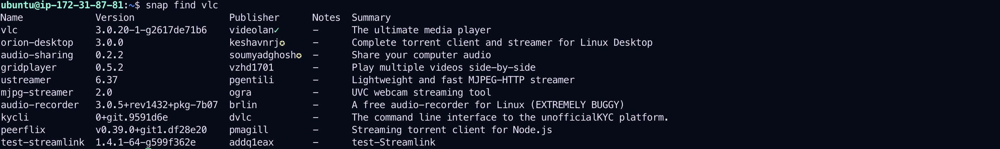

# Package Management in Linux

Package management is essential in Linux for installing, upgrading, and removing software packages. Different Linux distributions use different package managers (e.g., APT for Debian-based, YUM/DNF for RedHat-based, Zypper for SUSE, etc.). This document explains the basic concepts of package management with examples, including Snap.

---

## 1. Installing Packages

### APT (Debian, Ubuntu)

```bash
sudo apt update
sudo apt install package_name
```

### YUM (CentOS 7)

```bash
sudo yum install package_name
```

### DNF (CentOS 8, Fedora)

```bash
sudo dnf install package_name
```

### Zypper (openSUSE)

```bash
sudo zypper install package_name
```

## 2. Removing Packages

### APT

```bash
sudo apt remove package_name
sudo apt purge package_name   # Also removes config files
```

### YUM/DNF

```bash
sudo yum remove package_name
sudo dnf remove package_name
```

### Zypper

```bash
sudo zypper remove package_name
```

## 3. Upgrading Packages

### APT

```bash
sudo apt update
sudo apt upgrade
```

### YUM/DNF

```bash
sudo yum update
sudo dnf upgrade
```

### Zypper

```bash
sudo zypper update
```

## 4. Finding and Installing Packages

### APT

```bash
apt search package_name
sudo apt install package_name
```

### YUM/DNF

```bash
yum search package_name
dnf search package_name
```

### Zypper

```bash
zypper search package_name
```

## 5. Listing Installed Packages

### APT

```bash
dpkg --list
# display a list of all installed packages using the dpkg package manager.
```


### YUM/DNF

```bash
yum list installed
dnf list installed
```

### Zypper

```bash
zypper se --installed-only
```

## 6. Package Repositories

Package repositories are servers storing packages. Configuration files for repositories are found in:

- APT: `/etc/apt/sources.list`, `/etc/apt/sources.list.d/`
- YUM/DNF: `/etc/yum.repos.d/`
- Zypper: `/etc/zypp/repos.d/`

To add a repository (example APT):

```bash
sudo add-apt-repository ppa:repository_name
sudo apt update
```

## 7. Snap Packages

Snap is a universal Linux packaging system developed by Canonical. Snaps work across distributions and include all dependencies.

### Installing Snap (if not pre-installed)

```bash
sudo apt update
sudo apt install snapd
```

### Using Snap

```bash
snap find package_name
sudo snap install package_name
snap list
sudo snap remove package_name
```

### Example

```bash
snap find vlc
sudo snap install vlc
snap list
sudo snap remove vlc
```

## 

## Conclusion

Package managers simplify the process of managing software on Linux. Snap provides a modern and distribution-independent alternative, making software installation easier across different systems.
