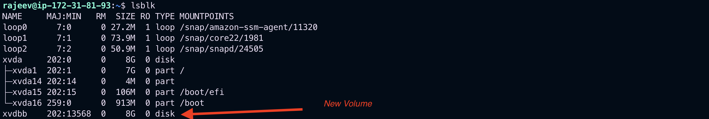
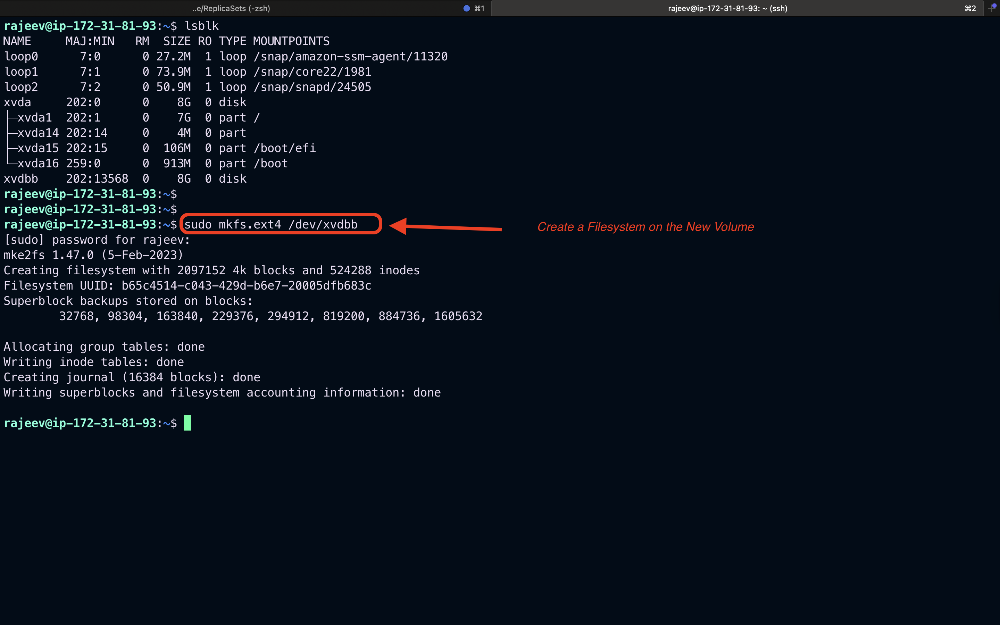
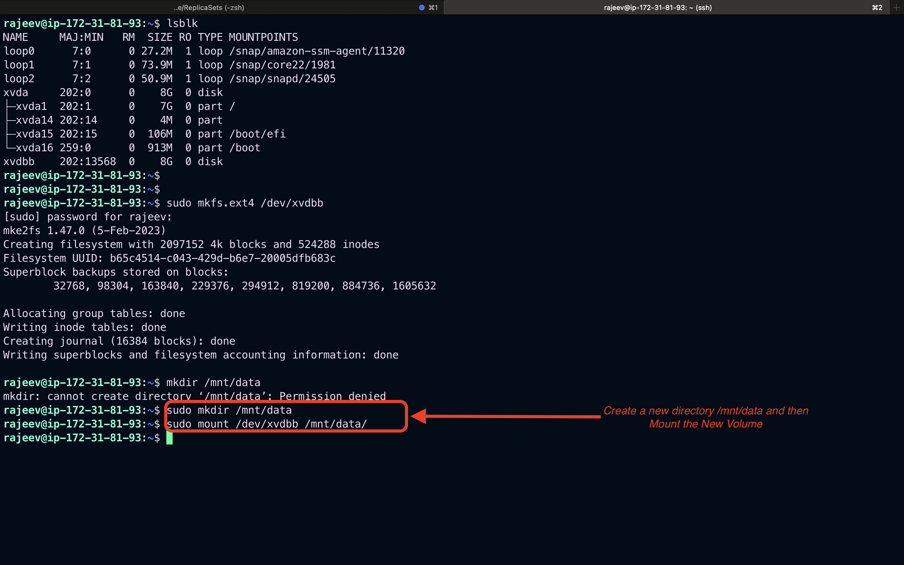
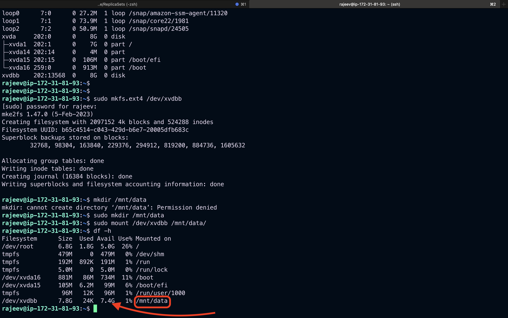
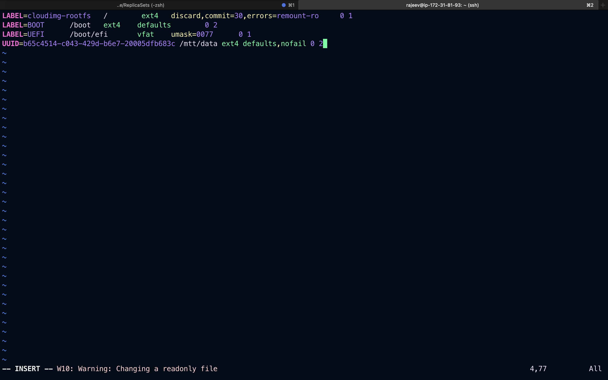
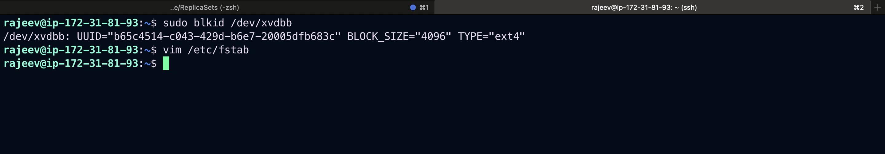

# Disks, Filesystems, Inodes, and Mounts (with AWS Examples)

## 1. Disks

A disk refers to a block storage device that stores data persistently. In Linux and cloud environments like AWS, disks are represented as devices such as `/dev/xvda`, `/dev/nvme1n1`, etc.

### In AWS:

- **EBS (Elastic Block Store)**: AWS provides persistent block storage for EC2 instances.
  - Example: When launching an EC2 instance, you can attach an EBS volume.
  - To list disks: `lsblk`

### Example:

```bash
# Check available disks
lsblk
```

Output:

```
NAME     MAJ:MIN RM  SIZE RO TYPE MOUNTPOINTS
loop0      7:0    0 27.2M  1 loop /snap/amazon-ssm-agent/11320
loop1      7:1    0 73.9M  1 loop /snap/core22/1981
loop2      7:2    0 50.9M  1 loop /snap/snapd/24505
xvda     202:0    0    8G  0 disk
├─xvda1  202:1    0    7G  0 part /
├─xvda14 202:14   0    4M  0 part
├─xvda15 202:15   0  106M  0 part /boot/efi
└─xvda16 259:0    0  913M  0 part /boot
```

## ✅ Add and Attach a New Volume in AWS EC2

- Step 1: Create a New EBS Volume

  1.  Go to the EC2 Dashboard → Volumes → Create Volume.

  2.  Select:

      - Size (e.g., 10 GiB)

      - Availability Zone (must match your instance’s AZ, e.g., us-east-1a)

      - Volume type (e.g., gp3)

  3.  Click Create Volume.

## Step 2: Attach the Volume to Your EC2 Instance

          1. In the Volumes page, select the new volume.

           2. Click Actions → Attach Volume.

           3. Choose your Instance ID.

           4. Device name: use something like /dev/xvdf (Linux will likely map it as /dev/nvme1n1 or /dev/xvdf).

           5. Click Attach.

## Step 3: SSH into Your Instance and Identify the Volume

```bash
lsblk
```



## Step 4: Create a Filesystem on the New Volume\

(only if it's a fresh volume)
For `ext4`:

```bash
sudo mkfs.ext4 /dev/xvdbb

```



## Step 5: Mount the New Volume

Create a mount point:

```bash
sudo mkdir /mnt/data
sudo mount /dev/xvdf /mnt/data

```


Check:

```bash
df -h
```



## ✅ Optional: Auto-mount on Reboot

### 1. Get the UUID:

```bash
sudo blkid /dev/xvdbb
/dev/xvdbb: UUID="b65c4514-c043-429d-b6e7-20005dfb683c" BLOCK_SIZE="4096" TYPE="ext4"

```

### 2. Add this line to /etc/fstab

```bash
UUID=b65c4514-c043-429d-b6e7-20005dfb683c /mtt/data ext4 defaults,nofail 0 2
```




## 2. Filesystems

A filesystem organizes data and provides metadata (permissions, timestamps, etc.) to the OS. Common Linux filesystems include `ext4`, `xfs`, and `btrfs`.

### Create and format a filesystem:

```bash
# Create a new 10GB EBS volume and attach to instance (e.g., /dev/xvdf)
# Format with ext4
sudo mkfs.ext4 /dev/xvdf
```

### Check filesystem type:

```bash
sudo file -s /dev/xvdf
```

Output:

```
/dev/xvdf: Linux rev 1.0 ext4 filesystem data
```

## 3. Inodes

Each file or directory is represented by an inode. An inode stores metadata like:

- Owner
- Permissions
- Timestamps
- Data block locations

But it **does not** store the file name (names are stored in directories).

### Check inode usage:

```bash
df -i
Filesystem     Inodes IUsed  IFree IUse% Mounted on
/dev/root      917504 81405 836099    9% /
tmpfs          122544     2 122542    1% /dev/shm
tmpfs          819200   624 818576    1% /run
tmpfs          122544     3 122541    1% /run/lock
/dev/xvda16     58496   601  57895    2% /boot
/dev/xvda15         0     0      0     - /boot/efi
/dev/xvdbb     524288    11 524277    1% /mnt/data
tmpfs           24508    32  24476    1% /run/user/1000
```

### Show inode details of a file:

```bash
ls -i file.txt

```

Output:

```
262486 file.txt
```

## 4. Mounts

Mounting is the process of making a filesystem accessible at a certain point in the directory tree.

### Example:

```bash
# Mount /dev/xvdf to /mnt/data
sudo mkdir /mnt/data
sudo mount /dev/xvdf /mnt/data
```

### Persist mount in fstab:

```bash
# Add to /etc/fstab to mount at boot
/dev/xvdf /mnt/data ext4 defaults,nofail 0 2
```

### Verify mount:

```bash
mount | grep xvdf
```

## AWS Example Workflow:

1. Launch an EC2 instance.
2. Create and attach a new EBS volume.
3. Format the volume:

```bash
sudo mkfs.ext4 /dev/xvdf
```

4. Mount the volume:

```bash
sudo mkdir /mnt/data
sudo mount /dev/xvdf /mnt/data
```

5. Make it persistent:

```bash
echo '/dev/xvdf /mnt/data ext4 defaults,nofail 0 2' | sudo tee -a /etc/fstab
```

---

## Useful Commands Cheat Sheet

| Command                     | Description              |
| --------------------------- | ------------------------ |
| `lsblk`                     | List block devices       |
| `mkfs.ext4 /dev/xvdf`       | Format disk with ext4    |
| `mount /dev/xvdf /mnt/data` | Mount disk               |
| `df -h`                     | Disk space usage         |
| `df -i`                     | Inode usage              |
| `ls -i filename`            | Show inode number        |
| `mount`                     | Show mounted filesystems |
| `cat /etc/fstab`            | Show persistent mounts   |

---

## Conclusion

Disks, filesystems, inodes, and mounts are foundational components in Linux and AWS. Understanding them is critical for managing storage in EC2 instances effectively.

Always ensure:

- Filesystems are correctly created.
- Mount points are secured and persistent.
- Inode and disk space usage are monitored for production systems.
