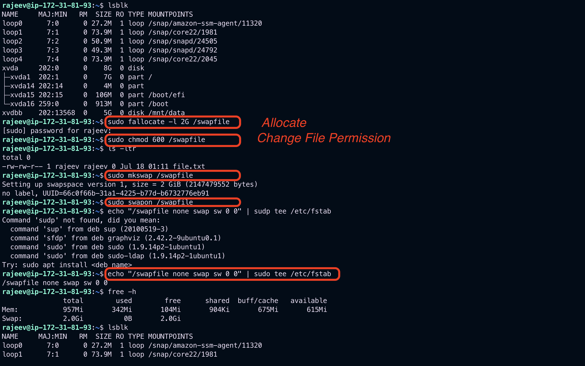
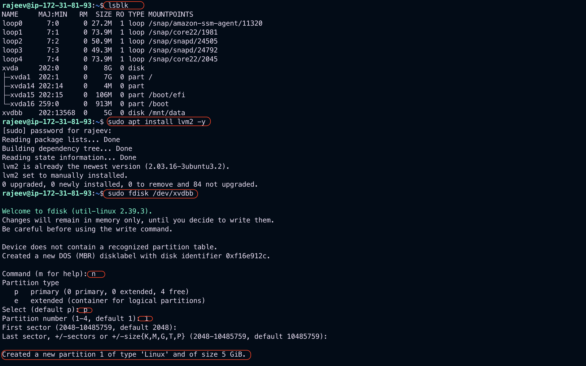
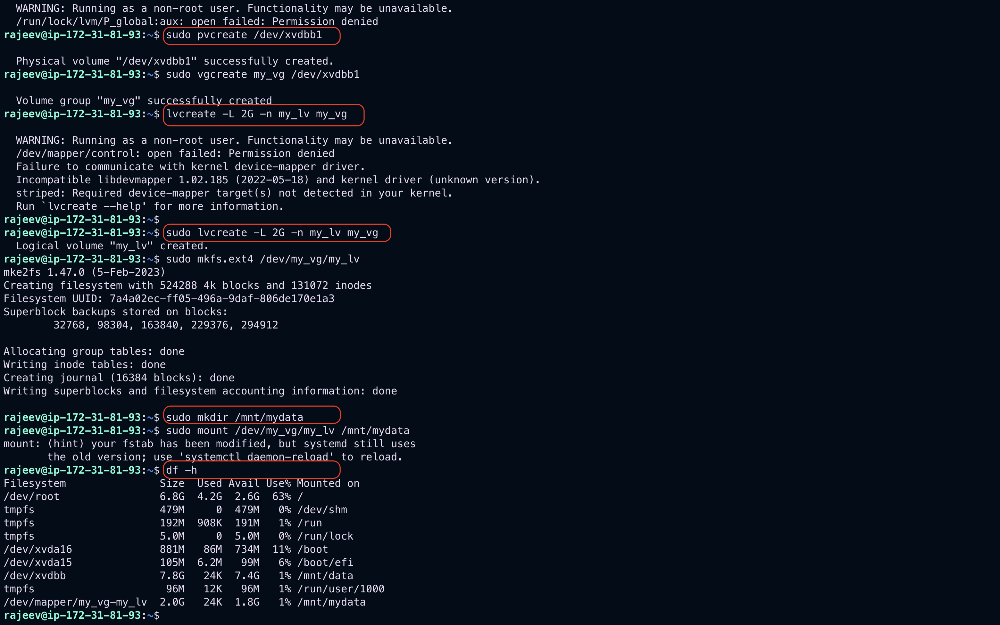

# Adding Disks, Swap, and LVM on AWS EC2 (Linux)

This guide explains how to add disks, configure swap, and set up LVM (Logical Volume Manager) on an AWS EC2 instance. We'll use a new EBS volume for practice.

## Prerequisites

- AWS EC2 instance (Amazon Linux 2 or Ubuntu)
- IAM role or user with permission to create and attach EBS volumes

---

## 1. Add a New Disk to EC2 Instance

### Step 1: Create and Attach EBS Volume

1. Go to AWS Console > EC2 > Volumes.
2. Click **Create Volume**:
   - Size: e.g., 5 GiB
   - Availability Zone: Same as your EC2 instance
3. After creation, click **Actions > Attach Volume**:
   - Select your instance

AWS typically attaches it as `/dev/xvdf` or `/dev/nvme1n1`.

### Step 2: Verify the Disk

```bash
lsblk
```

`Output`:

```bash
rajeev@ip-172-31-81-93:~$ lsblk
NAME     MAJ:MIN   RM  SIZE RO TYPE MOUNTPOINTS
loop0      7:0      0 27.2M  1 loop /snap/amazon-ssm-agent/11320
loop1      7:1      0 73.9M  1 loop /snap/core22/1981
loop2      7:2      0 50.9M  1 loop /snap/snapd/24505
loop3      7:3      0 49.3M  1 loop /snap/snapd/24792
loop4      7:4      0 73.9M  1 loop /snap/core22/2045
xvda     202:0      0    8G  0 disk
├─xvda1  202:1      0    7G  0 part /
├─xvda14 202:14     0    4M  0 part
├─xvda15 202:15     0  106M  0 part /boot/efi
└─xvda16 259:0      0  913M  0 part /boot
xvdbb    202:13568  0    5G  0 disk /mnt/data             # Newly added EBS
```

Look for a new disk like `/dev/xvdf` or `/dev/nvme1n1`.

---

## 2. Create a Swap Partition

> Swap is used as virtual memory when RAM is full.

### Step 1: Create a Swap File

```bash
sudo fallocate -l 2G /swapfile
sudo chmod 600 /swapfile
sudo mkswap /swapfile
sudo swapon /swapfile
```

### Step 2: Make it Persistent

```bash
echo '/swapfile none swap sw 0 0' | sudo tee -a /etc/fstab
```



### Verify Swap

```bash
free -h
```

`Output`:

```bash
rajeev@ip-172-31-81-93:~$ free -h
               total        used        free      shared  buff/cache   available
Mem:           957Mi       366Mi        79Mi       912Ki       676Mi       591Mi
Swap:          2.0Gi          0B       2.0Gi
```

---

## 3. Set Up LVM on a New Disk

### Step 1: Install LVM (if not installed)

```bash
# Amazon Linux
sudo yum install lvm2 -y

# Ubuntu
sudo apt install lvm2 -y
```

### Step 2: Prepare the Disk

Assume `/dev/xvdf` is the attached disk.

```bash
sudo fdisk /dev/xvdf
# Follow prompts to create a new partition (type `8e` for LVM)
```

## ✅ Step-by-Step fdisk Instructions:

At the Command (m for help): prompt, enter the following:

### 1. Create a new partition:

```bash
n
```

- Choose primary partition: p

- Partition number: 1 (default)

- First sector: press Enter (default)

- Last sector: press Enter (use full disk)

### 2. Change partition type to LVM:

```bash
t
```

- It will ask for the hex code. Enter:

```bash
8e
```

### 3. Write changes and exit:

```bash
w
```

This writes the partition table to the disk. You’ll now have a new partition like /dev/xvdbb1.

## 🔍 Verify the partition:

```bash
lsblk
```

## Now you can proceed to:

- pvcreate /dev/xvdbb1

- vgcreate my_vg /dev/xvdbb1

- lvcreate -L 2G -n my_lv my_vg
- Format and mount as shown in the Markdown file earlier.

## successfully completed above steps:

## ✅ Now continue with the following steps:

1. Format the Logical Volume

```bash
sudo mkfs.ext4 /dev/my_vg/my_lv

```

2. Create a Mount Point

```bash
sudo mkdir /mnt/mydata

```

3. Mount the Logical Volume

```bash
sudo mount /dev/my_vg/my_lv /mnt/mydata

```

4. Verify Mount

```bash
df -h

```

5. Make the Mount Persistent (on reboot)

```bash
sudo blkid /dev/my_vg/my_lv

```

You'll see something like:

```bash
/dev/my_vg/my_lv: UUID="abcd-1234" TYPE="ext4"

```

Then add this to `/etc/fstab`:

```bash
echo 'UUID=abcd-1234 /mnt/mydata ext4 defaults 0 2' | sudo tee -a /etc/fstab

```

> Replace abcd-1234 with your actual UUID.
> Or use device path directly (not preferred):

```bash
echo '/dev/my_vg/my_lv /mnt/mydata ext4 defaults 0 2' | sudo tee -a /etc/fstab

```

6. Test it works
   Unmount and test remounting from fstab:

```bash
sudo umount /mnt/mydata
sudo mount -a

```


Reboot or re-scan:

```bash
sudo partprobe
```

### Step 3: Create Physical Volume (PV)

```bash
sudo pvcreate /dev/xvdf1
```

### Step 4: Create Volume Group (VG)

```bash
sudo vgcreate my_vg /dev/xvdf1
```

### Step 5: Create Logical Volume (LV)

```bash
sudo lvcreate -L 2G -n my_lv my_vg
```

### Step 6: Format and Mount

```bash
sudo mkfs.ext4 /dev/my_vg/my_lv
sudo mkdir /mnt/mydata
sudo mount /dev/my_vg/my_lv /mnt/mydata
```



### Step 7: Make it Persistent

Add to `/etc/fstab`:

```bash
echo '/dev/my_vg/my_lv /mnt/mydata ext4 defaults 0 2' | sudo tee -a /etc/fstab
```

---

## 4. Useful Commands

```bash
lsblk        # List block devices
vgs          # Show volume groups
lvs          # Show logical volumes
pvs          # Show physical volumes
df -h        # Show mounted filesystems
```

---

## Cleanup

To delete the LVM and volume safely:

```bash
sudo umount /mnt/mydata
sudo lvremove /dev/my_vg/my_lv
sudo vgremove my_vg
sudo pvremove /dev/xvdf1
```

## Notes

- Always unmount and remove from `/etc/fstab` before deleting disks.
- Back up data before disk operations.

---

Happy practicing DevOps with AWS and Linux!
