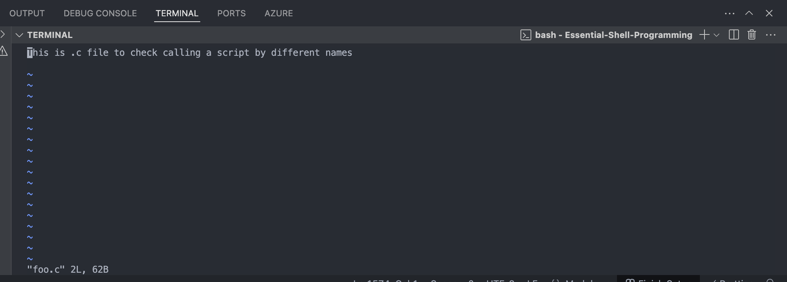
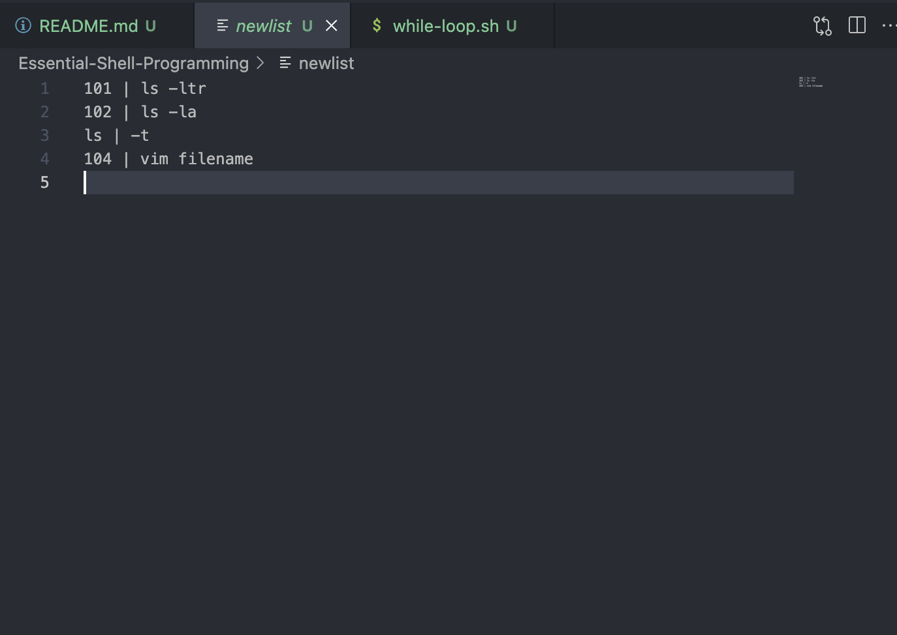
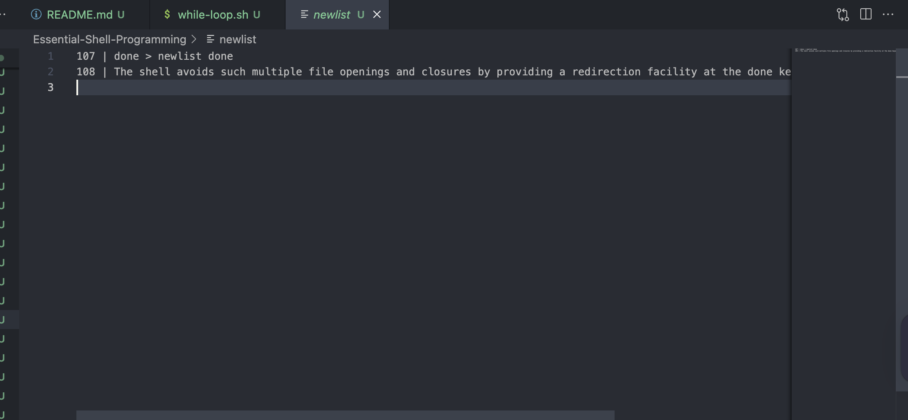
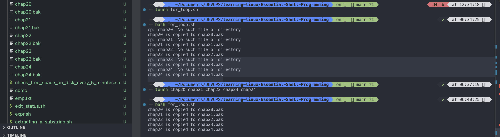
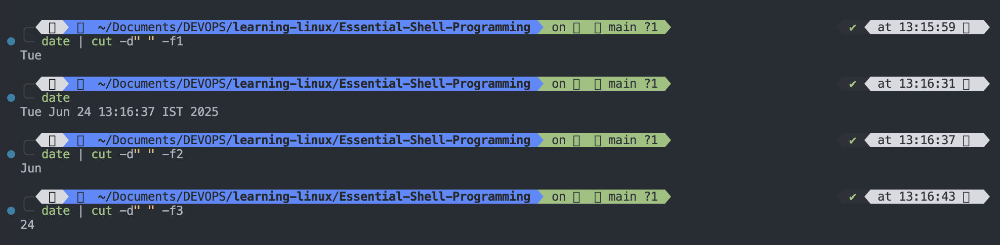

# Essential Shell Programming

- A shell program runs in **_interpretive_** mode. It is not compiled into a separate executable file as a C program is. Each statement is loaded into memory when it is to be executed. Shell scripts consequently run slower than those written in high-level language.

## SHELL SCRIPTS

- When a group of commands have to be executed regularly, they should be stored in a file, and the file itself executed as a **shell scripts** or **shell program**. Though it's not mandatory, we normally use the `.sh` extension for shell scripts. This makes easy them to match them with wild cards.
- Shell scripts are executed in separate child process, and this sub-shell need not be of the same type as your login shell. In other words, even if your login shell is Bourne, you can use Korn sub-shell to run your script. By default child and parent shells belongs to the same type, but you can provide a special **_interpreter line_** in the first line of the script to specify a different shell for your script.

> `Tip`: Generally Bourne shell scripts run without problem in the Korn and Bash shells. There are two issues in Bash, however. First Bash evaluates `$0` differntly. This has to be handled by appropriate code in the script. Second, it doesn't recognize escape sequence used by `echo` (like `\c` and `\n`) unless the `-e` option used. To make `echo` behave in the normal manner, place the statement `shopt -s xpg_echo` in your rc file(probably, ~/ .bashrc).

- Use your vi editor to create the shell script, `script.sh`

```vi
#!/bin/sh
# script.sh: Sample shell script
echo "Today's date: `date`"
echo "This month calendar"
cal `date "+%m 20%y" `
echo "My shell: $SHELL"
```

### Explanation (Line-by-Line):

### 1. #!/bin/sh

- This is called a shebang.
- It tells the system to use the sh shell (Bourne shell or its compatible shell) to interpret the script.
- It must be the very first line in the script.

### 2. # script.sh: Sample shell script

- This is a comment.
- Lines starting with # (except the shebang) are not executed. They're just notes or documentation for humans reading the code.

### 3. echo "Today's date: \date`"`

- echo prints a message to the terminal.

- `date` (backticks) executes the date command inside the quotes, and its output replaces the backtick section.
  - `date` prints the current date and time.

### 4. echo "This month calendar"

- Prints the text "This month calendar" to the screen. No commands here, just a label or message.

### cal \date "+%m 20%y"``

- This shows the calendar for the current month and year.

  - date "+%m 20%y": Formats the current date to get:

    - %m → current month (e.g., 06)

    - 20%y → full year (e.g., 2025 if %y = 25)

    - So, this would output: 06 2025

  - cal 06 2025 → displays the calendar for June 2025

- Backticks execute the date command and pass its result as arguments to cal.

### 6. echo "My shell: $SHELL"

- Prints the current user's default shell from the $SHELL environment variable.

✅ Summary Output Example:

```bash
Today's date: Sat Jun 14 07:00:00 IST 2025
This month calendar
     June 2025
Su Mo Tu We Th Fr Sa
 1  2  3  4  5  6  7
 8  9 10 11 12 13 14
15 16 17 18 19 20 21
22 23 24 25 26 27 28
29 30
My shell: /bin/zsh


```

---

- TO run the script, make it executable first and then invoke the script name.

```bash
chmod +x script.sh
script.sh # Path must include the . or else use ./script.sh
```

`O/P`

```bash
bash script.sh
Today's date: Sat Jun 14 08:16:11 IST 2025
This month calendar:
     June 2025
Su Mo Tu We Th Fr Sa
 1  2  3  4  5  6  7
 8  9 10 11 12 13 14
15 16 17 18 19 20 21
22 23 24 25 26 27 28
29 30

My shell: /bin/zsh
```

```bash
./script.sh
Today's date: Sat Jun 14 08:17:26 IST 2025
This month calendar:
     June 2025
Su Mo Tu We Th Fr Sa
 1  2  3  4  5  6  7
 8  9 10 11 12 13 14
15 16 17 18 19 20 21
22 23 24 25 26 27 28
29 30

My shell: /bin/zsh
```

---

- The script is too simple to need any explanation--no inputs, no command line arguments and no control structure. We'll be progressively adding these features to our future scripts.
- We mention that the shell scripts are executed by child shell. Actually the child shell reads and execute each statement in sequence( in iterpretive mode). You can also **_explicitly_** spawn a child of your choice with the scipt name as argument:

```bash
sh script.sh
```

`O/P`

```bash
sh script.sh
Today's date: Sat Jun 14 08:22:53 IST 2025
This month calendar:
     June 2025
Su Mo Tu We Th Fr Sa
 1  2  3  4  5  6  7
 8  9 10 11 12 13 14
15 16 17 18 19 20 21
22 23 24 25 26 27 28
29 30

My shell: /bin/zsh
```

- When used in this way, the Bourne sub-shell open the file but ignores the interpreter line. The script doesn't need to have execute permission either.

> `TIP`: The pathname of the shell specified in the interpreter line may not match the actual pathname on your system. This sometimes happens with downloaded scripts. To prevent these scripts from breaking. make a symbilic link between the two locations. Note that root access is required to make a symbolic line between `/bin/ksh` and `/usr/bin/ksh`.

---

## read: MAKING SCRIPTS INTERACTIVE

- The `read` statement is the shell internal tool for making input from the user, i.e., making script interactive. It is used with one or more variables. Input supplied through the standard input is read into these variables. When you use a statement like:

```bash
read name
```

the script pauses at the time to take input from the keyboard. Whatever you enter is stored in the variable name. Since this is a form of assignment, no `$` is used before **name**. Below script, uses `read` to take search string and filename from the terminal.

```bash
#! /bin/bash
# read_statement.sh: Interactive version -- uses read to take two inputs
echo "Enter the pattern to be searched: \c"
read pname
echo "Enter the file to be used: \c "
read flname
echo "Searching for $pname from file $flname "
grep "$pname" $flname
echo "Selected record shown above"

```

`O/P`

```bash
ls -ltr
total 40
-rwxr-xr-x@ 1 rajeevsingh  staff   170 Jun 14 08:13 script.sh
-rw-r--r--@ 1 rajeevsingh  staff  6047 Jun 14 08:41 README.md
-rw-r--r--@ 1 rajeevsingh  staff   232 Jun 14 08:43 emp.txt
-rw-r--r--@ 1 rajeevsingh  staff   281 Jun 14 08:47 read_statement.sh


sh read_statement.sh
Enter the pattern to be searched: Rajeev
Enter the file to be used: emp.txt
Searching for Rajeev from file emp.txt
1007,Rajeev Singh,DevOps Engineer,IT
Selected records shown above
```

---

- The scripts first ask for pattern to be entered. Input the string Rajeev, which is assign to the variable `pname`. Next, the script asks for the filename; enter the string `emp.txt`, which is assign to the variable `flname`. `grep` then runs with these two variables as arguments.
- A single `read` statement can be used with one or more variables to let you enter multiple arguments:

```bash
read pname flname
```

If the number of arguments supplied is less than the number of variables accepting them, any leftover variables will simply remain unassigned. However, when the number of arguments exceeds the number of variables, the remaining words are assigned to the last variable.

---

## USING COMMAND LINE ARGUMENTS

- Like UNIX commands ( which are written in C), shell script also accept arguments from the command line. They can therefor, run noninteractively and be used with **_redirection_** and **_pipelines_**. When arguments are specified with a shell script, they are assign to certain special "variables"-- rather **positional parameters**.
- The first argument is read by the shell in into the parameter `$1`, the second argument into `$2`, and so on. You can't technically call them shell variables because all variable names start with a latter. In addition to these positional parameter, there are a few other special parameters used by the shell.
  Their significance is noted below.
  - `$*`: It store the complete set of positional parameters as a single string.
  - `$#`: It is set to the number arguments specified. This lets you design scripts that check whether the right number of arguments have been entered.
  - `$0`: Holds the command name itself. You can link a shell script to be invoked by more than one script arguments, Rajeev and emp.txt
- The next script, positional_parameters.sh, runs `grep` with two positional parameters that are set by the script arguments, Rajeev and emp.txt

```bash
#! /bin/bash
# positional_parameters.sh: Non- Interactive Version -- uses command line arguments
echo "program: $0
The number of arguments specified is $#
The arguments are $*"
grep "$1" $2
echo "\nJob Over"

# $0 contains the program name
# All arguments stored in $*
```

`O/P`

```bash

sh positional_parameters.sh Rajeev emp.txt
Program: positional_parameters.sh # $0 hold the program name
The number of arguments specified is 2 # $# It set to the number of argument specified,THis lets you check whether the right number of argument is entered.
The arguments are Rajeev emp.txt # $* It stores complete set of positional parameter.
1007,Rajeev Singh,DevOps Engineer,IT

Job Over
```

- When arguments are specified in this way, the first word( the command itself) is assigned to `$0`, the second word (The first argument) to `$1`, and the third word ( the second argument) to $2. You can use more positional parameters in this way up to `$9` ( and using the `shift` statement, you can go beyond).
- When you use multiword string to represent a single command line argument, you must quote it. To look for rajeev singh, use **positional_parameter.sh "rajeev singh" emp.txt**. You have noted this quoting requirement when using `grep` also.

> > Bash Shell: `$0` in Bash depends the ./ prefix to the script name. In the example above, it would have shown **./positional_parameter.sh** instead of **positional_parameter.sh**. You need to keep this in mind when you make use of `$0` to develop portable scripts.

## Special Parameters Used By the shell

| **Shell Parameter** |                             **Significance**                              |
| :-----------------: | :-----------------------------------------------------------------------: |
|     $1, $2, ...     |          Positional Parameters reprenting command line arguments          |
|         $#          |               Number of arguments specified in command line               |
|         $0          |                       Name of the executed command                        |
|         $\*         |         Complete set of positional parameters as a single string          |
|        "$@"         | Each quoted string treated as a separate argument( recommended over $\* ) |
|         $?          |                        Exit status of last command                        |
|         $$          |                           PID of current shell                            |
|         $!          |                      PID of the last background jon                       |

---

## exit AND EXIT STATUS OF THE COMMAND

- C program and shell scripts have a lot in common, and one of them is that they both use the same command ( or function in C ) to terminate a program. It has the name `exit` in the shell and exit() in C.
- `exit` command is generally run with a numeric value.

```bash
exit 0
exit 1
```

- These are two very common `exit` values. You don't need to place this statement at the end of every shell script because the shell understands when exit execution is complete. Rather, it's quite often used with a command when it fails.
- Once `grep` couldn't locate a pattern; we said then that the command failed. What we meant was that `exit` function in `grep` code was invoked with a nonzero argument ( **exit(1)**). This value (1) is communicated to the calling program, usually the shell.
- It's through the exit command or function that every command returns an `exit status` to the caller. Further, a command is said to return a **_true_** exit status if it executes successfully, and **_false_** if it fails. The `cat` used below

```bash
cat rajeev.txt

```

`O/P`

```bash
cat: can't open rajeev.txt
```

returns a nonzero exit status becuase it couldn't open the file. The shell offers a variable ( `$?` ) and a command ( `test` ) that evaluates a command's exit status.

- The parameter `$?`: The parameter `$?` store the exit status of the last command. It has a value `0` if the command is succeds and a nonzero value it it fails. This parameter is set by `exit`'s argument. If no `exit` is specified, the `$?` is set to zero ( true ).
- Try using `grep` in these way and you will see it returning three different `exit` values:

```bash

grep Rajeev emp.txt >/dev/null; echo $?
grep Manager emp.txt >/dev/nul; echo $?
grep Rajeev emp1.txt >/dev/nul; echo $?
```

`O/P`

```bahs
sh exit_status.sh
0 # Success
1 # Failure in finding pattern
grep: emp1.txt: No such file or directory
2 # Failure in opening file
```

- The exit status is extremely important for programmers. They use it to devise program logic that branches into different paths depending on the success or failure of a command. For example there is no point in continuing with the script execution if an important file doesnit exit or can't be read.

> `Tip`: To find out whether a command executed successfully or not, simply use echo `$?` after the command. `0` indicates success, other values point to failure.

> > `Note`: Success or failure isn't intuitive as it may seem. The designer of `grep` interpreted `grep's` inability to locate a pattern as failure. The designer of `sed` thought otherwise. The command `sed -n '/manager/p'` emp.txt returns a true value even if manager is not found.

---

## THE LOGICAL OPERATORS && AND || CONDITIONAL EXECUTION

- The script emp.sh has no logic to prevent display of the message, selected lines shown above. When the pattern search fails. This is because we didn't use `grep`'sexit status to control the flow of the program. The shell provides two operators that allow conditional execution, the `&&` and `||`, which typically have this syntax.

```bash

cmd1 && cmd2
cmd1 || cmd2
```

- The `&&` delimits two commands; cmd2 is executed only when cmd1 succeds. You can use it with `grep` in this way:

```bash
grep "Rajeev" emp.lst && echo "Pattern found in file"
```

`O/P`

```bash
grep 'Rajeev' emp.txt  && echo 'pattern found in file'
1007,Rajeev Singh,DevOps Engineer,IT
pattern found in file
```

- The `||` operator plays inverse role; the second is executed only when the first fails. If you "grep" a pattern from a file without success, you can notify the failure:

```bash

grep "manager" emp.lst || echo "Pattern not found"
```

`O/P`

```bash
grep "manager" emp.txt || echo "Pattern not found"
Pattern not found

```

- The `||` goes pretty well with the `exit` command. You need to terminate a script when a command fails.

```bash

grep "Manager" emp.txt || echo "Pattern not found"
```

`O/P`

```bash

grep "Manager" emp.txt || echo "Pattern not found"
1001,John Smith,Manager,IT
1005,Sam Brown,Manager,HR
```

---

## THE `if` CONDITIONAL

- The `if` statements makes 2 way decisions depending on the fullfilment of a certain condition. In the shell, the statement uses the following forms, much like the one used in another languages:
  `Form 1`

```bash
if command is successfull
then
   execute commands
else
  execute commands
fi

```

`Form 2`

```bash
if command is successful
then
  execute commands
fi
```

`Form 3`

```bash

if command is successful
then
  execute commands
elif command is successful
then...
else...
fi
```

- As in BASIC, if also requires `then`. It evaluates the success or failure of the command that is specified in it's "command line". If **_command_** succeds, the sequence of commands following it is executed. If **_command_** fails, then the `else` statement (if present ) is executed. The statement is not always required, as shown in Form 2. Every `if` is closed with a correcsponding `fi`, and you will encounter an error if one is not present.

```bash
touch if-else.sh
```

```bash
#! /bin/bash
# if-else.sh: Using if and else
if grep "^$1" /etc/passwd 2>/dev/null
# search username at the beginning of line
then
  echo "Pattern found - Job Over"
else
  echo "Pattern not found"
```

🔍 Line-by-line Explanation

## #! /bin/bash

- This is the shebang.

- It tells the operating system to use the Bash shell to interpret this script.

## # if-else.sh: Using if and else

- This is a comment for documentation purposes.

- It describes what the script is about: demonstrating the use of if and else.

## if grep "^$1" /etc/passwd 2>/dev/null

### Breaking it down:

- grep "^$1" /etc/passwd: This searches for lines in /etc/passwd that start with the string passed as the first argument ($1) to the script.
  Explanation:

  - ^ — Anchors the search pattern to the beginning of the line.

- $1 — The first positional argument to the script (usually a username).

- /etc/passwd — This file stores information about user accounts on Linux systems (username, UID, home directory, etc).

- 2>/dev/null — Redirects error messages (stderr) to /dev/null, effectively suppressing them.
- Example

```bash

./if-else.sh rajeev
```

Searches for a line that starts with rajeev in /etc/passwd.

## then

- If the grep command finds a match (exit code 0), the code inside the then block is executed.

## echo "Pattern found - Job Over"

- This line is executed if the pattern was found.

- It confirms that the username (or pattern) was located in the file.

## else

- If the grep command doesn't find a match (exit code not 0), the else block is executed.

echo "Pattern not found"

- Prints a message indicating the pattern was not found in /etc/passwd.

## ✅ Summary

|        Component         |                          Purpose                          |
| :----------------------: | :-------------------------------------------------------: |
|           `$1`           |              Input username from commandline              |
| `grep "^$1" /etc/passwd` |     Check if that username exists in the passwd file      |
|      `2>/dev/null`       |           Suppress errors like "file not found"           |
|    `if...then...else`    | Executes different blocks based on grep’s success/failure |

## So, this line checks if the username exists at the beginning of any line in /etc/passwd.

---

## USING `test` AND `[]` TO EVALUATE EXPRESSIONS

- When you use `if` to evaluate expressions, you need to `test` statement because the true or false values returned by expressions can't be directly handled by `if`. `test` uses certain operators to evaluate the condition on its right and return either a true or false exit status, which is then used by `if` for making decisions.
- `test` works in three ways
  - Compare two numbers.
  - Compare two strings or a single one for a null value.
  - Checks a file's attributes.
- These test can be handled by `test` in association with the shell's other statements also, but for the present we'll stick with `if`. `test` doesn't display any output but simply sets the parameter `$?`.

### Numberic Comparision

- The numerical comparision used by `test` have a form different from what you would have seen anywhere. They always begins with a `-`(hyphen), followed by a two-letter string, and enclosed on either side by whitespace.

`-ne Not equal`

- The operators are quite mnemonic; `-eq` implies equal to, `-gt` implies greater than, and so on. Numeric comparision in the shell is confined to integer values only; decimal values are simply truncated.
- To illustrate how numeric test are performed, we will assign some values to three variables and numerically compare them:

```bash
x=5; y=7; z=7.2
test $x -eq $y ; echo $?
test $x -lt $y ; echo $?
test $z -eq $y | bc ; echo $?
test $z -gt $y | bc ; echo $?

# bc is a command-line calculator in UNIX/Linux that supports
#Floating-point arithmetic

#Comparisons

#Advanced math operations
```

## Use `bc` (Basic Calculator)

`bc` is a command-line calculator in Unix/Linux that supports:

- Floating-point arithmetic

- Comparisons

- Advanced math operations
  `O/P`

```bash
x=5; y=7; z=7.2
test $x -eq $y ; echo $?
test $x -lt $y ; echo $?
test $z -eq $y | bc ; echo $?
test $z -gt $y | bc ; echo $?
1
0
test: integer expression expected: 7.2
0
test: integer expression expected: 7.2
0

```

`Solution`

```bash
x=5; y=7; z=7.2
test $x -eq $y ; echo $?
test $x -lt $y ; echo $?
test $z = $y | bc ; echo $?
test $z > $y | bc ; echo $?
```

`O/P`

```bash
x=5; y=7; z=7.2
test $x -eq $y ; echo $?
test $x -lt $y ; echo $?
test $z = $y | bc ; echo $?
test $z > $y | bc ; echo $?
1
0
0
0
```

- The last 2 tests prove conclusively that numeric comparision is restricted to integers. Having used `test` as a standalone feature, you can now use it as `if`'s control command.

```bash
#! /bin/bash
# test-in-ifelse.sh: Using test, $0 and $# in an if-elif-if construct
#
if test $# -eq 0; then
  echo "Usage: $0 pattern file" >/dev/tty
elif test $# -eq 2 ; then
  grep "$1" $2 || echo "$1 not found in $2" >/dev/tty
else
  echo "You didn't entered two arguments">/dev/tty
fi
```

`O/P`

```bash
bash test-in-ifelse.sh rajeev emp.txt
rajeev not found in emp.txt

bash test-in-ifelse.sh Rajeev emp.txt
1007,Rajeev Singh,DevOps Engineer,IT

bash test-in-ifelse.sh manager emp.txt
manager not found in emp.txt

bash test-in-ifelse.sh Manager emp.txt
1001,John Smith,Manager,IT
1005,Sam Brown,Manager,HR

bash test-in-ifelse.sh
Usage: test-in-ifelse.sh pattern file

bash test-in-ifelse.sh Rajeev
You didn't entered two arguments

```

- Why did we redirect the `echo` output to `/dev/tty`? Simple, we want the script to work both with and without redirection. In either case, the output of the `echo` statements must appear only on the terminal. There arguments are used here as 'error' messages even though they are not directed to the standad error.
- The importance of `/dev/tty` as a mechanism of explicitly redirecting an output stream shows up in the example. You must appreciate this and use this feature in shell scripts when you like to have the redirection option open.

> `Tip`: An application may need to designd in a flexible manner to allow redirection of an entire script or it's participation in a pipeline. In that case, you need to ensure that messages meant to draw the attention to the user (mainluy from echo) are redirected to **>/dev/tty**.

## Numeric Comparision Operators Used by `test`

| Operators | Meaning                  |
| --------- | ------------------------ |
| `-eq `    | Equal to                 |
| `-ne`     | Not equal to             |
| `-gt `    | Greater than             |
| `-ge`     | Greater than or equal to |
| `-lt `    | Less than                |
| `-le`     | Less than or equal to    |

---

## Shorthand for `test`:

- `test` is widely used that fortunately there exist a shorthand method of executing it. A pair of rectangular brackets enclosing the expression can replace it. Thus the following two forms are equivalent:

```bash
test $x -eq $y
[ $x -eq $y ]

```

- Note that you must provide whitespace around the operators the [ and ]. The second form is easier to handle and will be used henceforth. But don't forget to be liberal in the whitespace.

> `Note`: It is a feature of most programming language that you can use a condition like `if (x)`, where x is a variable or expression. If x is greater than 0, the statement is said to be true. We can also apply the same logic here and use `if [ $x ]` as shorthand form of `if [ $x -gt 0 ]`.

---

## String Comparison

- `test` can be used to compare strings with yet another set of operators. Equality is performed with `=` and inequality with the C-type operator `!=`. Other `test` can be negated by the `!` too. Thus, `[ ! -z $string ]` negates `[ -z $string ]`.
- Our next script `string-comparision.sh` behaves both interactively and noninteractively. When run without arguments, it turns interactive and takes two inputs from you. It then run `test-in-ifelse.sh`, the script developed previously, with the supplied inputs as arguments. However when `string-comparison.sh` itself is run with atleast one argument, it runs `test-in-ifelse.sh` with the same arguments. In either case, `test-in-ifelse.sh` is run, which finally checks for the actual number of arguments entered before making a search with `grep`.
- When the script runs in the interactive mode, the check for a null string made with `[ -z $pname ]` as well as with the `[ ! -n "$flname" ]`, since they are really two different ways of saying the same thing. Note that `$*` in the noninteractive mode; this is the way you can use the same set of arguments to run another script.

```bash
#! /bin/bash
# string-comparision.sh : Check user input for null values - Finally runs test-ifelse.sh developed previously
#
if [ $# -eq 0 ] ; then
  echo "Enter the string to be searched: \c"
  read pname
  if [ -z "$pname" ] ; then # -z checks for a null string
    echo "You have not entered the string" ; exit 1
  fi
  echo "Enter the filename to be used: \c"
  read flname
  if [ ! -n "$flname" ] ; then # ! -n is the same as -z
    echo "You have not entered the filename" ; exit 2
  fi
  ./test-in-ifelse.sh "$pname" "$flname" # Runs the script that will do job
else
  ./test-in-ifelse.sh $* # We'll change $* to "$@" soon
fi
```

`O/P`

```bash
bash string-comparision.sh Rajeev emp.txt
1007,Rajeev Singh,DevOps Engineer,IT

bash string-comparision.sh
Enter the string to be searched: \c
John
Enter the filename to be used: \c
emp.txt
1001,John Smith,Manager,IT
1002,Alice Johnson,Developer,Engineering
1006,John Davis,Developer,IT

bash string-comparision.sh
Enter the string to be searched: \c
John
Enter the filename to be used: \c

You have not entered the filename


bash string-comparision.sh
Enter the string to be searched: \c

You have not entered the string


bash string-comparision.sh "Rajeev Singh" emp.txt
You didn't entered two arguments

```

- The last message could take you surprise as Rajeev Kumar should have been treated as a single argument by the script. Indeed it has been, but `$*` doesn't understand it as such; Rajeev and Singh are embeded in `$*` as separate arguments. `$#` thus makes a wrong argument count. The solution to this is simple: Replace `$*` in the script with `$@` (with qotes) and then run the script again.

```bash
if [ $# -eq 0 ] ; then
  echo "Enter the string to be searched: \c"
  read pname
  if [ -z "$pname" ] ; then # -z checks for a null string
    echo "You have not entered the string" ; exit 1
  fi
  echo "Enter the filename to be used: \c"
  read flname
  if [ ! -n "$flname" ] ; then # ! -n is the same as -z
    echo "You have not entered the filename" ; exit 2
  fi
  ./test-in-ifelse.sh "$pname" "$flname" # Runs the script that will do job
else
  ./test-in-ifelse.sh $* # We'll change $* to "$@" soon
fi

```

`O/P`

```bash
bash string-comparision1.sh "Rajeev Singh" emp.txt
1007,Rajeev Singh,DevOps Engineer,IT
```

> `Tip`: it is safer to use `"$@"` instead of `$*`. When you employ multiword string as arguments to a shell script, it is only `"$@"` that interpretes each quoted arguments as a separate argument. As the output above suggest, If you use `$*`, the shell makes a wrong count of the arguments.

- `test` also permits the checking of more than one condition in the same line, using the `-a` (AND) and `-o` (OR) operators. You can now simplify the earlier script to illustrate this feature. Accept both inputs in succession and then make the check with a compound if statement:

```bash
if [ -n "$pname" -a -n "$flname" ]; then
  test-in-ifelse.sh "$pname" "$flname"
else
  echo "At least one input was a null string" ; exit 1
fi

```

- The `test` output is true only if both variables are nonnull strings, i.e., the user enters some nonwhitespace characters when the script pauses twice.

> `Tip`: Observe that we have been quoting our variables wherever possible. Quoting is essential when you assign multiple words to a variable. To try that out, drop the quotes to use the statement `if [ -z $pname ]`. When you inputs two words, or even a null string to be assigned to pname, you'll often encounter an error . Quoting is safe with no adverse consequences.

---

| test     | True if                              |
| -------- | ------------------------------------ |
| s1 = s2  | Strings s1 = s2                      |
| s1 != s2 | String s1 is not equal to s2         |
| -n stg   | String stg is not a null string      |
| -z stg   | String stg is a null string          |
| stg      | String stg is assigned and not null  |
| s1 == s2 | String s1 = s2 ( Korn and Bash only) |

---

## File Tests

- `test` can be used to the variaus `file` attributes like it's type (file, directory or symbolic link) or it's permissions (read, write, execute, SUID, etc.). Both `perl` and the UNIX system call library also offer these facilities. Let's test some attributes of the file emp.txt at the prompt:

```sh
ls -l emp.txt
[ -f emp.txt ] ; echo $?
[ -x emp.txt ] ; echo $?
[ -w emp.txt ] ; echo $?
[ ! -w emp.txt ] ; echo $?; echo "False that file is not writable"
```

`O/P`

```bash
[ -f emp.txt ] ; echo $?  # An ordinary file
0                         # Yes


[ -x emp.txt ] ; echo $? # An Executable file
1                        # No

ls -lrt emp.txt
-rw-r--r--@ 1 rajeevsingh  staff  232 Jun 14 08:43 emp.txt

[ -w emp.txt ] ; echo $?
0

[ ! -w emp.txt ] ; echo $?; echo "False that file is not writable"
1
False that file is not writable

```

- The `!` negates a test, so `[ ! -w foo ]` negates `[ -w foo ]`. Using these features, you can design a script filetest.sh. that accepts a filename as argument and then perfoem a number of test on it. Test the script with two filenames---One that doesn't exit and one that does:

```bash
#! /bin/bash
# filetest.sh : Test file attributes
#
if [ ! -e $1 ] ; then # -e = "exists"
  echo "File does not exist"
elif [ ! -r $1 ] ; then # -r = readable
  echo "File is not readable"
elif [ ! -w $1 ] ; then      # -w = writable
  echo "File is not writable"
else
  echo "File is both writable and readable"
fi


```

`O/P`

```bash

bash filetest.sh emp.txt foo.txt
File is both writable and readable

bash filetest.sh  "foo.txt"
File does not exist

bash filetest.sh  "emp.txt"
File is both writable and readable

```

---

## File related Tests with `test`

|           |                                                         |
| --------- | ------------------------------------------------------- |
| -f file   | file exists and is a regular file                       |
| -r file   | file exists and readable                                |
| -w file   | file exists and writable                                |
| -x file   | file exists and executable                              |
| -d file   | file exists and is a directory                          |
| -s file   | file exists and has a size greater than zero            |
| -e file   | file exists (Korn and Bash only)                        |
| -u file   | file exists and has SUID bit set                        |
| -k file   | file exists and has sticky bit set                      |
| -L file   | file exists and is a symbolic link (Korn and Bash only) |
| f1 -nt f2 | f1 is newer than f2 (Korn and Bash only )               |
| f1 -ot f2 | f1 is older than f2 (Korn and Bash only )               |
| f1 -ef f2 | f1 is linked to f2 (Korn and Bash only )                |

---

## THE `case` CONDITIONAL

- The `case` statement is the second conditional offered by the shell. It doesn't have a parallel either in C (`switch` is similar) or `perl`. The statement matches an expression for more than one alternative, and uses a compact construct to permit multiway branching. `case` also handles string tests, but in a more efficient manner than `if`. The general syntax of `case` statement is as follow:

```bash
case expression in
  pattern 1 ) commands1 ;;
  pattern 2 ) commands2 ;;
  pattern 3 ) commands3 ;;
   .....
esac

```

```bash
#! /bin/bash
# menu.sh: Uses case to offer 5-items menu
#
echo "       MENU\n
1. List of files\n2. Processes of user\n3. Today's Date
4. Users of system\n5. Quit to UNIX\nEnter your option: \c"
read choice
case "$choice" in
  1) ls -l ;;
  2) ps -f ;;
  3) date ;;
  4) who ;;
  5) exit ;;
  *) echo "Invalid Option" # ;; not really required for the last option
esac
```

`O/P`

```bash
bash menu.sh
       MENU\n
1. List of files\n2. Processes of user\n3. Today's Date
4. Users of system\n5. Quit to UNIX\nEnter your option: \c
1
total 152
-rw-r--r--@ 1 rajeevsingh  staff      0 Jun 17 07:32 7
-rw-r--r--@ 1 rajeevsingh  staff    232 Jun 14 08:43 emp.txt
-rw-r--r--@ 1 rajeevsingh  staff    133 Jun 14 14:59 exit_status.sh
-rw-r--r--@ 1 rajeevsingh  staff    317 Jun 17 16:26 filetest.sh
-rw-r--r--@ 1 rajeevsingh  staff    201 Jun 17 06:51 if-else.sh
-rw-r--r--@ 1 rajeevsingh  staff    380 Jun 17 16:58 menu.sh
-rw-r--r--@ 1 rajeevsingh  staff    264 Jun 14 09:27 positional_parameters.sh
-rw-r--r--@ 1 rajeevsingh  staff    281 Jun 14 08:47 read_statement.sh
-rw-r--r--@ 1 rajeevsingh  staff  32407 Jun 17 16:52 README.md
-rwxr-xr-x@ 1 rajeevsingh  staff    170 Jun 14 08:13 script.sh
-rw-r--r--@ 1 rajeevsingh  staff    603 Jun 17 11:02 string-comparision.sh
-rw-r--r--@ 1 rajeevsingh  staff    504 Jun 17 12:13 string-comparision1.sh
-rwxrwxrwx@ 1 rajeevsingh  staff    288 Jun 17 07:45 test-in-ifelse.sh

```

```bash
bash menu.sh
       MENU\n
1. List of files\n2. Processes of user\n3. Today's Date
4. Users of system\n5. Quit to UNIX\nEnter your option: \c
2
  UID   PID  PPID   C STIME   TTY           TIME CMD
  501 48911 48910   0 Thu05PM ttys000    0:19.89 -zsh
  501 48922     1   0 Thu05PM ttys000    0:00.00 -zsh
  501 48955     1   0 Thu05PM ttys000    0:00.00 -zsh
  501 48956     1   0 Thu05PM ttys000    0:02.15 -zsh
  501 48958 48922   0 Thu05PM ttys000    0:06.79 /Users/rajeevsingh/.cache/gitstatus/gitstatusd-darwin-arm64 -G v1.5.4 -s -1 -u -1 -d -1 -c -1 -m -1 -v FATAL -t 16
  501 48619 48616   0 Thu05PM ttys002    0:29.71 -zsh
  501 48673     1   0 Thu05PM ttys002    0:00.00 -zsh
  501 48674     1   0 Thu05PM ttys002    0:02.19 -zsh
  501 48676     1   0 Thu05PM ttys002    0:00.00 -zsh
  501 48681 48676   0 Thu05PM ttys002    0:06.92 /Users/rajeevsingh/.cache/gitstatus/gitstatusd-darwin-arm64 -G v1.5.4 -s -1 -u -1 -d -1 -c -1 -m -1 -v FATAL -t 16
  501 88574 88560   0  1:55PM ttys003    0:01.26 /bin/zsh -il
  501 88617     1   0  1:55PM ttys003    0:00.00 /bin/zsh -il
  501 88725     1   0  1:55PM ttys003    0:00.00 /bin/zsh -il
  501 88727     1   0  1:55PM ttys003    0:00.11 /bin/zsh -il
  501 88729 88617   0  1:55PM ttys003    0:00.38 /Users/rajeevsingh/.cache/gitstatus/gitstatusd-darwin-arm64 -G v1.5.4 -s -1 -u -1 -d -1 -c -1 -m -1 -v FATAL -t 16
  501 22277 88671   0  4:59PM ttys005    0:00.01 bash menu.sh
  501 88671 88560   0  1:55PM ttys005    0:04.09 /bin/zsh -il
  501 88700     1   0  1:55PM ttys005    0:00.00 /bin/zsh -il
  501 88805     1   0  1:55PM ttys005    0:00.00 /bin/zsh -il
  501 88807     1   0  1:55PM ttys005    0:00.11 /bin/zsh -il
  501 88808 88700   0  1:55PM ttys005    0:00.40 /Users/rajeevsingh/.cache/gitstatus/gitstatusd-darwin-arm64 -G v1.5.4 -s -1 -u -1 -d -1 -c -1 -m -1 -v FATAL -t 16
```

```bash
bash menu.sh
       MENU\n
1. List of files\n2. Processes of user\n3. Today's Date
4. Users of system\n5. Quit to UNIX\nEnter your option: \c
3
Tue Jun 17 16:59:19 IST 2025

```

```bash
bash menu.sh
       MENU\n
1. List of files\n2. Processes of user\n3. Today's Date
4. Users of system\n5. Quit to UNIX\nEnter your option: \c
4
rajeevsingh      console      Jun  1 17:53
rajeevsingh      ttys000      Jun 12 17:11
rajeevsingh      ttys002      Jun 12 17:09
```

```bash

bash menu.sh
       MENU\n
1. List of files\n2. Processes of user\n3. Today's Date
4. Users of system\n5. Quit to UNIX\nEnter your option: \c
5
```

---

- `case` matches **_expression_** with **_pattern1_**. If it match succeds, then it executes commands1, which may be one or more commands. If the match fails, then **_pattern2_**is matched, and so forth. Each command list is terminated with a `pair of semicolons`, and the entire construct is closed with `esac`.
- `case` matches the value of `$choice` with the strings 1,2,3,4 and 5. If the user enters a 1, the `ls -l` command is executed. Option 5 quits the program. The last option `(*)` matches any option not matched by the previous options.
- `case` can't handle relational and file test, but it matches strings which compact code. It is also very effective when the string is fetched by command substitution. If you cut out the first field from the `date` output, you can use this `case` construct to do different things, depending on the day of the week:

```bash
case $(date | cut -d" " -f1) in
  Mon) tar -cvf /dev/fd0 $HOME ;;
  Wed) scp -r $HOME mercurry:/home/henry ;;
  Fri) find $HOME -newer .last_full_backup_time -print > tarilist ;;
  *) ;;
esac
```

---

# 🗂️ Shell Script: Day-Based Backup Using `case`

This script performs different backup-related actions based on the **day of the week** using a `case` statement.

---

## ✅ Corrected Script

```bash
case $(date | cut -d" " -f1) in
  Mon) tar -cvf /dev/fd0 $HOME ;;
  Wed) scp -r $HOME mercurry:/home/henry ;;
  Fri) find $HOME -newer .last_full_backup_time -print > tarilist ;;
  *) ;;
esac
```

> **Note**: `$(...)` is command substitution, replacing `date | cut -d" " -f1` with the current weekday (e.g., `Mon`, `Wed`, `Fri`).

---

## 🔍 Line-by-Line Explanation

### `$(date | cut -d" " -f1)`

- Gets the current weekday.
- `date` returns:
  ```
  Mon Jun 17 09:20:33 UTC 2025
  ```
- `cut -d" " -f1` isolates `Mon`, `Tue`, etc.
- `$(...)` substitutes this value into the `case`.

---

## 🧠 What Each Case Does

| **Day** | **Action**                                                                                                                                              |
| ------- | ------------------------------------------------------------------------------------------------------------------------------------------------------- |
| `Mon`   | `tar -cvf /dev/fd0 $HOME`<br>Creates a full backup of the `$HOME` directory to `/dev/fd0` (floppy drive).                                               |
| `Wed`   | `scp -r $HOME mercurry:/home/henry`<br>Copies the entire home directory recursively to a remote machine `mercurry` at `/home/henry`.                    |
| `Fri`   | `find $HOME -newer .last_full_backup_time -print > tarilist`<br>Generates a list of all files in `$HOME` that were modified after the last full backup. |
| `*`     | Matches all other days (Tue, Thu, Sat, Sun). Does **nothing**.                                                                                          |

---

## 🔐 Notes

- `/dev/fd0` is a **floppy disk device** — obsolete on modern systems.
- `scp` is used for secure copy. For better performance or incremental syncing, consider `rsync`.
- The file `.last_full_backup_time` should be updated after a full backup for accurate incremental lists.

---

## 🧪 Recommended Modern Version

```bash
case $(date +%a) in
  Mon) tar -czvf /backup/home_backup.tar.gz "$HOME" ;;
  Wed) scp -r "$HOME" user@mercuryy:/home/henry ;;
  Fri) find "$HOME" -newer .last_full_backup_time -print > tarilist ;;
  *) echo "No backup today." ;;
esac
```

- Uses `+%a` format for weekday abbreviation directly (`Mon`, `Tue`, etc.).
- Compresses the backup with `-z` into a `.tar.gz`.
- Adds logging or user feedback on days with no backup.

---

- `case` can also handle numbers, but only by treating them as strings. Some of our previous programs used `if` and `test` to check the value of `$#`. You can use `case` to match `$#` directly (without using test) with specific values (0,1,2,3...etc), but you can't use it to make numeric checks (of the type `$# -gt 2` ).

---

## Matching multiple patterns

- `case` can also specify the same action for more than one pattern. Programmers frequently encounter a logic that has to test user response for both y and Y (or n and N). Like `grep -E` and `grep`, `case` uses the `|` to delimit multiple patterns. For instance, the expressions `y|Y` can be used to match `y` in both upper and lowercase:

```bash
#! /bin/bash
# multiple-patters-case.sh : Logic that has to test a user response for both y and Y (or n and N)
#
echo "Do you wish to continue: (y/Y) \c"
read answer
case "$answer" in
  y|Y) echo "Welcome to multi patterns option" ;;    # grep -E and egrep, case uses the | to delimit multiple patterns
  n|N) exit ;; # Null statement, no action to be performed.
esac
```

`O/P`

```bash
bash multiple-patterns-case.sh
Do you wish to continue: (y/Y) \c
y
Welcome to multi patterns option

bash multiple-patterns-case.sh
Do you wish to continue: (y/Y) \c
Y
Welcome to multi patterns option
```

```bash
bash multiple-patterns-case.sh
Do you wish to continue: (y/Y) \c
n

bash multiple-patterns-case.sh
Do you wish to continue: (y/Y) \c
N
```

- The same logic would require a larger number of lines if implemented with `if`. `case` becomes an automatic choice when the number of matching options is high.

---

## Wild-Cards: `case` Uses Them

- case has superb string matching feature that uses wild-cards. It uses the filename matching metacharacters `*`, `?` and the character class but only to match strings and not files in the **_current directory_**. The revised `case` contruct of a previous example lets the user ansawer the question in several ways:

```bash
case "$answer" in
     [yY][eE]*) ;;
     [nN][oO] exit ;;
        *) echo "Invalid response" # When everything else fails
esac

```

- Wild cards useds in the first two options appear simple enough. Note that the `*` appears in two options. In the first option, it behave like a normal wild-card. In the last option it provides a refuge for all other non-matched options. Note that the last `case` option doesn't need `;;` but you can provide them if you want.

---

## `expr`: COMPUTATION AND STRING HANDLING

- The Bourne shell can check whether an integer is greater than another, but it doesn't have any computing features at all. It has rely on the external `expr` command for that purpose. This command combines two functions in one:
  - Perform arithmatic operation on integers.
  - Manipulate strings.
- We'll use `expr` to perform both these functions, but with not-very-readable code when it comes to string handling. If you are using the Korn shell or Bash, you have better ways of handling these things, but you must also understand the helpnessess of Bourne. It quite possible that you have to debug someone else's script which contain `expr`.

---

## Computtation

- expr can perform four basic arithmatic operations as well as the modules (remainder) function:

```bash
x=3 y=5      # multiple assignment without a `;`
expr 3 + 5
8

expr $x -$y
-2

expr 3 \* 5    # Asterisk has to be escaped
15

expr $y / $x
1              # Decimal portion truncated

expr 13 % 5
3

```

- The operand, be it `+, -, *` etc., must be enclosed on either side by the `whitespace`. Observe that the `multiplication oprand` ( `*` ) has to be escaped to prevent the shell from interpreting it as `filename metacharacter`. Since `expr` can handle only integers, division yields only the integeral part.
- `expr` often used with command substitution to assign a variable. For example, you can set a variable z to the sum of two numbers:

```bash
x=6 y=2 ; z= `expr $x + $y`
echo $z
8

```

- Perhaps the most common use of `expr` is in incrementing the value of a variable. All programming languages have a shorthand method of doing that, and it is natural that UNIX should also have its own:

```bash
$x=5
x= `expr $x + 1`   # This is the same as C's x++
echo $z
6

```

---

## String Handling

- Though `expr`'s string handling facilities aren't exactly elegant, Bourne shell users hardly have any choice. For manipulating strings, `expr` uses two expressions separated by colon ( `:` ). The string to be worked upon is placed on the left hand side of the `:`, and a regular expressions is placed on right. Depending on the composition of the expression, `expr` can perform three important string functions:
  - Determine the length of the string.
  - Extracting a substring.
  - Locate the position of a character in a string.

### The length of a string: The length of a string is a relatively simple matter; the regular expression `.*` signifies to `expr` that has to print the number of characters matching the pattern, i.e., the length of the entire string.

```bash
expr "abcdefghijklmnopqrstuvwxyz" : ' .*'  # space on either side of : required.
12
```

# 📏 Measuring String Length in Bash Using `expr` and Alternatives

## ❌ Problem Statement

You tried the following Bash command:

```bash
expr "abcdefghijklmnopqrstuvwxyz" : ' .*'
```

And got:

```bash
0
```

### 🔍 Why This Happens

This command uses the `expr` syntax:

```bash
expr STRING : REGEX
```

This attempts to match the beginning of `STRING` with the given `REGEX` and **returns the length of the match**.

In your case:

```bash
expr "abcdefghijklmnopqrstuvwxyz" : ' .*'
```

- The pattern `' .*'` (note the **leading space**) expects the string to **start with a space**.
- Since `"abcdefghijklmnopqrstuvwxyz"` doesn't start with a space, the match fails → **length is 0**.

---

## ✅ Correct Ways to Measure String Length

### ✅ 1. Using `expr length`

```bash
expr length "abcdefghijklmnopqrstuvwxyz"
```

**Output:**

```
26
```

---

### ✅ 2. Bash Built-in (Recommended)

```bash
str="abcdefghijklmnopqrstuvwxyz"
echo ${#str}
```

**Output:**

```
26
```

This is faster and more idiomatic in Bash scripting.

---

### ✅ 3. Using `expr` with `:` Correctly

If you want to stick with `expr` and the `:` operator, remove the leading space:

```bash
expr "abcdefghijklmnopqrstuvwxyz" : '.*'
```

**Output:**

```
26
```

---

## ✅ Summary

| Method                  | Command                                    | Output |
| ----------------------- | ------------------------------------------ | ------ |
| Incorrect (has space)   | `expr "abc..." : ' .*'`                    | `0`    |
| Correct (`expr length`) | `expr length "abcdefghijklmnopqrstuvwxyz"` | `26`   |
| Correct (no space)      | `expr "abc..." : '.*'`                     | `26`   |
| Bash native             | `${#string}`                               | `26`   |

---

### 📌 Tip

Prefer Bash's built-in `${#string}` for better readability and performance.

- Here, `expr` has counted the number of occurance of any character(`.*`). This feature is useful in validating data entry. Consider that you want to validate the name of a person accepted through the keyboard so that it doesn't exceed, say 20 characters in length. The following `expr` sequence can be quite useful for this task:

```bash
#!/bin/bash
# nos_of_occurance_of_any_characters.sh : Consider that you want to validate the name of a person accepted through the keyboard so that it doesn't exceed, say 20 characters in length.
#
while echo "Enter your name: \c " ; do # echo always returns true
  read name
  if [ `expr $name : ".*"` -gt 20 ] ; then
    echo "Name too long"
  else
    break                             # terminate a loop
  fi
done
```

`Output`

```bash
bash nos_of_occurance_of_any_character.sh
Enter your name: \c
Rajeev Kumar Singh Rajeev Kumar Singh
expr: syntax error
nos_of_occurance_of_any_character.sh: line 6: [: -gt: unary operator expected
```

```bash
bash nos_of_occurance_of_any_character.sh
Enter your name: \c
Rajeev Kumar Singh
expr: syntax error
nos_of_occurance_of_any_character.sh: line 6: [: -gt: unary operator expected

```

---

1.  expr: syntax error

- This happens because the string entered contains spaces, and you're passing it unquoted to expr:

```bash
expr $name : ".*"

```

If $name is:

```bash
Rajeev Kumar Singh Rajeev Kumar Singh

```

Then expr sees:

```bash
expr Rajeev Kumar Singh Rajeev Kumar Singh : ".*"

```

Which is invalid syntax.

2. [: -gt: unary operator expected
   -This error happens when the expression inside [ ] fails and returns an empty value, like:

   ```bash
    if [  -gt 20 ]  # <- Missing left-hand side value

   ```

- ***

```bash
bash nos_of_occurance_of_any_character.sh
Enter your name: \c
RajeevKumarSingh
```

---

## ✅ Corrected Script

Here is the fixed version with proper quoting:

```bash
#!/bin/bash
# nos_of_occurance_of_any_characters.sh : Validate that a name entered doesn't exceed 20 characters

while echo "Enter your name: \c"; do
  read name
  if [ "$(expr "$name" : '.*')" -gt 20 ]; then
    echo "Name too long"
  else
    break
  fi
done

echo "Accepted name: $name"

```

`O/P`

```bash
bash nos_of_occurance_of_any_character.sh
Enter your name: \c
Rajeev Kumar Singh
Accepted name: Rajeev Kumar Singh

```

```bash
bash nos_of_occurance_of_any_character.sh
Enter your name: \c
rrrrrrrrrrrrrrrrrrrrrrrrrrrrrrrrrrrrr
Name too long
Enter your name: \c
rrrrrrrrrrrrrrrrrrrrrrrrrrrrr
Name too long
Enter your name: \c
rajeev
Accepted name: rajeev

```

## ✅ Key Fixes

- ✅ Quoting: "$name" and ' .\* ' to handle spaces.

- ✅ Used $(...) instead of backticks (modern and clearer).

- ✅ Added final echo for accepted name.

---

## Extracting a Substring: `expr` can extract a string enclosed by the accepted characters `\` `( and \)`. If you wish to extract the 2-digit year from a 4-digit string, you must create a pattern group and extract in this way:

```bash
#!/bin/bash
# extracting_a_substring.sh: `expr` can extract a string enclosed by the escaped characters \ ( and \ ).
#
stg=2003
stg1=123456
stg2=12345678
expr "$stg" : '..\(..\)'      # Extract last 2 characters
expr "$stg1" : '...\(...\)'   # Extract last 3 characters
expr "$stg2" : '....\(....\)' # Extract last 4 characters
```

`O/P`

```bash
bash extracting_a_substring.sh
03
456
5678
```

- Note the pattern group `\(..\)`. This is `tagged regular expression (TRE)` used by `sed` but it is used here with a somewhat different meaning. It signifies that the first two characters in the value of `$stg` have to be ignored and two characters have to be exteracted from the third character position. ( There's no \1 and \2 here.)

---

## Locating Position of Characters:

- expr can also return the location of the first occurance of a character inside a string. To locate the position of the character `d` in the string value of `$stg`, you have to count the number of characters which are not `d` (`[^d]*`), followed by a d: `[^d]*d'`

```bash
#!/bin/bash
# locating_position_of_a_character.sh : uses [^d]*d to locate the posititon of d in $stg
#
stg=abcdefghij ; expr "$stg" : '[^d]*d'
expr "$stg" : '[^e]*e'
expr "$stg" : '[^i]*i'
```

`O/P`

```bash
 bash locating_position_of_a_character.sh
4
5
9
```

- `expr` duplicates some of the feature of `test` statement, and also uses the relational operator in the same way. They are not persued here because `test` is a built-in feature of shell, and is consequently faster. The Korn shell and Bash have built-in string handling facilities; they don't need `expr`.

---

## CALLING A SCRIPT BY DIFFERENT NAMES

- Possibilities of invoking file by different names and doing different things depending on the name on which it is called. In fact there are number of UNIX commands that do exactly that. Now that we know how to extract a string whith `expr`, it is time to designed a single script, comc.sh, that compiles, edit or runs the last modified C program. The script file will have three more names, but before developing it, let's understand the compiling mechanism used by the `cc` (`C Compiler` s simply a link to `gcc`) or `gcc` (GNU Compiler Collection) compiler.
- A C program has the name of the `.c` extension. When compiled with `cc filename`,it produces a file named `a.out`. However we can provide different name to the executable using `-o` option. For instance, `cc -o foo foo.c` creates an executable named `foo`. we must able to extract the "base" filename after dropping extension, and with `expr` it should be a simple matter.
- First we store the name of the C program that was last modified, in the variable `lastfile`. Next, we extract the base filename by dropping the `.c` extension using `tagged regular expression (TRE)` feature of `expr`. The `case` conditional now checks the name (saved in the variable command) by which the program is invoked. Observe that the first option (`runc`) simply executes the value evaluated by the variable executable. The only thing is left to do now is to create three links:

```bash
ln comc.sh comc
ln comc.sh runc
ln comc.sh vic
```

- Now you can run `vic` to edit the program, `comc`to compile it and runc to execute it here:

```bash
comc
hello.c compiled successfully
```

- Not that this script works only with a C program that is stored, along with any functions, in one file. If functions are stored in separate files, this script won't work.

```bash
#!/bin/bash
# calling_a_script_by_different_names.sh : Script that is called by different names
#
lastfile=`ls -t *.c | head -n 1` # This gets the most recently modified .c file in the current directory.
# `ls -t *.c` lists all `.c` files sorted by modification time.
# `head -n 1` picks the latest one.
# The result is stored in `lastfile`.


command=$0  # Assign a special parameter to a variable
# $0 contains the name used to invoke the script, which could be ./runc, ./comc, ./vic, etc.
# This allows the script to behave differently based on how it was called.
executable=`expr $lastfile : '\(.*\).c'` # Removes .c; foo.c becomes foo
# expr $lastfile : '\(.*\).c' uses regex to remove .c from the filename.
# For example: foo.c → foo
# The result is stored in `executable`.

case $command in
  *runc) $executable ;;
  *vic) vi $lastfile ;;
  *comc) cc -o $executable $lastfile &&
         echo "$lastfile compiled successfully" ;;
esac
```

`Link script with comc, runc, and vic`

```bash
ln calling_a_script_by_different_names.sh comc
ln calling_a_script_by_different_names.sh runc
ln calling_a_script_by_different_names.sh vic
```

`O/P`

```bash
bash comc
foo.c:1:1: error: unknown type name 'This'
    1 | This is .c file to check calling a script by different names
      | ^
foo.c:1:8: error: expected ';' after top level declarator
    1 | This is .c file to check calling a script by different names
      |        ^
      |        ;
2 errors generated.

```

---

```bash
bash runc
runc: line 19: foo: command not found
```

---

```bash
bash vic
```

## 

`Explanation`

- 🟩 Case 1: \*runc

```bash
  *runc) $executable ;;

```

- If script is called as runc (or anything ending in runc), it:

  - executes the binary file named after the .c file (without extension).

  - Assumes it has already been compiled.
    `Example`

    ```bash
     ./comc  # compiles test.c → test
     ./runc  # runs ./test

    ```

- 🟩 Case 2: \*vic

```bash
  *vic) vi $lastfile ;;

```

- If script is called as vic, it:

  - Opens the latest .c file in the vi editor.

    ```bash
    ./vic  # opens latest modified .c file

    ```

- 🟩 Case 3: \*comc

```bash
  *comc) cc -o $executable $lastfile &&
         echo "$lastfile compiled successfully" ;;

```

- If script is called as comc, it:

  - Compiles the latest .c file using cc.

  - Names the output file same as the source file but without .c.

  - If compilation is successful (&&), prints a success message.

---

# while: LOOPING

- None of the pattern scanning script developed so far offer the user another chance to rectify a faulty response. Loops let you perform a set of actions repeatedly. The shell featurs three types of loops
  - `while`
  - `until`
  - `for`
- All of them repeat the instruction set enclosed by certain keywords as often as their control command permits.
- The while statement should be quite familiar to most programmers. It repeatedly perform a set of instructions until the control command returns a true exit status. The general syntax of this command is as follows:

```bash
while condition is true
do                       # Note the `do` keyword
  commands
done                    # Note the `done` keyword

```

- The command enclosed by `do` and `done` are executed repeatedly as long as the condition remains true. Yes you can use any UNIX command or `test` as the condition, as before.

```bash
#!/bin/bash
# while-loop.sh : Shows use of the while loop
#
answer=y                   # Must set it to y first to enter the loop
while [ "$answer" = "y" ]  # The control command
do
  echo "Enter the code and description: \c" >/dev/tty
  read code description    # Read both together
  echo "$code | $description" >> newlist # Append the line to newlist
  echo "Enter any more (y/n)? \c" >/dev/tty
  read anymore
  case $anymore in
    y*|Y*) answer=y ;; # Also accepts yes, YES etc.
    n*|N*) answer=n ;; # Also accepts no, NO etc.
        *) answer=y ;; # Any other reply means y
  esac
done
```

# while-loop.sh – Shell Script Explanation

## 🔹 Script Purpose

This Bash script demonstrates the use of a `while` loop to:

- Prompt the user to enter a **code** and **description**
- Save each entry to a file named `newlist`
- Continue this process until the user says **no**

---

## 🖥️ Script

```bash
#!/bin/bash
# while-loop.sh : Shows use of the while loop
#
answer=y                   # Must set it to y first to enter the loop
while [ "$answer" = "y" ]  # The control command
do
  echo "Enter the code and description: \c" >/dev/tty
  read code description    # Read both together
  echo "$code | $description" >> newlist # Append the line to newlist
  echo "Enter any more (y/n)? \c" >/dev/tty
  read anymore
  case $anymore in
    y*|Y*) answer=y ;; # Also accepts yes, YES etc.
    n*|N*) answer=n ;; # Also accepts no, NO etc.
        *) answer=y ;; # Any other reply means y
  esac
done
```

---

## 🧾 Line-by-Line Explanation

### `#!/bin/bash`

- Declares the script should be executed with the Bash shell.

### `answer=y`

- Initializes `answer` to "y" to allow the loop to start.

### `while [ "$answer" = "y" ]`

- Starts a loop that continues as long as `answer` is `"y"`.

### Inside the Loop:

#### `echo "Enter the code and description: \c" >/dev/tty`

- Prompts the user to input data.
- `\c` keeps the cursor on the same line.
- `>/dev/tty` ensures it prints to the terminal.

#### `read code description`

- Reads two values:
  - First word into `code`
  - Remaining into `description`

#### `echo "$code | $description" >> newlist`

- Appends the code and description to a file named `newlist`.

#### `echo "Enter any more (y/n)? \c" >/dev/tty`

- Asks the user if they want to continue.

#### `read anymore`

- Captures the user’s response.

#### `case $anymore in`

- Processes the response:
  - `y*|Y*`: any "yes"-like input sets `answer=y`
  - `n*|N*`: any "no"-like input sets `answer=n`
  - `*`: any other input defaults to `answer=y`

---

## 📂 Example Output (`newlist` content)

If the user inputs:

```
101 Disk Full
102 Network Timeout
```

The `newlist` file would contain:

```
101 | Disk Full
102 | Network Timeout
```

---

## ✅ Key Concepts Demonstrated

- `while` loop control
- User input via `read`
- Writing to files with `>>`
- Terminal-safe prompts using `/dev/tty`
- Case statement for input pattern matching

---

`O/P`

```bash

bash while-loop.sh
Enter the code and description: \c
101 ls -ltr
Enter any more (y/n)? \c
Y
Enter the code and description: \c
102 ls -la
Enter any more (y/n)? \c
Y
Enter the code and description: \c
ls -t
Enter any more (y/n)? \c
YES
Enter the code and description: \c
104 vim filename
Enter any more (y/n)? \c
No
```

## 

- Did redirection with /dev/tty achieve anything here? No, nothing yet, but after we make a small change in the script, it will. Note that you added a record to `newlist` with the `>>` symbol. This cause `newlist` to be opened every time `echo` is called up. The shell avoids such multiple file openings and closures by providing facility at the `done` keyword itself.

```bash
done > newlist
```

- Make this change in the script and remove the redirection provided with the >> symbols. This form of redirection speeds up execution time `newlist` is opened and closed only once. Because the action redirects the standard output of all commands inside the loop, we redirect some statements to /dev/tty because we want their output to come on the terminal.

```bash
#!/bin/bash
# while-loop.sh : Shows use of the while loop
#
answer=y                   # Must set it to y first to enter the loop
while [ "$answer" = "y" ]  # The control command
do
  echo "Enter the code and description: \c" >/dev/tty
  read code description    # Read both together
  echo "$code | $description"  done >> newlist # Append the line to newlist
  echo "Enter any more (y/n)? \c" >/dev/tty
  read anymore
  case $anymore in
    y*|Y*) answer=y ;; # Also accepts yes, YES etc.
    n*|N*) answer=n ;; # Also accepts no, NO etc.
        *) answer=y ;; # Any other reply means y
  esac
done
```

`O/P`

```bash
bash while-loop.sh
Enter the code and description: \c
107 done > newlist
Enter any more (y/n)? \c
n


bash while-loop.sh
Enter the code and description: \c
108 The shell avoids such multiple file openings and closures by providing a redirection facility at the done keyword itself. done >> newlist
Enter any more (y/n)? \c
n
```



> > `Note`: Redirection is also available at the `fi` and `esac` keywords, and include input redirection and piping

```bash
done < param.lst  # statements in loop take input from param.lst
done | while true # Pipes output to a while loop
fi > foo          # Affects statements between if and fi
esac > foo        # Affects statements between case and esac
```

---

# Using while to Wait for a File

- Let's now consider an interesting `while` loop application. There are situation when a program needs to read a file that is created by another program, but it also has to wait until the file is created. The script `monitfile.sh`, periodically monitors the disk for existance of the file, and then executes the program once the file has been located. It makes use of the external `sleep` command that make the script pause for the duration ( in seconds ) as specified in it's arguments.
- The loop executes repeatedly as long as the the file `invoce.lst` can't be read ( ! -r means not readable). If the file becomes readable, the loop is terminated and the program `alloc.pl` is executed. This script is an ideal candidate to be run in the background like this:

```bash
monitfile.sh &
```

- We used the `sleep` command to check every 60 seconds for the existance of the file. `sleep` is also quite useful in introducing some delay in the shell scripts.

```bash
#!/bin/bash
# monitfile.sh : Waits for a file to be created
#
while [ ! -r invoice.lst ]    # While the file invoice.lst can't be read
do
   sleep 60                   # Sleep for 60 seconds
done
alloc.pl                      # Execute this program after exiting loop
```

---

# Stting Up an Infinite Loop

- Suppose you as a system administrator, want to see the free space available on your disks every five minutes. You need an infinite loop, and it's best implemented by using `true` as a dummy control command with `while`. `true` does nothing except return a true exit status. Another command named `false` returns a false value. You can set up this loop in the background as well

```bash

while true ; do      # This form is also permitted
  df -t              # df reports free space on disk
  sleep 300          # sleep for 300 seconds or 5 minutes
done &               # & after done runs loop in background
```

`O/P`

```bash
bash check_free_space_on_disk_every_5_minutes.sh
Filesystem     512-blocks      Used Available Capacity iused     ifree %iused  Mounted on
/dev/disk3s1s1  478724992  21978784  51126176    31%  425798 255630880    0%   /
devfs                 396       396         0   100%     686         0  100%   /dev
/dev/disk3s6    478724992   4194680  51126176     8%       2 255630880    0%   /System/Volumes/VM
/dev/disk3s2    478724992  13918320  51126176    22%    1285 255630880    0%   /System/Volumes/Preboot
/dev/disk3s4    478724992      7600  51126176     1%      59 255630880    0%   /System/Volumes/Update
/dev/disk1s2      1024000     12328    987424     2%       1   4937120    0%   /System/Volumes/xarts
/dev/disk1s1      1024000     11432    987424     2%      32   4937120    0%   /System/Volumes/iSCPreboot
/dev/disk1s3      1024000      3096    987424     1%      75   4937120    0%   /System/Volumes/Hardware
/dev/disk3s5    478724992 385185624  51126176    89% 1502703 255630880    1%   /System/Volumes/Data
map auto_home           0         0         0   100%
```

- With the job running in the background, you can continue your other work, except that every five minutes you could find your screen filled with `df` output. You can't now use the interrupt key to kill this loop; you'll have to use `kill $!`, which kills the last background job.
  > > `Note`: The shell also offer an **until** statement which operates with a reverse logic used in `while`. With `until`, the loop body is executed as long as the condition remains \_**\_false\_\_**. Some people would have preffered to have written a previous **while** control command as **until** [ -r invoice.lst ]. This form is easily intelligible.

---

# for: LOOPING WITH A LIST

- The shell's **for** loop differs in structure form that ones used in other programming languages. There is no three-part structure as used in C, **awk** and **perl**. Unlike **while** and **until**, **for** doesn't test a condition, but uses a list instead:

```bash
for variable in list
do
   commands                # Loop body
done
```

- The loop body also uses the keywords **do** and **done**, but the additional parameters here are **_variable_** and **_list_**. Each whitespace-separated word in **_list_** is assigned to variable in turn, and **_commands_** are executed until **_list_** is exhausted. A simple example can help you understand things better:

```bash
for file in chap20 chap21 chap22 chap23 ; do
     cp $file $(file).bak
     echo $file copied to $file.bak
done
```

- The **_list_** here comprises a series of character strings (chap20 and onwards, representing filenames) separated by whitespace. Each item in the list is assigned to a variable file. file first gets the value chap20, then chap21, and so on. Each file is copied with a **.bak** extension and the completion message displayed after every file is copied.
  `Output`

```bash
touch chap20 chap21 chap22 chap23 chap24
```

```bash
bash for_loop.sh
chap20 is copied to chap20.bak
chap21 is copied to chap21.bak
chap22 is copied to chap22.bak
chap23 is copied to chap23.bak
chap24 is copied to chap24.bak

```

## 

## Possible Sources Of the List

- The list can consist of practically any of the expressions that the shell understands and processes. `for` is probably the most often used in the UNIX system, and it's important that you understand it thoroughly.

### List from Variable:

- You can use series of variables in the command line. They are evaluated by the shell before executing the loop:

```bash
for var in $HOME $PATH $MAIL ; do echo "$var" ; done
```

`O/P`

```bash

bash for_loop_variable_list.sh
/Library/Java/JavaVirtualMachines/jdk-23.jdk/Contents/Home/bin:/Library/Frameworks/Python.framework/Versions/3.12/bin:/opt/homebrew/bin:/opt/homebrew/sbin:/usr/local/bin:/System/Cryptexes/App/usr/bin:/usr/bin:/bin:/usr/sbin:/sbin:/var/run/com.apple.security.cryptexd/codex.system/bootstrap/usr/local/bin:/var/run/com.apple.security.cryptexd/codex.system/bootstrap/usr/bin:/var/run/com.apple.security.cryptexd/codex.system/bootstrap/usr/appleinternal/bin:/usr/local/share/dotnet:~/.dotnet/tools:/Library/Frameworks/Mono.framework/Versions/Current/Commands:/Library/Java/JavaVirtualMachines/jdk-23.jdk/Contents/Home/bin:/Library/Frameworks/Python.framework/Versions/3.12/bin
/Users/rajeevsingh
```

- You have to provide the `semicolons` ( `;` ) at the right places if you want to enter the entire loop in a single line.

### List from Command Substitution:

- You can use command substitution to create the list. The following `for` command line picks up it's list from the **chap20**:

```bash
f#!/bin/bash
# ist_from_command_substitution.sh : List from command substitution
#
for file in `cat chap20`
do
    echo "$file"
done
```

`O/P`

```bash
bash list_from_command_substitution.sh
apple
banana
cherry
date
```

- This method is suitable when the list is large and you don't consider it practicable to specify it's contents individually. It's also a clean arrangement because you can change the list without having to change the script.

---

## List from Wild-Cards:

- When a list consist of wild-cards, the shell interpretes them as **_filenames_**. `for` is thus indispensable for making substitution in a set of files with `sed`. Take, for instance, this loops which works on every HTML file in the current directory

```bash
for file in *.htm *.html ; do
  sed -e 's/strong/STRONG/g' -e 's/img src/IMG SRC/g'  $file > $$
  mv $$ $file
  gzip $file
done
```

`OR`

```bash
for file in *.htm *.html ; do
  tmpfile=$(mktemp)
  sed -e 's/strong/STRONG/g' -e 's/img src/IMG SRC/g' "$file" > "$tmpfile"
  mv "$tmpfile" "$file"
  gzip "$file"
done

```

`Explanation`

# HTML Processing and Compression Script – Explained

## 📝 Script

```bash
for file in *.htm *.html ; do
  sed 's/strong/STRONG/g s/img src/IMG SRC/g' $file > $$
  mv $$ $file
  gzip $file
done
```

---

## 🔍 Script Purpose

This script processes all `.htm` and `.html` files in the current directory by:

1. Converting specific HTML tags and attributes to uppercase.
2. Replacing the original file with the modified content.
3. Compressing each file using `gzip`.

---

## 🧾 Detailed Explanation

### `for file in *.htm *.html ; do`

- Loops through all `.htm` and `.html` files.
- Assigns each file name to the variable `file`.

### `sed 's/strong/STRONG/g s/img src/IMG SRC/g' $file > $$`

- Uses `sed` to:
  - Replace all occurrences of `strong` with `STRONG`.
  - Replace all `img src` with `IMG SRC`.
- `> $$` saves the result to a temporary file named after the process ID.

> **Note**: This line contains a mistake — `sed` needs `-e` for multiple expressions.

### `mv $$ $file`

- Moves the temp file (`$$`) back over the original file.

### `gzip $file`

- Compresses the file with `gzip`, creating `filename.html.gz`.

---

## ⚠️ Issues in the Original Script

### ❌ Invalid `sed` usage:

```bash
sed 's/strong/STRONG/g s/img src/IMG SRC/g'
```

This is incorrect because it contains two `s///` expressions without using `-e`.

### ❌ Risky use of `$$` as a temporary file:

- If the script crashes or is interrupted, it may leave leftover files or overwrite another file with the same PID.

---

## ✅ Improved Version

```bash
for file in *.htm *.html ; do
  tmpfile=$(mktemp)
  sed -e 's/strong/STRONG/g' -e 's/img src/IMG SRC/g' "$file" > "$tmpfile"
  mv "$tmpfile" "$file"
  gzip "$file"
done
```

- `mktemp` creates a safe, unique temporary file.
- Uses proper `sed` syntax with `-e` for multiple replacements.

---

## 🧪 Example

If `example.html` contains:

```html
<strong>Welcome</strong><br />
```

After processing and unzipping:

```html
<strong>Welcome</strong><br />
```

---

## 📦 Result

- The original `.html` file is:
  - Modified with uppercase tags.
  - Replaced.
  - Compressed into `.gz`.

---

```bash
#!/bin/bash
# list_all_.txt_file.sh : List all .txt file
#
echo "list all .txt file:"
for file in *.txt ; do
  echo "$file"
done
```

`O/P`

```bash
bash list_all_.txt_file.sh
list all .txt file:
emp.txt
```

---

## List from Positional Parameters

- `for` is also used to process positional parameters that are assigned from command line arguments. The next script scan file repeateadly for each argument. It uses the shell parameter "`$@`" ( and not `$*` ) to represents all command line arguments.
- Execute the script by passing four arguments, one of which is a multiword string:

```bash
#!/bin/bash
# list_from_positional_parameter.sh : Using a for loop with positional parameters
#
for pattern in "$@"       # Decide not to use $*
do
  grep "$pattern" emp.txt || echo pattern "$pattern not found "
done

```

`O/P`

```bash

bash list_from_positional_parameter.sh 1001 1007 1006 "Rajeev Singh"
1001,John Smith,Manager,IT
1007,Rajeev Singh,DevOps Engineer,IT
1006,John Davis,Developer,IT
1007,Rajeev Singh,DevOps Engineer,IT
```

```bash
bash list_from_positional_parameter.sh 1001 1002 1006 "Rajeev Singh"
1001,John Smith,Manager,IT
1002,Alice Johnson,Developer,Engineering
1006,John Davis,Developer,IT
1007,Rajeev Singh,DevOps Engineer,IT

```

---

- Since is mostly used with "`$@`" to access command line arguments, a blank list default to this parameter. Thus, these two statements mean the same thing:

```bash
for pattern in "$@"
for pattern                   # "$@" is implied

```

- Note that the script won't work properly if we replaced "`$@`" with `$*`. Make this change and see yourself how this script behaves.

```bash
#!/bin/bash
# list_from_positional_parameter1.sh : Using for loop with positional parameter and replacing "$@" with $*
#
for pattern in $*
do
  grep "$pattern" emp.txt || echo "Pattern $pattern not found"
done

```

`O/P`

```bash
bash list_from_positional_parameter1.sh 1001 1002 1006 "Rajeev Singh"
1001,John Smith,Manager,IT
1002,Alice Johnson,Developer,Engineering
1006,John Davis,Developer,IT
1007,Rajeev Singh,DevOps Engineer,IT
1007,Rajeev Singh,DevOps Engineer,IT
```

- As we can see the output in which 1007 prints twice because interpreter sees "Rajeev Singh" as two different string so it's matched twice and prints on the terminal.

---

## basename: CHANGING FILENAME EXTENSIONS

- We'll discuss yet another external command, **basename**, only because it's most effective when used inside a `for` loop. Working in tandem, they quite useful in changing the extensions of a group of filenames. `basename` extracts the "base" filename from the absolute pathname:

```bash
basename /Users/rajeevsingh/Documents/DEVOPS/learning-linux/Essential-Shell-Programming/emp.txt
```

`Basic Syntax`

```bash
basename /path/to/file.txt       # returns "file.txt"
basename /path/to/file.txt .txt  # returns "file"

```

### 🔄 Use Case: Changing File Extensions

#### 🧪 Example: .txt → .md

```bash
#!/bin/bash
# basename.sh : Using basename to change file extension
#
for file in *.txt
do
  base=$(basename "$file" .txt) # Remove .txt
  mv "$file" "${base}.md"       # Rename to .md
done
```

## 🧪 Example

| Original Filename | Output After Script |
| ----------------- | ------------------- |
| `file1.txt`       | `file1.md`          |
| `notes.txt`       | `notes.md`          |

💡 Explanation

- `basename "$file" .txt` removes the `.txt` extension and returns just the core name.
- `"${base}.md"` uses the cleaned name and appends the `.md` extension correctly.

---

## `set` AND `shift` : MANIPULATE THE POSITIONAL PARAMETERS

- Some Unix commands like `date` produce single line output. We also pass command output through filters like `grep` and `head` to produce a single line. Recall that we had use an external command (`cut`) to extract field from the `date` outoput

```bash
case `date | cut -d" " -f1` in
Mon) tar -cvf /dev/fd0 $HOME ;;
Wed) scp -r $HOME ubuntu:/home/rajeev ;;
Fri) find $HOME -newer .last_full_backup_time -print > tarilist ;;
  *) ;;
esac
```

## 

- This is overkill; the shell has an internal command to do this job----the `set` statement. `set` assigns it's argument to the positional parameters $1,$2, and so on. This feature is especially useful for picking up individual fields from the output of a program. But before we do that, lets use `set` to convert it's arguments to positional parameters:

```bash
set 9876 2345 6213 1212
```

- This assigns the value 9876 to the positional parameter $1, 2345 to $2, 6212 to $3 and 1212 to $4. It also sets the other parameters `$#`and`$\*`. You can verify this by enchoing each parameter in turn:

```bash
echo "\$1 is $1, \$2 is $2, \$3 is $3, \$4 is $4"
```

```bash
#!/bin/bash
# set_command.sh : set assign it's argument to the positional parameters
#
set 9876 2345 6213
echo "\$1 is $1", "\$2 is $2", "$3 is $3"
echo "The $# arguments are $*"
```

`O/P`

```bash
bash set_command.sh
$1 is 9876, $2 is 2345, 6213 is 6213
The 3 arguments are 9876 2345 6213
```

# `set` Command in Shell Scripting

The `set` command is a built-in shell command used to control shell behavior, manage positional parameters, and configure script execution rules.

---

## 🔹 1. Set Positional Parameters

```bash
set apple banana cherry
echo $1  # apple
echo $2  # banana
```

- This sets `$1`, `$2`, etc., just like script arguments.
- Useful when simulating or resetting arguments within a script.

---

## 🔹 2. Enable Debugging or Strict Mode Using Flags

| Flag          | Description                                    |
| ------------- | ---------------------------------------------- |
| `-x`          | Print each command before executing it (debug) |
| `-e`          | Exit script if any command returns non-zero    |
| `-u`          | Treat unset variables as an error              |
| `-o pipefail` | Catch failures in piped commands               |

### 🧪 Example

```bash
#!/bin/bash
set -euxo pipefail

echo "Step 1"
some_command   # If this fails, script exits due to `-e`
```

---

## 🔹 3. Unset All Positional Parameters

```bash
set --
echo $1  # (empty)
```

- Clears all `$1`, `$2`, etc.

---

## 🔹 4. View All Shell and Environment Variables

```bash
set
```

- Without any options, it lists all current environment and shell variables.

---

## ✅ Summary of Common `set` Flags

| Flag          | Description                                |
| ------------- | ------------------------------------------ |
| `-e`          | Exit immediately on command failure        |
| `-x`          | Print commands before execution            |
| `-u`          | Error for using undefined variables        |
| `-v`          | Print input lines as they are read         |
| `-o pipefail` | Pipeline returns failure if any step fails |

---

## ✅ Best Practice

```bash
set -euxo pipefail
```

Use this line at the top of your production shell scripts to:

- Debug (`-x`)
- Fail early (`-e`)
- Catch unset variables (`-u`)
- Ensure pipelines are safe (`-o pipefail`)

---

- Now we will use command substitution to extract individual fields from the `date` output and without using `cut`.

```bash
#!/bin/bash
# extract_individual_field_from_date_using_set.sh : Using set extract individual fields of date
#
set `date`
echo $*
echo "The date today is $2 $3, $6"
echo " $4 "
echo "First field of date is: $1"
echo "Second field of date is: $2"
echo "Third field of date is: $3"
echo "Fourth field of date is: $4"
echo "Fiveth field of date is:$5"
echo "Sixth field of date is: $6"
echo "His son born in $2 $3 $6"
```

`O/P`

```bash
Tue Jun 24 15:16:36 IST 2025
The date today is Jun 24, 2025
 15:16:36
First field of date is: Tue
Second field of date is: Jun
Third field of date is: 24
Fourth field of date is: 15:16:36
Fiveth field of date is:IST
Sixth field of date is: 2025
His son born in Jun 24 2025
```

```bash
#!/bin/bash
# extract_individual_field_from_date_using_set.sh : Using set extract individual fields of date
#
set `date`
echo $*
echo "The date today is $2 $3, $6"
echo " $4 "
echo "First field of is: $1"
echo "Second field of date is: $2"
echo "Third field of date is: $3"
echo "Fourth field of date is: $4"
echo "Fiveth field of date is:$5"
echo "Sixth field of date is: $6"
echo "His son born in $2 $3 $6"

case $1 in
Tue) tar -cvf /dev/fd0 $HOME ;;
Thu) scp -r $HOME ubuntu:/home/user ;;
Sat) find $HOME -newer .last_full_backup_time -print >tarilist ;;
  *) ;;
```

> `Tip`: set parses it's arguments on the delimeters specified in the environment variable IFS, which by default, is whitespace. You can change the value of this variable to make `set` work on different delimiter. This means that you can easily extract any field in a line from /etc/passwd without using cut!

---

## `shif`: SHIFTING ARGUMENT LEFT

- Many scripts use the fist argument to indicate a separeate entity----say a filename. The other arguments could then represent a series of strings--------probably different patterns to be selected from a file. For this to be possible, `for` should start it's iteration from the second parameter onwards. This is possible with the `shift` statement.
- shift transfer the content of a positional parameters to its immediate lower numbered one. This is done as many times as the statement is called. When called once, `$2` becomes `$1` and `$3` becomes `$2`, and so on. Try this on the positional parameters that were previously filled up with `date`:

```bash
#!/bin/bash
# shift_statement.sh: Using shift statement to transfer the contents of the positional parameter to it's immediate lower numbered one.
#
set `date`
echo $@                        # Here "$@" and $* are interchangable
echo $1 $2 $3
shift
echo $1 $2 $3
```

`O/P`

```bash
bash shift_statement.sh
Tue Jun 24 15:39:51 IST 2025
Tue Jun 24
Jun 24 15:39:51
```

- Note that the content of the leftmost parameter,`$1`, are lost every time `shift` is invoked. In this way, you can access `$10` by first shifting it and converting it to `$9`. So if a script uses twelve arguments, you can shift thrice and then use the ninth parameter. We need the `set-shift`duo for the next script, which is run with filename and a set patterns as arguments.
- Since the script requires at least two arguments, you should verify their presence before you act on the patterns. We stored `$1` in the variable `flname` because the next `shift` operation would wipe it away. Now you can use the script with a variable number of arguments(not less than 2).

# `shift_statement1.sh` — Shell Script Explained

This shell script uses the `shift` command to process command-line arguments. It extracts the first argument as a **filename**, then treats the rest as **search patterns** to look for in that file using `grep`.

---

## 🧾 Script

```bash
#!/bin/bash
# shift_statement1.sh : Script using shift -- Saves first argument; for works with the rest
#
case $# in
  0|1) echo "Usage: $0 file patterns(s)" ; exit 2 ;;
    *) flname=$1        # Stored $1 as a variable before it gets lost.
       shift
       for pattern in "$@"
       do
         grep "$pattern" $flname || echo "Pattern $pattern not found"
       done
esac
```

`O/P`

```bash
bash shift_statement1.sh emp.txt Rajeev
1007,Rajeev Singh,DevOps Engineer,IT
```

Here flname stores emp.txt.

> `Tip`: Every time you use `shift`, the leftmost variable get lost; so it should be saved in a variable before using `shift`. If you have to start iteration from the fourth parameter, save the first three parameters and then use shift 3.

---

## 🧩 Explanation

### ✅ `case $# in`

- Checks the number of arguments (`$#`).
- If **0 or 1**, shows usage and exits.
- If **2 or more**, continues with processing.

---

### ✅ `flname=$1`

- Assigns the **first argument** (assumed to be the file name) to `flname`.

### ✅ `shift`

- Discards the **first argument** so that `$@` now contains only the patterns.

---

### ✅ `for pattern in "$@"`

- Iterates over all remaining arguments (the patterns).
- Each `pattern` is searched in the file using `grep`.

---

### ✅ `grep "$pattern" $flname || echo "Pattern $pattern not found"`

- Tries to search the pattern in the file:
  - If **found**, `grep` outputs the matching line.
  - If **not found**, `grep` returns a non-zero exit status and the `||` triggers the fallback message.

---

## 🧪 Example Usage

Assume `log.txt` contains:

```
INFO: Server started
ERROR: Disk full
WARNING: CPU high
```

Run the script:

```bash
./shift_statement1.sh log.txt ERROR INFO DEBUG
```

✅ Output:

```
ERROR: Disk full
INFO: Server started
Pattern DEBUG not found
```

---

## 📌 Summary

| Part                  | Purpose                            |
| --------------------- | ---------------------------------- | ----- | ------------------------------------ |
| `case $#`             | Validates argument count           |
| `flname=$1`           | Extracts the file name             |
| `shift`               | Removes first argument (file name) |
| `for pattern in "$@"` | Loops through all patterns         |
| `grep ...             |                                    | echo` | Searches or prints not-found message |

---

## ✅ Key Takeaways

- `shift` is powerful when separating options vs inputs.
- Always validate arguments with `case $#` or `if [ $# -lt N ]`.
- Combining `grep` with `||` adds robustness to error handling.
-

---

-
-
-
-
-
- ***

- ***

- ***

- ***

- ***

- ***

- ***

- ***

- ***

- ***

- ***

- ***

- ***

- ***

- ***

- ***

- ***

- ***

- ***

- ***

- ***

- ***

- ***

- ***

- ***

- ***

- ***

- ***

- ***

-
-
-
