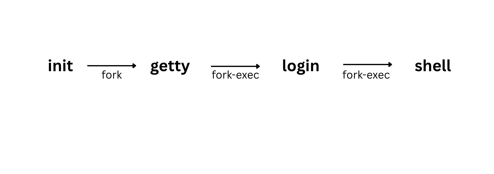

# The Process

- Everything, they say, in UNIX is a file. Here we will look at everything as a process.
- A process is a UNIX abstraction that enable us to look at file and programs in another way.
  -A file is treated as a simple file when it lies in a `dormant` state on disk. It can also be understood as a process when it `executed`. Like living organism, processes are born, they give birth to another processes and also die. Processes makes things happens in `UNIX`.
- Unix being a multitasking system, hundreds or even thousands of processes can run on a large system.
- Process belongs to the domain of the `kernel`, which is responsible for their management

---

## Process Basics

- A process is simply an instance of running program. A process is said to be `born` when the program start execution and remains alive as long as the program is active. After execution is complete, the process is said to `die`.
- A process also has name, usually the name of the program being executed. For e.g. when you execute the `grep` command, a process named `grep` is created.
- The `kernel` is responsible for management of `processes`. It determine the time and priorities that are allocated to the processes so that multiple processes are able to share `CPU` resources. The kerner has to sometimes store `pages`(sections) of these processes in the swap area of the disk before calling them again for running. All these happens more than once a second, making the user oblivious to the switching process.
- File have `attributes`, and so do processes. Some attributes of every processes are maintained by the `kernel` in memory in a separate structure called the p`rocess table`. You could say that the `process table` is `inode` for processes.
- Two important attributes of a process are:
  - The `process-id(PID)`: Each process is uniquely identified by a unique integer called the `process-id(PID)` that alloted by the `kernel` when the process is born. We need this `PID` to control a process, for instance, to kill it.
  - The **_parent PID(PPID)_**: The **PID** of parent is also available as a `process attribute`. When several processes have the same PPID, it often make sense to kill the parent rather than all it's children separately.
- The other attributes are inherited by the child from it's parent.
- A process may go berserk and multiply rapidly, bringing the system to complete standstill. A process may not complete in the expected time, and you may decide to `suspend` it, move it to the `background`, or even `kill` it. UNIX provides us with the tools to understand the process hierarchy and also control these processes.

---

## The Shell Process

- When you log on to a UNIX system, a process is immediately set up by the kernel. This process represents a UNIX command which may be `sh`(Bourne shell), `ksh`(Korn shell), `csh`(C shell) or `bash`(Bash). Any command that you key in is actually the `standard input` to the shell process. This process remains alive untill you log out, when it is `killed` by the `kernel`.
- The shell maintains a set of `environment variables`, like `PATH` and `SHELL`. The shell's pathname is stored in `SHELL` but it's `PID` is stored in a special "variable", `$$`. To know the `PID` of your current shell, type `echo $$`

```sh
echo $$
48619
```

The `PID` of your login shell can't obviously change as long as you logged in.

- A low `PID` indicates that the process was initiated quite early. When you logged out and logging again your login shell will be assigned a different `PID`. Knowledge of the PID is often necessary to control the activities at your terminal, especially when things go wrong.

---

## Parents and Children

- Just a file has a `parent`, every process also has one. This `parent` itself is another process, and a process born from is said to be it's `child`.
- When you run the command `cat emp.lst` from the keyboad, a process representing the `cat` command, is started by the shell process. This `cat` process remain active as long as the command is active. The shell(which could be `sh`, `ksh`, `bash`, or `csh`) is said to be parent of `cat`, while `cat` is said to be `child` of shell.
- The analogy with files and directory doesn't stop here. Like a file, a process can have only one parent. Moreover, just as a directory can have more than one file under it, the multitasking nature of UNIX permits a process to generate (or spawn) one or more children. The command `cat emp.lst | grep 'director'` sets up two processes for the two commands. These processes have the name `cat` and `grep` and both are spawned by the shell.

---

## Wait or Not Wait

- While the analogy between processes and mortals is striking, you could be amused by two different attitudes that can be taken by the parent towards it's child.

  - It may wait for the child to die so that it can spawn the next process. The death is informed by the `kernel` to the parent. When you execute a command from the shell, the shell precess waits for the command to die before it returns the prompt to take up the next command.
  - It may not wait for the child to die at all and may continue to spawn other processes. This is what the `init` process does, the reason why `init` is the parent of several processes. Your shell can also create a process without waiting for it to die.

  > `Note`: All commands don't set up processes. Built-in commands of shell like `pwd`, `cd` etc. don't create processes.

---

## PROCESS STATUS

- Let's now use the `ps` command to display some process attributes.
- `ps` can be seen as the process counterpart of the file system's `ls` command. The command reads through the kernel's data structures and process table to fetch the characteristics of processes.
- By default `ps` displays the processes owned by the user running the command

```sh
ps
  PID TTY           TIME CMD
48911 ttys000    0:00.41 -zsh
48922 ttys000    0:00.00 -zsh
48955 ttys000    0:00.00 -zsh
48956 ttys000    0:00.02 -zsh
48958 ttys000    0:00.07 /Users/rajeevsingh/.cache/gitstatus/gitstatusd-darwin-arm64 -G v1.5.4 -s -1 -u -1 -d -1 -c -1 -m -1 -v FATAL -t 16
48619 ttys002    0:00.52 -zsh
48673 ttys002    0:00.00 -zsh
48674 ttys002    0:00.02 -zsh
48676 ttys002    0:00.00 -zsh
48681 ttys002    0:00.07 /Users/rajeevsingh/.cache/gitstatus/gitstatusd-darwin-arm64 -G v1.5.4 -s -1 -u -1 -d -1 -c -1 -m -1 -v FATAL -t 16
41581 ttys005    0:03.44 /bin/zsh -il
41766 ttys005    0:00.00 /bin/zsh -il
41796 ttys005    0:00.00 /bin/zsh -il
41797 ttys005    0:00.07 /bin/zsh -il
41799 ttys005    0:00.25 /Users/rajeevsingh/.cache/gitstatus/gitstatusd-darwin-arm64 -G v1.5.4 -s -1 -u -1 -d -1 -c -1 -m -1 -v FATAL -t 16
```

```sh
echo $$
48619
```

- Ignoring the header, each line shows the `PID`, the terminal (TTY) with which the process is associated (the **_controlling terminal_**), the comulative processor time (TIME) that has been consumed since the process has been started, and the process name(CMD).
- You can see that your login shell (`zsh` for macbook) has the PID 48619, the same number echoed by the special variable, `$$`. On some systems, you might see the `ps` command itself in the output. Since the login shell is not doing much work, it's CPU usage is negligble. Here the user running `zsh` shell your shell could be different.

---

## ps Options

- `ps` is highly variant command; it's actual output varies across different UNIX flavors. `BSD` and `System V` at war here; there are hardly any options common to both systems.
- For instance, `ps -e` on `System V` approximate to `ps aux`(no hyphens) on `BSD`. Solaris uses the System V version while Linux accepts both type of options.
- `Full listing (-f)`: To get the detailed listing which also shows the parent of every process, use the `-f` option.
  `ps -f`

```sh
ps -f
  UID   PID  PPID   C STIME   TTY           TIME CMD
  501 48911 48910   0  5:11PM ttys000    0:00.51 -zsh
  501 48922     1   0  5:11PM ttys000    0:00.00 -zsh
  501 48955     1   0  5:11PM ttys000    0:00.00 -zsh
  501 48956     1   0  5:11PM ttys000    0:00.03 -zsh
  501 48958 48922   0  5:11PM ttys000    0:00.11 /Users/rajeevsingh/.cache/gitstatus/gitstatusd-darwin-arm64 -G v1.5.4 -s -1 -u -1 -d -1 -c -1 -m -1 -v FATAL -t 16
  501 48619 48616   0  5:09PM ttys002    0:01.16 -zsh
  501 48673     1   0  5:09PM ttys002    0:00.00 -zsh
  501 48674     1   0  5:09PM ttys002    0:00.04 -zsh
  501 48676     1   0  5:09PM ttys002    0:00.00 -zsh
  501 48681 48676   0  5:09PM ttys002    0:00.11 /Users/rajeevsingh/.cache/gitstatus/gitstatusd-darwin-arm64 -G v1.5.4 -s -1 -u -1 -d -1 -c -1 -m -1 -v FATAL -t 16
  501 41581 41546   0  4:02PM ttys005    0:03.54 /bin/zsh -il
  501 41766     1   0  4:02PM ttys005    0:00.00 /bin/zsh -il
  501 41796     1   0  4:02PM ttys005    0:00.00 /bin/zsh -il
  501 41797     1   0  4:02PM ttys005    0:00.08 /bin/zsh -il
  501 41799 41766   0  4:02PM ttys005    0:00.29 /Users/rajeevsingh/.cache/gitstatus/gitstatusd-darwin-arm64 -G v1.5.4 -s -1 -u -1 -d -1 -c -1 -m -1 -v FATAL -t 16
```

- Now you can see the `parent` (PPID) and `owner` (UID) of every process. The login shell (PID 48619) has the `PPID` 1, the second process of the system. (The first process has the PID 0). This is `init` the creator of all login shells and parents of all services offered by the system.
- Apart from `vi` editor, there are two shells running here, and the `-f` option easily identifies a login shell by the hyphen preceeding the command name. we will ignore the `C` header for the time being. `STIME` shows the time the process started. `CMD` displays the entire command line with it's argument.
- Options of `ps`

# `ps` Command Options in Linux

The `ps` command is used to display information about active processes.

---

## 📌 Basic Syntax

```bash
ps [options]
```

---

## 📋 Common Options

| Option      | Description                                                    |
| ----------- | -------------------------------------------------------------- |
| `-e`, `-A`  | Show all processes                                             |
| `-f`        | Full-format listing                                            |
| `-l`        | Long listing format                                            |
| `-u [user]` | Show processes for a specific user                             |
| `-U [user]` | Show processes for real user ID                                |
| `-x`        | Show processes without a controlling terminal                  |
| `-a`        | Show processes of all users (except session leaders)           |
| `-r`        | Show only running processes                                    |
| `-T`        | Show processes attached to the current terminal                |
| `-N`        | Invert the selection (show processes that do NOT match)        |
| `--forest`  | Show process hierarchy (tree view)                             |
| `--sort`    | Sort output (e.g., `--sort=-%mem` for memory usage descending) |

---

## ⚙️ Commonly Used `ps` Command Combinations

```bash
ps aux                # Show all processes with detailed info
ps -ef                # Show all processes in full-format listing
ps -u username        # Show processes for a given user
ps -eo pid,ppid,cmd   # Custom output format
ps -e --forest        # Tree view of all processes
```

---

## 🧾 Output Fields

| Field       | Description                                 |
| ----------- | ------------------------------------------- |
| PID         | Process ID                                  |
| PPID        | Parent Process ID                           |
| CMD/COMMAND | Command that started the process            |
| USER        | User who owns the process                   |
| %CPU        | CPU usage                                   |
| %MEM        | Memory usage                                |
| STAT        | Process state (e.g., S=sleeping, R=running) |
| TIME        | Cumulative CPU time used                    |

---

## 🧪 Example: Top Memory Consuming Processes

```bash
ps -eo pid,ppid,cmd,%mem,%cpu --sort=-%mem | head
```

This command lists processes sorted by memory usage in descending order.

> `Caution`: The display of entire command line by the -f options let's one user know what the other is doing. This can argubaly be considered as demarit of the system. When a user is working on a file, it's difficult for her to keep the filename a closely guarded secret.

- `Displaying processes of a User (-u)`: The system administrator need to use the `-u`(user) option to know the activities of any user.

```sh
ps -u rajeevsingh
UID   PID TTY           TIME CMD
  501   963 ??         3:02.09 /usr/sbin/distnoted agent
  501   973 ??         2:45.71 /usr/libexec/secd
  501   982 ??         3:25.12 /usr/sbin/cfprefsd agent
  501   983 ??         1:49.13 /usr/libexec/UserEventAgent (Aqua)
  501   989 ??         0:17.65 /usr/sbin/universalaccessd launchd -s
  501   991 ??         0:03.57 /usr/libexec/pboard
  501   993 ??         1:23.12 /usr/libexec/lsd
  501   997 ??         0:36.34 /usr/libexec/containermanagerd --runmode=agent --user-container-mode=current --bundle-container-mode=proxy --sy
  501  1001 ??         1:54.18 /usr/libexec/nsurlsessiond
  501  1002 ??         2:41.27 /System/Library/CoreServices/ControlStrip.app/Contents/MacOS/ControlStrip
  501  1003 ??         0:31.58 /usr/sbin/usernoted
  501  1004 ??         1:19.54 /usr/libexec/rapportd
  501  1008 ??         1:08.76 /System/Library/CoreServices/lockoutagent
  501  1014 ??         2:40.83 /System/Library/PrivateFrameworks/IDS.framework/identityservicesd.app/Contents/MacOS/identityservicesd
  501  1016 ??         4:40.81 /usr/libexec/trustd --agent
  501  1018 ??         4:16.65 /System/Library/CoreServices/WiFiAgent.app/Contents/MacOS/WiFiAgent
  501  1030 ??         0:00.02 /System/Library/PrivateFrameworks/SystemMigrationNetwork.framework/Resources/migrationhelper
  501  1040 ??         4:38.12 /usr/libexec/sharingd
  501  1049 ??         0:03.95 /System/Library/CoreServices/sharedfilelistd
  501  1052 ??         1:00.03 /System/Library/PrivateFrameworks/UserNotificationsCore.framework/Support/usernotificationsd
  501  1058 ??         0:15.67 /System/Library/PrivateFrameworks/FamilyCircle.framework/Versions/A/Resources/familycircled
  501  1073 ??        14:21.41 /System/Library/CoreServices/WindowManager.app/Contents/MacOS/WindowManager
  501  1079 ??         1:23.03 /usr/libexec/ContinuityCaptureAgent server
  501  1105 ??        41:04.19 /System/Library/CoreServices/ControlCenter.app/Contents/MacOS/ControlCenter
  501  1115 ??         5:24.18 /System/Library/PrivateFrameworks/BiomeStreams.framework/Support/BiomeAgent
  501  1126 ??         0:34.50 /System/Library/PrivateFrameworks/AuthKit.framework/Versions/A/Support/akd
  501  1139 ??         0:35.64 /System/Library/CoreServices/talagentd
  501  1147 ??        10:45.56 /System/Library/PrivateFrameworks/FileProvider.framework/Support/fileproviderd
  501  1151 ??         4:31.56 /System/Library/CoreServices/NotificationCenter.app/Contents/MacOS/NotificationCenter
  501  1155 ??         1:36.61 /System/Library/CoreServices/audioaccessoryd
  501  1167 ??         0:33.24 /System/Library/PrivateFrameworks/ViewBridge.framework/Versions/A/XPCServices/ViewBridgeAuxiliary.xpc/Contents/
  501  1183 ??         1:12.81 /System/Library/PrivateFrameworks/IMCore.framework/imagent.app/Contents/MacOS/imagent
  501  1188 ??         3:50.98 /System/Library/Frameworks/CoreServices.framework/Frameworks/Metadata.framework/Versions/A/Support/corespotligh
  501  1194 ??         0:00.47 /usr/libexec/seserviced
  501  1200 ??         0:33.68 /System/Library/PrivateFrameworks/UserActivity.framework/Agents/useractivityd
  501  1201 ??         0:03.84 /System/Library/PrivateFrameworks/MediaRemote.framework/Support/mediaremoteagent
  501  1202 ??         0:07.85 /usr/libexec/avconferenced
  501  1227 ??       114:38.26 /System/Library/PrivateFrameworks/CoreSpeech.framework/corespeechd
  501  1228 ??         0:04.79 /System/Library/PrivateFrameworks/EmailDaemon.framework/Versions/A/maild
  501  1236 ??         0:00.03 /System/Applications/System Settings.app/Contents/PlugIns/csimporter.appex/Contents/MacOS/csimporter -AppleLang
  501  1252 ??         3:00.66 /System/Library/Frameworks/ApplicationServices.framework/Frameworks/ATS.framework/Support/fontd
  501  1278 ??         0:03.29 /System/Library/Frameworks/ApplicationServices.framework/Versions/A/Frameworks/ATS.framework/Versions/A/Support
  501  1293 ??         0:11.83 /System/Library/PrivateFrameworks/PassKitCore.framework/passd
  501  1295 ??         1:43.05 /System/Library/CoreServices/WallpaperAgent.app/Contents/MacOS/WallpaperAgent
  501  1297 ??         1:11.69 /System/Library/Frameworks/CoreServices.framework/Frameworks/Metadata.framework/Versions/A/Support/mdbulkimport
  501  1305 ??         0:01.83 /System/Library/ExtensionKit/Extensions/WallpaperImageExtension.appex/Contents/MacOS/WallpaperImageExtension
  501  1311 ??         0:00.86 /System/Library/Frameworks/InputMethodKit.framework/Resources/imklaunchagent
  501  1312 ??         1:08.60 /System/Library/PrivateFrameworks/TextInputUIMacHelper.framework/Versions/A/XPCServices/CursorUIViewService.xpc
  501  1313 ??         0:14.06 /System/Library/Input Methods/PressAndHold.app/Contents/PlugIns/PAH_Extension.appex/Contents/MacOS/PAH_Extensio
  501  1315 ??         0:16.77 /System/Library/Input Methods/EmojiFunctionRowIM.app/Contents/PlugIns/EmojiFunctionRowIM_Extension.appex/Conten
  501  1318 ??         2:01.97 /System/Library/CoreServices/Dock.app/Contents/MacOS/Dock
  501  1319 ??         0:18.56 /System/Library/CoreServices/SystemUIServer.app/Contents/MacOS/SystemUIServer
  501  1320 ??        11:51.12 /System/Library/CoreServices/Finder.app/Contents/MacOS/Finder
  501  1323 ??         1:23.31 /System/Library/CoreServices/Spotlight.app/Contents/MacOS/Spotlight
  501  1328 ??         0:01.06 /System/Library/PrivateFrameworks/AMPDevices.framework/Versions/A/Support/AMPDeviceDiscoveryAgent --launchd
  501  1338 ??         1:41.37 /System/Library/CoreServices/Dock.app/Contents/XPCServices/com.apple.dock.extra.xpc/Contents/MacOS/com.apple.do
  501  1341 ??         0:08.57 /System/Library/PrivateFrameworks/CommerceKit.framework/Versions/A/Resources/commerce
  501  1342 ??         0:07.70 /System/Library/PrivateFrameworks/CloudDocs.framework/PlugIns/com.apple.CloudDocs.iCloudDriveFileProvider.appex
  501  1344 ??         0:00.01 /Users/rajeevsingh/Library/Application Support/iTerm2/iTermServer-3.5.13 /Users/rajeevsingh/Library/Application
  501  1348 ??         0:00.37 /System/Library/Frameworks/CryptoTokenKit.framework/ctkahp.bundle/Contents/MacOS/ctkahp
  501  1380 ??         0:00.52 /System/Library/Image Capture/Support/icdd
  501  1384 ??         0:13.40 /opt/homebrew/opt/httpd/bin/httpd -D FOREGROUND
  501  1386 ??         0:05.93 /System/Library/CoreServices/AirPlayUIAgent.app/Contents/MacOS/AirPlayUIAgent --launchd
  501  1391 ??         0:10.49 /System/Library/CoreServices/diagnostics_agent
  501  1392 ??         0:24.40 /System/Library/CoreServices/TextInputMenuAgent.app/Contents/MacOS/TextInputMenuAgent
  501  1459 ??         0:00.00 /opt/homebrew/opt/httpd/bin/httpd -D FOREGROUND
  501  1460 ??         0:00.00 /opt/homebrew/opt/httpd/bin/httpd -D FOREGROUND
  501  1461 ??         0:00.00 /opt/homebrew/opt/httpd/bin/httpd -D FOREGROUND
  501  1462 ??         0:00.00 /opt/homebrew/opt/httpd/bin/httpd -D FOREGROUND
  501  1463 ??         0:00.00 /opt/homebrew/opt/httpd/bin/httpd -D FOREGROUND
  501  1714 ??         0:52.50 /System/Library/Frameworks/CoreSpotlight.framework/spotlightknowledged -x
  501  1891 ??         0:11.79 /System/Cryptexes/App/usr/libexec/PasswordBreachAgent
  501  2923 ??         0:01.42 /System/Library/PrivateFrameworks/IMDPersistence.framework/IMAutomaticHistoryDeletionAgent.app/Contents/MacOS/I
  501  6374 ??         0:09.25 /usr/libexec/routined LAUNCHED_BY_LAUNCHD
  501  7380 ??         0:00.07 /usr/bin/ssh-agent -l
  501 11065 ??         0:34.35 /System/Library/Services/AppleSpell.service/Contents/MacOS/AppleSpell
  501 12091 ??         0:01.60 /System/Library/PrivateFrameworks/StatusKit.framework/StatusKitAgent
  501 17768 ??         0:10.97 /System/Library/PrivateFrameworks/HomeKitDaemon.framework/Support/homed
  501 25204 ??         0:19.56 /System/Library/ExtensionKit/Extensions/WallpaperVideoExtension.appex/Contents/MacOS/WallpaperVideoExtension
  501 28251 ??         0:02.92 /System/Applications/Mail.app/Contents/PlugIns/com.apple.mail.SpotlightIndexExtension.appex/Contents/MacOS/com.
  501 28347 ??         0:00.35 /System/Applications/Notes.app/Contents/PlugIns/com.apple.Notes.SpotlightIndexExtension.appex/Contents/MacOS/co
  501 33214 ??         0:04.91 /System/Library/PrivateFrameworks/CoreDuetContext.framework/Resources/ContextStoreAgent
  501 36763 ??         0:18.02 /Library/Application Support/Microsoft/MAU2.0/Microsoft AutoUpdate.app/Contents/MacOS/Microsoft AutoUpdate
  501 36899 ??        33:07.75 /Applications/iTerm.app/Contents/MacOS/iTerm2
  501 36954 ??         0:04.32 /System/Library/PrivateFrameworks/CommerceKit.framework/Versions/A/Resources/storeuid.app/Contents/MacOS/storeu
  501 38696 ??        16:17.29 /Applications/Grammarly Desktop.app/Contents/MacOS/Grammarly Desktop
  501 38705 ??         0:02.93 /System/Library/Frameworks/WebKit.framework/Versions/A/XPCServices/com.apple.WebKit.GPU.xpc/Contents/MacOS/com.
  501 38706 ??         0:00.19 /System/Library/Frameworks/WebKit.framework/Versions/A/XPCServices/com.apple.WebKit.WebContent.xpc/Contents/Mac
  501 38709 ??         0:08.50 /System/Library/Frameworks/WebKit.framework/Versions/A/XPCServices/com.apple.WebKit.Networking.xpc/Contents/Mac
  501 38731 ??         0:07.17 /Applications/Grammarly Desktop.app/Contents/Library/LaunchAgents/Grammarly Desktop Helper.app/Contents/MacOS/G
  501 39105 ??         0:06.44 /System/Library/PrivateFrameworks/iCloudDriveCore.framework/Versions/A/Support/bird
  501 39252 ??         0:00.68 /usr/libexec/pkd
  501 39298 ??         0:00.49 /usr/libexec/SidecarRelay
  501 39326 ??         0:04.45 /System/Library/PrivateFrameworks/CoreSuggestions.framework/Versions/A/Support/suggestd
  501 39345 ??         0:10.84 /System/Library/CoreServices/UniversalControl.app/Contents/MacOS/UniversalControl
  501 39436 ??         0:18.46 /System/Library/CoreServices/Siri.app/Contents/MacOS/Siri launchd
  501 39437 ??         0:02.66 /System/Library/Frameworks/ApplicationServices.framework/Versions/A/Frameworks/HIServices.framework/Versions/A/
  501 39449 ??         0:01.57 /System/Library/PrivateFrameworks/TelephonyUtilities.framework/callservicesd
  501 39597 ??         0:00.26 /usr/libexec/neagent
  501 39670 ??         0:06.55 /System/Library/CoreServices/Siri.app/Contents/XPCServices/SiriNCService.xpc/Contents/MacOS/SiriNCService
  501 39671 ??         0:00.82 /usr/libexec/bluetoothuserd
  501 39680 ??         0:13.31 /System/Library/CoreServices/PowerChime.app/Contents/MacOS/PowerChime
  501 40301 ??         0:06.86 /System/Library/CoreServices/UserNotificationCenter.app/Contents/MacOS/UserNotificationCenter
  501 40565 ??         0:00.09 /System/Library/Frameworks/CoreServices.framework/Frameworks/Metadata.framework/Versions/A/Support/mdwrite
  501 40614 ??         0:30.36 /usr/libexec/duetexpertd
  501 40640 ??         0:02.11 /System/Library/CoreServices/ControlCenter.app/Contents/XPCServices/ControlCenterHelper.xpc/Contents/MacOS/Cont
  501 40911 ??         0:00.40 /System/Library/PrivateFrameworks/Synapse.framework/Support/contentlinkingd
  501 40986 ??         0:00.70 /usr/libexec/linkd
  501 41113 ??         0:01.16 /usr/libexec/proactived
  501 41136 ??         2:43.80 /Applications/Google Chrome.app/Contents/MacOS/Google Chrome
  501 41138 ??         0:00.04 /Applications/Google Chrome.app/Contents/Frameworks/Google Chrome Framework.framework/Versions/137.0.7151.69/He
  501 41140 ??         0:47.84 /Applications/Google Chrome.app/Contents/Frameworks/Google Chrome Framework.framework/Versions/137.0.7151.69/He
  501 41141 ??         0:49.90 /Applications/Google Chrome.app/Contents/Frameworks/Google Chrome Framework.framework/Versions/137.0.7151.69/He
  501 41142 ??         0:01.74 /Applications/Google Chrome.app/Contents/Frameworks/Google Chrome Framework.framework/Versions/137.0.7151.69/He
  501 41179 ??         0:00.23 /System/Library/Frameworks/AppKit.framework/Versions/C/XPCServices/ThemeWidgetControlViewService.xpc/Contents/M
  501 41180 ??         0:12.93 /Applications/Google Chrome.app/Contents/Frameworks/Google Chrome Framework.framework/Versions/137.0.7151.69/He
  501 41181 ??         0:03.69 /Applications/Google Chrome.app/Contents/Frameworks/Google Chrome Framework.framework/Versions/137.0.7151.69/He
  501 41189 ??         0:03.18 /Applications/Google Chrome.app/Contents/Frameworks/Google Chrome Framework.framework/Versions/137.0.7151.69/He
  501 41191 ??         0:14.03 /Applications/Google Chrome.app/Contents/Frameworks/Google Chrome Framework.framework/Versions/137.0.7151.69/He
  501 41192 ??         0:00.87 /Applications/Google Chrome.app/Contents/Frameworks/Google Chrome Framework.framework/Versions/137.0.7151.69/He
  501 41194 ??         0:00.93 /Applications/Google Chrome.app/Contents/Frameworks/Google Chrome Framework.framework/Versions/137.0.7151.69/He
  501 41196 ??         0:00.28 /System/Library/Frameworks/AudioToolbox.framework/AudioComponentRegistrar
  501 41201 ??         0:01.00 /Applications/Google Chrome.app/Contents/Frameworks/Google Chrome Framework.framework/Versions/137.0.7151.69/He
  501 41202 ??         0:01.13 /Applications/Google Chrome.app/Contents/Frameworks/Google Chrome Framework.framework/Versions/137.0.7151.69/He
  501 41208 ??         1:30.94 /Applications/PDF Reader Pro.app/Contents/MacOS/PDF Reader Pro
  501 41243 ??         0:00.24 /System/Library/Frameworks/AppKit.framework/Versions/C/XPCServices/ThemeWidgetControlViewService.xpc/Contents/M
  501 41249 ??         0:59.86 /Applications/Google Chrome.app/Contents/Frameworks/Google Chrome Framework.framework/Versions/137.0.7151.69/He
  501 41264 ??         0:04.57 /Applications/Google Chrome.app/Contents/Frameworks/Google Chrome Framework.framework/Versions/137.0.7151.69/He
  501 41351 ??         0:01.55 /System/Library/Frameworks/AppKit.framework/Versions/C/XPCServices/com.apple.appkit.xpc.openAndSavePanelService
  501 41359 ??         0:00.24 /System/Library/Frameworks/QuickLookUI.framework/Versions/A/XPCServices/QuickLookUIService.xpc/Contents/MacOS/Q
  501 41505 ??         4:18.20 /Applications/Visual Studio Code.app/Contents/MacOS/Electron
  501 41507 ??         0:00.03 /Applications/Visual Studio Code.app/Contents/Frameworks/Electron Framework.framework/Helpers/chrome_crashpad_h
  501 41508 ??         2:48.57 /Applications/Visual Studio Code.app/Contents/Frameworks/Code Helper (GPU).app/Contents/MacOS/Code Helper (GPU)
  501 41509 ??         0:01.72 /Applications/Visual Studio Code.app/Contents/Frameworks/Code Helper.app/Contents/MacOS/Code Helper --type=util
  501 41510 ??         9:11.41 /Applications/Visual Studio Code.app/Contents/Frameworks/Code Helper (Renderer).app/Contents/MacOS/Code Helper
  501 41546 ??         0:24.84 /Applications/Visual Studio Code.app/Contents/Frameworks/Code Helper.app/Contents/MacOS/Code Helper --type=util
  501 41548 ??         2:25.15 /Applications/Visual Studio Code.app/Contents/Frameworks/Code Helper (Plugin).app/Contents/MacOS/Code Helper (P
  501 41555 ??         0:26.64 /Applications/Visual Studio Code.app/Contents/Frameworks/Code Helper (Plugin).app/Contents/MacOS/Code Helper (P
  501 41558 ??         0:03.46 /Applications/Visual Studio Code.app/Contents/Frameworks/Code Helper.app/Contents/MacOS/Code Helper --type=util
  501 41560 ??         0:03.48 /Applications/Visual Studio Code.app/Contents/Frameworks/Code Helper.app/Contents/MacOS/Code Helper --type=util
  501 41590 ??         0:00.80 /Applications/Visual Studio Code.app/Contents/Frameworks/Code Helper (Plugin).app/Contents/MacOS/Code Helper (P
  501 43048 ??         0:00.05 /System/Library/Frameworks/MediaAccessibility.framework/Versions/A/XPCServices/com.apple.accessibility.mediaacc
  501 43799 ??         0:31.16 /Applications/Google Chrome.app/Contents/Frameworks/Google Chrome Framework.framework/Versions/137.0.7151.69/He
  501 43803 ??         0:00.82 /Applications/Google Chrome.app/Contents/Frameworks/Google Chrome Framework.framework/Versions/137.0.7151.69/He
  501 43807 ??         0:00.60 /Applications/Google Chrome.app/Contents/Frameworks/Google Chrome Framework.framework/Versions/137.0.7151.69/He
  501 43891 ??         0:09.49 /Applications/Google Chrome.app/Contents/Frameworks/Google Chrome Framework.framework/Versions/137.0.7151.69/He
  501 44009 ??         0:54.86 /Applications/Google Chrome.app/Contents/Frameworks/Google Chrome Framework.framework/Versions/137.0.7151.69/He
  501 46955 ??         0:43.28 /Applications/Visual Studio Code.app/Contents/Frameworks/Code Helper (Renderer).app/Contents/MacOS/Code Helper
  501 47549 ??         0:00.32 /System/Library/Frameworks/ExtensionFoundation.framework/Versions/A/XPCServices/extensionkitservice.xpc/Content
  501 47585 ??         0:07.60 /usr/libexec/triald
  501 47618 ??         0:09.45 /System/Library/PrivateFrameworks/CloudKitDaemon.framework/Support/cloudd
  501 47619 ??         0:03.14 /System/Library/PrivateFrameworks/TCC.framework/Support/tccd
  501 47624 ??         0:00.33 /System/Library/PrivateFrameworks/CoreCDP.framework/Versions/A/Resources/cdpd
  501 47628 ??         0:00.66 /System/Library/PrivateFrameworks/CloudTelemetry.framework/Versions/A/XPCServices/CloudTelemetryService.xpc/Con
  501 47964 ??         0:00.44 /usr/libexec/secinitd
  501 48254 ??         0:09.62 /System/Library/Frameworks/Contacts.framework/Support/contactsd
  501 48350 ??         0:00.45 /System/Library/PrivateFrameworks/SyncedDefaults.framework/Support/syncdefaultsd
  501 48613 ??         0:00.60 /System/Library/PrivateFrameworks/AppPredictionFoundation.framework/Versions/A/XPCServices/AppPredictionIntents
  501 48614 ??         0:01.33 /System/Library/PrivateFrameworks/CalendarDaemon.framework/Support/calaccessd
  501 48615 ??         0:00.27 /System/Library/CoreServices/CoreLocationAgent.app/Contents/MacOS/CoreLocationAgent
  501 50072 ??         0:00.19 /System/Library/CoreServices/Keychain Circle Notification.app/Contents/MacOS/Keychain Circle Notification
  501 50088 ??         0:00.24 /System/Library/PrivateFrameworks/IntelligenceFlowRuntime.framework/Versions/A/intelligenceflowd
  501 50089 ??         0:00.06 /System/Library/PrivateFrameworks/NewDeviceOutreach.framework/ndoagent
  501 50094 ??         0:00.04 /usr/libexec/feedbackd
  501 50101 ??         0:00.26 /System/Library/Frameworks/CoreTelephony.framework/Support/CommCenter -L
  501 50106 ??         0:02.85 /usr/libexec/replayd
  501 50113 ??         0:00.16 /System/Library/PrivateFrameworks/BusinessChatService.framework/businessservicesd
  501 50114 ??         0:00.34 /System/Library/PrivateFrameworks/MessagesBlastDoorSupport.framework/Versions/A/XPCServices/MessagesBlastDoorSe
  501 50188 ??         0:00.28 /usr/libexec/swcd
  501 50190 ??         0:00.59 /System/Library/PrivateFrameworks/GeoServices.framework/Versions/A/XPCServices/com.apple.geod.xpc/Contents/MacO
  501 50224 ??         0:00.06 /System/Library/Frameworks/VideoToolbox.framework/Versions/A/XPCServices/VTDecoderXPCService.xpc/Contents/MacOS
  501 50238 ??         0:00.17 /usr/libexec/keyboardservicesd
  501 50501 ??         0:01.30 /System/Library/Frameworks/QuickLookThumbnailing.framework/Support/com.apple.quicklook.ThumbnailsAgent
  501 50507 ??         0:03.59 /System/Library/PrivateFrameworks/CacheDelete.framework/deleted
  501 50509 ??         0:00.25 /System/Library/Frameworks/ExtensionFoundation.framework/Versions/A/XPCServices/extensionkitservice.xpc/Content
  501 50510 ??         0:00.83 /System/Library/ExtensionKit/Extensions/TextThumbnailExtension.appex/Contents/MacOS/TextThumbnailExtension
  501 50519 ??         0:00.03 /System/Library/PrivateFrameworks/GeoServices.framework/geodMachServiceBridge
  501 50531 ??         0:00.10 /System/Library/PrivateFrameworks/AMPLibrary.framework/Versions/A/Support/AMPArtworkAgent --launchd
  501 50532 ??         0:00.82 /System/Library/PrivateFrameworks/AppleMediaServices.framework/Resources/amsaccountsd
  501 50533 ??         0:01.22 /System/Library/PrivateFrameworks/AppleMediaServicesUI.framework/amsengagementd
  501 50658 ??         0:00.14 /System/Library/PrivateFrameworks/AssetCacheServices.framework/Versions/A/XPCServices/AssetCacheLocatorService.
  501 50668 ??         0:00.14 /System/Library/Frameworks/CryptoTokenKit.framework/ctkd -tw
  501 50669 ??         0:00.12 /System/Library/Frameworks/LocalAuthentication.framework/Support/coreauthd
  501 50672 ??         0:00.49 /System/Library/PrivateFrameworks/DoNotDisturbServer.framework/Support/donotdisturbd
  501 50673 ??         0:00.23 /usr/libexec/findmylocateagent
  501 50719 ??         0:00.72 /System/Library/PrivateFrameworks/ScreenTimeCore.framework/Versions/A/ScreenTimeAgent
  501 50720 ??         0:01.24 /usr/libexec/knowledge-agent
  501 50721 ??         0:00.18 /usr/libexec/dmd
  501 50722 ??         0:00.02 /System/Library/Frameworks/FamilyControls.framework/Versions/A/FamilyControlsAgent
  501 50723 ??         0:00.09 /System/Library/Frameworks/ManagedSettings.framework/Versions/A/ManagedSettingsAgent
  501 50725 ??         0:00.65 /usr/libexec/remindd
  501 50729 ??         0:01.85 /System/Library/Frameworks/CoreSpotlight.framework/spotlightknowledged -u
  501 50736 ??         0:18.24 /System/Library/PrivateFrameworks/MediaAnalysis.framework/Versions/A/mediaanalysisd
  501 50954 ??         0:00.23 /System/Library/CoreServices/CoreServicesUIAgent.app/Contents/MacOS/CoreServicesUIAgent
  501 50990 ??         0:00.18 /System/Library/PrivateFrameworks/MobileTimer.framework/Executables/mobiletimerd
  501 51114 ??         0:01.77 /System/Library/PrivateFrameworks/PhotoAnalysis.framework/Versions/A/Support/photoanalysisd
  501 51115 ??         0:00.37 /usr/libexec/mlhostd
  501 51119 ??         0:03.24 /System/Library/PrivateFrameworks/SafariSafeBrowsing.framework/com.apple.Safari.SafeBrowsing.Service
  501 51120 ??         0:00.20 /System/Library/PrivateFrameworks/ContextKit.framework/Versions/A/XPCServices/ContextService.xpc/Contents/MacOS
  501 51121 ??         0:02.11 /System/Library/PrivateFrameworks/SiriInference.framework/Versions/A/siriinferenced
  501 51122 ??         0:00.87 /System/Library/PrivateFrameworks/PhotoLibraryServices.framework/Versions/A/Support/photolibraryd
  501 51123 ??         0:00.20 /System/Library/CoreServices/ScopedBookmarkAgent
  501 51124 ??         0:00.13 /System/Library/Frameworks/ExtensionFoundation.framework/Versions/A/XPCServices/extensionkitservice.xpc/Content
  501 51126 ??         0:00.56 /usr/libexec/appleaccountd
  501 51127 ??         0:00.26 /System/Library/PrivateFrameworks/IntelligencePlatformCore.framework/Versions/A/intelligenceplatformd
  501 51128 ??         0:00.75 /usr/libexec/tipsd
  501 51133 ??         0:00.07 /System/Library/PrivateFrameworks/CoreFollowUp.framework/Versions/A/Support/followupd
  501 51134 ??         0:00.56 /System/Library/PrivateFrameworks/SiriSuggestionsSupport.framework/Versions/A/XPCServices/SiriSuggestionsBookke
  501 51135 ??         0:00.39 /System/Library/PrivateFrameworks/GenerativeExperiencesRuntime.framework/Versions/A/generativeexperiencesd
  501 51136 ??         0:00.55 /System/Library/PrivateFrameworks/VoiceShortcuts.framework/Versions/A/Support/siriactionsd
  501 51137 ??         0:00.06 /System/Library/PrivateFrameworks/iCloudDriveService.framework/XPCServices/ContainerMetadataExtractor.xpc/Conte
  501 51139 ??         0:01.02 /System/Library/PrivateFrameworks/DataAccess.framework/Support/dataaccessd
  501 51146 ??         0:00.24 /System/Library/PrivateFrameworks/People.framework/peopled
  501 51147 ??         0:00.12 /System/Library/PrivateFrameworks/iCloudNotification.framework/iCloudNotificationAgent
  501 51148 ??         0:00.27 cloudphotod
  501 51151 ??         0:00.22 /System/Library/Frameworks/Security.framework/Versions/A/XPCServices/TrustedPeersHelper.xpc/Contents/MacOS/Trus
  501 51167 ??         0:00.73 /System/Library/PrivateFrameworks/ModelCatalogRuntime.framework/Versions/A/ModelCatalogAgent
  501 51171 ??         0:00.29 /System/Library/PrivateFrameworks/MapsSync.framework/mapssyncd
  501 51172 ??         0:00.29 /usr/libexec/proactiveeventtrackerd
  501 51173 ??         0:00.02 /System/Library/PrivateFrameworks/IntlPreferences.framework/Support/localizationswitcherd
  501 51175 ??         0:06.98 /usr/libexec/siriknowledged
  501 51178 ??         0:00.14 /System/Library/PrivateFrameworks/RemoteManagement.framework/RemoteManagementAgent
  501 51180 ??         0:00.11 /System/Library/PrivateFrameworks/SafariFoundation.framework/Versions/A/XPCServices/SafariConfigurationSubscrib
  501 51182 ??         0:00.09 /System/Library/PrivateFrameworks/RemoteManagement.framework/XPCServices/SecuritySubscriber.xpc/Contents/MacOS/
  501 51187 ??         0:00.11 /System/Library/PrivateFrameworks/RemoteManagement.framework/XPCServices/InteractiveLegacyProfilesSubscriber.xp
  501 51188 ??         0:00.13 /System/Library/PrivateFrameworks/RemoteManagement.framework/XPCServices/ScreenSharingSubscriber.xpc/Contents/M
  501 51194 ??         0:00.11 /System/Library/PrivateFrameworks/RemoteManagement.framework/XPCServices/LegacyProfilesSubscriber.xpc/Contents/
  501 51196 ??         0:00.11 /System/Library/PrivateFrameworks/RemoteManagement.framework/XPCServices/PasscodeSettingsSubscriber.xpc/Content
  501 51198 ??         0:00.14 /System/Library/PrivateFrameworks/RemoteManagement.framework/XPCServices/AccountSubscriber.xpc/Contents/MacOS/A
  501 51200 ??         0:00.12 /System/Library/PrivateFrameworks/RemoteManagement.framework/XPCServices/ManagementTestSubscriber.xpc/Contents/
  501 51202 ??         0:00.12 /System/Library/PrivateFrameworks/RemoteManagement.framework/XPCServices/ASConfigurationSubscriber.xpc/Contents
  501 51204 ??         0:00.69 /System/Library/PrivateFrameworks/AXAssetLoader.framework/Support/axassetsd
  501 51205 ??         0:00.05 /System/Library/CoreServices/pbs
  501 51206 ??         0:00.11 /System/Library/PrivateFrameworks/RemoteManagement.framework/XPCServices/ManagedSettingsSubscriber.xpc/Contents
  501 51207 ??         0:00.05 /System/Library/Frameworks/AudioToolbox.framework/XPCServices/com.apple.audio.ComponentTagHelper.xpc/Contents/M
  501 51212 ??         0:00.04 /System/Library/PrivateFrameworks/SiriTTSService.framework/Versions/A/XPCServices/com.apple.SiriTTSService.Tria
  501 51213 ??         0:02.28 /System/Library/PrivateFrameworks/UsageTracking.framework/Versions/A/UsageTrackingAgent
  501 51216 ??         0:00.33 /System/Library/PrivateFrameworks/Categories.framework/Versions/A/XPCServices/CategoriesService.xpc/Contents/Ma
  501 51222 ??         0:00.04 /System/Library/CoreServices/ReportCrash agent
  501 51225 ??         0:00.73 /System/Library/PrivateFrameworks/iTunesCloud.framework/Support/itunescloudd
  501 51230 ??         0:00.19 /System/Library/PrivateFrameworks/CloudServices.framework/Helpers/com.apple.sbd
  501 51234 ??         0:00.24 /System/Library/PrivateFrameworks/SoftwareUpdate.framework/Resources/SoftwareUpdateNotificationManager.app/Cont
  501 51269 ??         0:00.57 /System/Library/Frameworks/FinanceKit.framework/financed
  501 51300 ??         0:01.66 /System/Library/PrivateFrameworks/SiriTTSService.framework/sirittsd
  501 51301 ??         0:00.30 /System/Library/PrivateFrameworks/CascadeSets.framework/Versions/A/XPCServices/SetStoreUpdateService.xpc/Conten
  501 51321 ??         0:00.72 /System/Library/PrivateFrameworks/AMPLibrary.framework/Versions/A/Support/AMPLibraryAgent --launchd
  501 51331 ??         0:00.19 /usr/libexec/MTLAssetUpgraderD
  501 51332 ??         0:00.08 /System/Library/PrivateFrameworks/AssistantServices.framework/Versions/A/XPCServices/media-indexer.xpc/Contents
  501 51333 ??         0:00.07 /System/Library/PrivateFrameworks/PodcastServices.framework/XPCServices/PodcastContentService.xpc/Contents/MacO
  501 51334 ??         0:00.52 /usr/libexec/networkserviceproxy
  501 51335 ??         0:00.09 /System/Library/PrivateFrameworks/BookKit.framework/Versions/A/XPCServices/com.apple.BKAgentService.xpc/Content
  501 51338 ??         0:00.08 /usr/libexec/swtransparencyd
  501 51339 ??         0:00.14 /System/Library/PrivateFrameworks/CloudTelemetry.framework/Versions/A/XPCServices/CloudTelemetryService.xpc/Con
  501 51344 ??         0:06.23 /System/Library/PrivateFrameworks/IntelligencePlatformCompute.framework/Versions/A/XPCServices/IntelligencePlat
  501 51349 ??         0:00.11 /usr/libexec/milod
  501 51350 ??         0:00.27 /System/Library/PrivateFrameworks/CoreEmbeddedSpeechRecognition.framework/Versions/A/XPCServices/com.apple.siri
  501 51352 ??         0:00.39 /System/Library/PrivateFrameworks/Noticeboard.framework/Versions/A/Resources/nbagent.app/Contents/MacOS/nbagent
  501 51558 ??         0:00.02 /System/Library/Frameworks/CoreServices.framework/Versions/A/Frameworks/CarbonCore.framework/Versions/A/XPCServ
  501 51852 ??         0:00.19 /System/Library/PrivateFrameworks/SiriAnalytics.framework/Versions/A/XPCServices/SAExtensionOrchestrator.xpc/Co
  501 51853 ??         0:00.14 /System/Library/Frameworks/ExtensionFoundation.framework/Versions/A/XPCServices/extensionkitservice.xpc/Content
  501 51854 ??         0:00.04 /System/Library/ExtensionKit/Extensions/IFTelemetrySELFIngestor.appex/Contents/MacOS/IFTelemetrySELFIngestor
  501 51855 ??         0:00.03 /System/Library/ExtensionKit/Extensions/BiomeSELFIngestor.appex/Contents/MacOS/BiomeSELFIngestor
  501 51856 ??         0:00.01 /System/Library/ExtensionKit/Extensions/IFTranscriptSELFIngestor.appex/Contents/MacOS/IFTranscriptSELFIngestor
  501 51857 ??         0:00.02 /System/Library/ExtensionKit/Extensions/GMSSELFIngestor.appex/Contents/MacOS/GMSSELFIngestor
  501 52150 ??         0:00.03 /Applications/iTerm.app/Contents/XPCServices/pidinfo.xpc/Contents/MacOS/pidinfo
  501 52370 ??         0:01.16 /System/Library/PrivateFrameworks/AppStoreDaemon.framework/Support/appstoreagent
  501 52379 ??         0:00.49 /usr/libexec/promotedcontentd
  501 53621 ??         0:00.07 /usr/libexec/betaenrollmentagent
  501 53683 ??         0:00.05 /System/Library/CoreServices/iconservicesagent
  501 53736 ??         0:00.11 /usr/libexec/inputanalyticsd
  501 54660 ??         0:00.17 /usr/libexec/ciphermld
  501 54673 ??         0:00.10 /System/Library/PrivateFrameworks/CoreParsec.framework/parsec-fbf
  501 54718 ??         0:00.13 /usr/libexec/dprivacyd
  501 54719 ??         0:00.02 /Library/Apple/System/Library/CoreServices/XProtect.app/Contents/MacOS/XProtect
  501 54720 ??         0:00.27 /Library/Apple/System/Library/CoreServices/XProtect.app/Contents/XPCServices/XProtectPluginService.xpc/Contents
  501 54738 ??         0:00.18 /System/Library/PrivateFrameworks/IntelligencePlatformCore.framework/Versions/A/knowledgeconstructiond
  501 54789 ??         0:00.37 /System/Cryptexes/App/System/Library/CoreServices/SafariSupport.bundle/Contents/MacOS/SafariBookmarksSyncAgent
  501 54793 ??         0:00.10 /System/Library/PrivateFrameworks/SocialLayer.framework/sociallayerd.app/Contents/MacOS/sociallayerd
  501 54801 ??         0:00.10 /System/Cryptexes/App/usr/libexec/SafariLaunchAgent
  501 55201 ??         0:28.03 /Applications/Google Chrome.app/Contents/Frameworks/Google Chrome Framework.framework/Versions/137.0.7151.69/He
  501 55316 ??         0:00.78 /System/Library/Frameworks/CoreServices.framework/Frameworks/Metadata.framework/Versions/A/Support/mdworker_sha
  501 55427 ??         0:00.03 /System/Library/PrivateFrameworks/XprotectFramework.framework/Versions/A/XPCServices/XprotectService.xpc/Conten
  501 55455 ??         0:00.01 /System/Library/Frameworks/NetFS.framework/Versions/A/XPCServices/PlugInLibraryService.xpc/Contents/MacOS/PlugI
  501 55456 ??         0:00.11 /System/Library/Frameworks/CoreGraphics.framework/Versions/A/XPCServices/CGPDFService.xpc/Contents/MacOS/CGPDFS
  501 55457 ??         0:00.13 /System/Library/ExtensionKit/Extensions/OfficeThumbnailExtension.appex/Contents/MacOS/OfficeThumbnailExtension
  501 55458 ??         0:00.13 /System/Library/ExtensionKit/Extensions/ImageThumbnailExtension.appex/Contents/MacOS/ImageThumbnailExtension
  501 55459 ??         0:00.26 /System/Library/ExtensionKit/Extensions/WebThumbnailExtension.appex/Contents/MacOS/WebThumbnailExtension
  501 55460 ??         0:00.13 /System/Library/Frameworks/WebKit.framework/Versions/A/XPCServices/com.apple.WebKit.GPU.xpc/Contents/MacOS/com.
  501 55462 ??         0:00.05 /System/Library/Frameworks/AudioToolbox.framework/XPCServices/com.apple.audio.SandboxHelper.xpc/Contents/MacOS/
  501 55873 ??         0:00.16 /System/Library/PrivateFrameworks/AOSKit.framework/Versions/A/XPCServices/com.apple.iCloudHelper.xpc/Contents/M
  501 55881 ??         0:00.21 /System/Library/PrivateFrameworks/IMDPersistence.framework/XPCServices/IMDPersistenceAgent.xpc/Contents/MacOS/I
  501 55882 ??         0:00.27 /System/Library/PrivateFrameworks/ContactsDonation.framework/Versions/A/Support/contactsdonationagent
  501 55897 ??         0:00.24 /System/Library/Frameworks/CoreServices.framework/Frameworks/Metadata.framework/Versions/A/Support/mdworker_sha
  501 56068 ??         0:00.06 /Applications/Google Chrome.app/Contents/Frameworks/Google Chrome Framework.framework/Versions/137.0.7151.69/He
  501 56239 ??         0:00.11 /System/Library/Frameworks/CoreServices.framework/Frameworks/Metadata.framework/Versions/A/Support/mdworker_sha
  501 56243 ??         0:00.08 /System/Library/Frameworks/CoreServices.framework/Frameworks/Metadata.framework/Versions/A/Support/mdworker_sha
  501 56264 ??         0:00.10 /System/Library/Frameworks/CoreServices.framework/Frameworks/Metadata.framework/Versions/A/Support/mdworker_sha
  501 56268 ??         0:00.00 docker context ls --format {{json .}}
  501 62249 ??         4:12.09 /usr/libexec/searchpartyuseragent
  501 65787 ??         0:00.10 /System/Library/CoreServices/Setup Assistant.app/Contents/Resources/mbuseragent
  501 76098 ??         0:16.85 /System/Library/PrivateFrameworks/ChronoCore.framework/Support/chronod
  501 76112 ??         0:00.85 /System/Applications/Calendar.app/Contents/PlugIns/CalendarWidgetExtension.appex/Contents/MacOS/CalendarWidgetE
  501 76113 ??         0:09.78 /System/Library/CoreServices/Screen Time.app/Contents/PlugIns/ScreenTimeWidgetExtension.appex/Contents/MacOS/Sc
  501 76114 ??         0:21.14 /System/Applications/Weather.app/Contents/PlugIns/WeatherWidget.appex/Contents/MacOS/WeatherWidget
  501 76122 ??         0:01.30 /System/Applications/Clock.app/Contents/PlugIns/WorldClockWidget.appex/Contents/MacOS/WorldClockWidget
  501 76124 ??         0:06.89 /System/Applications/Stocks.app/Contents/PlugIns/StocksWidget.appex/Contents/MacOS/StocksWidget
  501 76536 ??         0:40.60 /System/Library/Frameworks/Accounts.framework/Versions/A/Support/accountsd
  501 78463 ??         0:05.47 /System/Library/PrivateFrameworks/MobileDevice.framework/Resources/MobileDeviceUpdater.app/Contents/MacOS/Mobil
  501 79020 ??         1:14.02 /System/Library/PrivateFrameworks/AssistantServices.framework/Versions/A/Support/assistantd
  501 81684 ??         0:00.05 /usr/libexec/USBAgent
  501 94039 ??         0:08.82 /Applications/OneDrive.app/Contents/Microsoft SharePoint.app/Contents/MacOS/Microsoft SharePoint /silentConfig
  501 97569 ??         0:00.03 /System/Library/PrivateFrameworks/KerberosHelper/Helpers/DiskUnmountWatcher
    0 48910 ttys000    0:00.02 login -fp rajeevsingh
  501 48911 ttys000    0:00.66 -zsh
  501 48922 ttys000    0:00.00 -zsh
  501 48955 ttys000    0:00.00 -zsh
  501 48956 ttys000    0:00.05 -zsh
  501 48958 ttys000    0:00.16 /Users/rajeevsingh/.cache/gitstatus/gitstatusd-darwin-arm64 -G v1.5.4 -s -1 -u -1 -d -1 -c -1 -m -1 -v FATAL -t
    0 48616 ttys002    0:00.02 login -fp rajeevsingh
  501 48619 ttys002    0:01.50 -zsh
  501 48673 ttys002    0:00.00 -zsh
  501 48674 ttys002    0:00.05 -zsh
  501 48676 ttys002    0:00.00 -zsh
  501 48681 ttys002    0:00.16 /Users/rajeevsingh/.cache/gitstatus/gitstatusd-darwin-arm64 -G v1.5.4 -s -1 -u -1 -d -1 -c -1 -m -1 -v FATAL -t
    0 56265 ttys002    0:00.01 ps -u rajeevsingh
  501 41581 ttys005    0:03.97 /bin/zsh -il
  501 41766 ttys005    0:00.00 /bin/zsh -il
  501 41796 ttys005    0:00.00 /bin/zsh -il
  501 41797 ttys005    0:00.10 /bin/zsh -il
  501 41799 ttys005    0:00.34 /Users/rajeevsingh/.cache/gitstatus/gitstatusd-darwin-arm64 -G v1.5.4 -s -1 -u -1 -d -1 -c -1 -m -1 -v FATAL -t
```

- `Displaying All User Processes(-a)`: The `-a`(all) option list processes of all users but doesn't display the system processes.

```sh
ps -a
  PID TTY           TIME CMD
48910 ttys000    0:00.02 login -fp rajeevsingh
48911 ttys000    0:00.67 -zsh
48922 ttys000    0:00.00 -zsh
48955 ttys000    0:00.00 -zsh
48956 ttys000    0:00.05 -zsh
48958 ttys000    0:00.16 /Users/rajeevsingh/.cache/gitstatus/gitstatusd-darwin-arm64 -G v1.5.4 -s -1 -u -1 -d -1 -c -1 -m -1 -v FATAL -t 16
48616 ttys002    0:00.02 login -fp rajeevsingh
48619 ttys002    0:01.97 -zsh
48673 ttys002    0:00.00 -zsh
48674 ttys002    0:00.05 -zsh
48676 ttys002    0:00.00 -zsh
48681 ttys002    0:00.17 /Users/rajeevsingh/.cache/gitstatus/gitstatusd-darwin-arm64 -G v1.5.4 -s -1 -u -1 -d -1 -c -1 -m -1 -v FATAL -t 16
56459 ttys002    0:00.01 ps -a
41581 ttys005    0:03.98 /bin/zsh -il
41766 ttys005    0:00.00 /bin/zsh -il
41796 ttys005    0:00.00 /bin/zsh -il
41797 ttys005    0:00.10 /bin/zsh -il
41799 ttys005    0:00.35 /Users/rajeevsingh/.cache/gitstatus/gitstatusd-darwin-arm64 -G v1.5.4 -s -1 -u -1 -d -1 -c -1 -m -1 -v FATAL -t 16
```

---

## SYSTEM PROCESSES (-e or -A)

- Apart from the processes a user generates, a number of system processes keep running all the time. Most of them are not associated with any terminal (having no controlling terminal). They spawned during system startup and some of them start when the system goes to the multiuser state.
- To list all the processes running on your machine, use the `-e` or `-A` option to `ps`. On a busy system list could be very long;

```sh
ps -e
 PID TTY           TIME CMD
   1 ??        34:04.59 /sbin/launchd
 515 ??        12:51.50 /usr/libexec/logd
 517 ??         1:15.89 /usr/libexec/UserEventAgent (System)
 519 ??         8:14.43 /System/Library/Frameworks/CoreServices.framework/Versions/A/Frameworks/FSEvents.framework/Versions/A/Support/fsevent
 520 ??         1:52.38 /System/Library/PrivateFrameworks/MediaRemote.framework/Support/mediaremoted
 523 ??         0:53.42 /usr/sbin/systemstats --daemon
 526 ??         3:22.82 /usr/libexec/configd
 528 ??         3:59.29 /System/Library/CoreServices/powerd.bundle/powerd
 529 ??         0:00.04 /usr/libexec/IOMFB_bics_daemon
 537 ??         0:00.01 /System/Library/PrivateFrameworks/CoreSpeech.framework/corespeechd_system
 539 ??         0:14.55 /usr/libexec/watchdogd
 543 ??        16:19.86 /System/Library/Frameworks/CoreServices.framework/Frameworks/Metadata.framework/Support/mds
 545 ??         0:01.36 /usr/libexec/kernelmanagerd
 546 ??         0:23.47 /usr/libexec/diskarbitrationd
 550 ??         0:26.75 /usr/sbin/syslogd
 553 ??         1:00.45 /usr/libexec/thermalmonitord
 554 ??        12:02.67 /usr/libexec/opendirectoryd
 556 ??         2:13.81 /System/Library/PrivateFrameworks/ApplePushService.framework/apsd
 557 ??         2:14.70 /System/Library/CoreServices/launchservicesd
 558 ??         0:13.85 /usr/libexec/timed
 559 ??         0:02.56 /System/Library/PrivateFrameworks/MobileDevice.framework/Versions/A/Resources/usbmuxd -launchd
 560 ??         0:27.65 /usr/sbin/securityd -i
 565 ??         0:00.11 autofsd
 566 ??         9:23.70 /usr/libexec/dasd
 568 ??         1:47.94 /usr/sbin/distnoted daemon
 572 ??         0:02.50 /System/Library/CoreServices/logind
 573 ??         0:01.76 /System/Library/PrivateFrameworks/GenerationalStorage.framework/Versions/A/Support/revisiond
 574 ??         0:00.07 /usr/sbin/KernelEventAgent
 577 ??        15:20.47 /usr/sbin/bluetoothd
 578 ??         2:41.12 /usr/sbin/notifyd
 580 ??        14:48.82 /usr/libexec/corebrightnessd --launchd
 581 ??         0:59.82 /usr/libexec/AirPlayXPCHelper
 582 ??         0:18.03 /System/Library/Frameworks/CoreMediaIO.framework/Versions/A/Resources/com.apple.cmio.registerassistantservice
 585 ??       386:03.71 /System/Library/PrivateFrameworks/SkyLight.framework/Resources/WindowServer -daemon
 586 ??         1:25.79 /System/Library/PrivateFrameworks/TCC.framework/Support/tccd system
 587 ??         3:51.44 /usr/sbin/cfprefsd daemon
 588 ??         6:54.20 /System/Library/CoreServices/loginwindow.app/Contents/MacOS/loginwindow console
 590 ??        16:14.98 /usr/libexec/runningboardd
 591 ??         3:15.76 /System/Library/PrivateFrameworks/CoreDuetContext.framework/Resources/contextstored
 592 ??         0:11.58 /System/Library/CoreServices/coreservicesd
 593 ??         1:06.79 /usr/libexec/lsd runAsRoot
 594 ??        47:00.42 /usr/libexec/airportd
 595 ??         1:16.12 /System/Library/PrivateFrameworks/CoreAnalytics.framework/Support/analyticsd
 596 ??       130:33.69 /usr/sbin/coreaudiod
 598 ??         4:40.66 /usr/libexec/trustd
 600 ??         1:55.69 /usr/libexec/apfsd
 601 ??         4:42.46 /usr/libexec/nsurlsessiond --privileged
 605 ??         0:31.06 /usr/libexec/eligibilityd
 620 ??         0:14.92 /usr/sbin/distnoted agent
 621 ??         0:16.02 /usr/sbin/distnoted agent
 628 ??         4:06.18 /usr/libexec/symptomsd
 629 ??         0:14.48 /usr/sbin/distnoted agent
 630 ??         7:16.71 /usr/sbin/mDNSResponder
 633 ??         0:00.09 /usr/libexec/ApplicationFirewall/socketfilterfw
 634 ??         0:20.07 /System/Library/Frameworks/Security.framework/Versions/A/XPCServices/authd.xpc/Contents/MacOS/authd
 636 ??         0:14.98 /usr/sbin/mDNSResponderHelper
 637 ??         0:46.21 /usr/sbin/cupsd -l
 646 ??        12:13.00 /usr/libexec/TouchBarServer
 647 ??         0:13.88 /usr/sbin/distnoted agent
 653 ??         0:13.74 /usr/sbin/distnoted agent
 670 ??         0:13.65 /usr/sbin/distnoted agent
 681 ??         0:27.28 /usr/sbin/appleh13camerad
 682 ??         0:00.21 /usr/libexec/cameracaptured
 683 ??         0:00.85 /System/Library/Frameworks/CoreMediaIO.framework/Versions/A/Resources/UVCAssistant.systemextension/Contents/MacOS/UVC
 684 ??         3:18.45 /usr/libexec/syspolicyd
 686 ??         0:49.15 /usr/sbin/WirelessRadioManagerd
 688 ??         4:19.89 /usr/libexec/audioclocksyncd
 691 ??         0:00.86 /System/Library/CoreServices/Software Update.app/Contents/Resources/suhelperd
 693 ??         0:14.23 /usr/libexec/modelmanagerd
 699 ??        36:03.65 /System/Library/DriverExtensions/com.apple.DriverKit-AppleBCMWLAN.dext/com.apple.DriverKit-AppleBCMWLAN com.apple.bcm
 700 ??         0:00.40 /System/Library/DriverExtensions/com.apple.DriverKit-IOUserDockChannelSerial.dext/com.apple.DriverKit-IOUserDockChann
 701 ??         0:05.34 /System/Library/DriverExtensions/com.apple.AppleUserHIDDrivers.dext/com.apple.AppleUserHIDDrivers com.apple.driverkit
 713 ??         8:26.50 /usr/libexec/searchpartyd
 720 ??         0:23.77 /usr/libexec/wifianalyticsd
 732 ??         0:13.53 /usr/sbin/distnoted agent
 734 ??         0:06.00 /usr/sbin/systemstats --logger-helper /private/var/db/systemstats
 752 ??         0:02.35 /System/Library/CoreServices/appleeventsd --server
 787 ??        17:15.05 /usr/libexec/locationd
 797 ??         2:03.13 /usr/libexec/gamepolicyd
 801 ??         0:01.11 /Library/PrivilegedHelperTools/com.docker.vmnetd
 804 ??         0:13.45 /usr/sbin/distnoted agent
 806 ??       245:07.70 /System/Library/Frameworks/CoreServices.framework/Frameworks/Metadata.framework/Versions/A/Support/mds_stores
 865 ??         0:13.25 /usr/sbin/distnoted agent
 866 ??         0:00.71 /usr/libexec/rosetta/oahd
 881 ??         0:00.37 /System/Library/DriverExtensions/IOUserBluetoothSerialDriver.dext/IOUserBluetoothSerialDriver com.apple.IOUserBluetoo
 893 ??         0:08.10 /System/Library/CoreServices/SubmitDiagInfo server-init
 962 ??         0:06.81 /System/Library/Frameworks/LocalAuthentication.framework/Support/coreauthd
 963 ??         3:02.57 /usr/sbin/distnoted agent
 973 ??         2:45.78 /usr/libexec/secd
 982 ??         3:25.34 /usr/sbin/cfprefsd agent
 983 ??         1:49.21 /usr/libexec/UserEventAgent (Aqua)
 989 ??         0:17.67 /usr/sbin/universalaccessd launchd -s
 991 ??         0:03.59 /usr/libexec/pboard
 993 ??         1:23.19 /usr/libexec/lsd
 997 ??         0:36.47 /usr/libexec/containermanagerd --runmode=agent --user-container-mode=current --bundle-container-mode=proxy --system-c
1001 ??         1:54.41 /usr/libexec/nsurlsessiond
1002 ??         2:41.34 /System/Library/CoreServices/ControlStrip.app/Contents/MacOS/ControlStrip
1003 ??         0:31.58 /usr/sbin/usernoted
1004 ??         1:19.66 /usr/libexec/rapportd
1008 ??         1:08.89 /System/Library/CoreServices/lockoutagent
1014 ??         2:41.22 /System/Library/PrivateFrameworks/IDS.framework/identityservicesd.app/Contents/MacOS/identityservicesd
1016 ??         4:41.17 /usr/libexec/trustd --agent
1018 ??         4:16.82 /System/Library/CoreServices/WiFiAgent.app/Contents/MacOS/WiFiAgent
1030 ??         0:00.02 /System/Library/PrivateFrameworks/SystemMigrationNetwork.framework/Resources/migrationhelper
1040 ??         4:38.61 /usr/libexec/sharingd
1043 ??         0:02.08 /System/Library/PrivateFrameworks/WirelessDiagnostics.framework/Support/awdd
1049 ??         0:03.95 /System/Library/CoreServices/sharedfilelistd
1052 ??         1:00.29 /System/Library/PrivateFrameworks/UserNotificationsCore.framework/Support/usernotificationsd
1058 ??         0:15.69 /System/Library/PrivateFrameworks/FamilyCircle.framework/Versions/A/Resources/familycircled
1066 ??         3:19.07 /usr/sbin/filecoordinationd
1069 ??         0:13.24 /usr/sbin/distnoted agent
1073 ??        14:29.63 /System/Library/CoreServices/WindowManager.app/Contents/MacOS/WindowManager
1079 ??         1:23.20 /usr/libexec/ContinuityCaptureAgent server
1096 ??         0:13.10 /usr/sbin/distnoted agent
1105 ??        41:08.50 /System/Library/CoreServices/ControlCenter.app/Contents/MacOS/ControlCenter
1115 ??         5:25.01 /System/Library/PrivateFrameworks/BiomeStreams.framework/Support/BiomeAgent
1126 ??         0:34.51 /System/Library/PrivateFrameworks/AuthKit.framework/Versions/A/Support/akd
1132 ??         0:13.06 /usr/sbin/distnoted agent
1137 ??         0:13.00 /usr/sbin/distnoted agent
1139 ??         0:36.11 /System/Library/CoreServices/talagentd
1147 ??        10:47.02 /System/Library/PrivateFrameworks/FileProvider.framework/Support/fileproviderd
1148 ??         0:00.33 /System/Library/Frameworks/CryptoTokenKit.framework/ctkd -st
1151 ??         4:31.95 /System/Library/CoreServices/NotificationCenter.app/Contents/MacOS/NotificationCenter
1153 ??         1:52.17 /usr/libexec/nearbyd
1155 ??         1:36.76 /System/Library/CoreServices/audioaccessoryd
1167 ??         0:33.57 /System/Library/PrivateFrameworks/ViewBridge.framework/Versions/A/XPCServices/ViewBridgeAuxiliary.xpc/Contents/MacOS/
1183 ??         1:12.93 /System/Library/PrivateFrameworks/IMCore.framework/imagent.app/Contents/MacOS/imagent
1188 ??         3:51.10 /System/Library/Frameworks/CoreServices.framework/Frameworks/Metadata.framework/Versions/A/Support/corespotlightd
1194 ??         0:00.47 /usr/libexec/seserviced
1200 ??         0:33.74 /System/Library/PrivateFrameworks/UserActivity.framework/Agents/useractivityd
1201 ??         0:03.84 /System/Library/PrivateFrameworks/MediaRemote.framework/Support/mediaremoteagent
1202 ??         0:07.85 /usr/libexec/avconferenced
1227 ??       114:38.68 /System/Library/PrivateFrameworks/CoreSpeech.framework/corespeechd
1228 ??         0:04.80 /System/Library/PrivateFrameworks/EmailDaemon.framework/Versions/A/maild
1236 ??         0:00.03 /System/Applications/System Settings.app/Contents/PlugIns/csimporter.appex/Contents/MacOS/csimporter -AppleLanguages
1252 ??         3:00.96 /System/Library/Frameworks/ApplicationServices.framework/Frameworks/ATS.framework/Support/fontd
1278 ??         0:03.29 /System/Library/Frameworks/ApplicationServices.framework/Versions/A/Frameworks/ATS.framework/Versions/A/Support/fontw
1285 ??         0:17.70 /System/Library/PrivateFrameworks/CoreFP.framework/Versions/A/fairplayd
1293 ??         0:11.83 /System/Library/PrivateFrameworks/PassKitCore.framework/passd
1295 ??         1:43.06 /System/Library/CoreServices/WallpaperAgent.app/Contents/MacOS/WallpaperAgent
1297 ??         1:11.69 /System/Library/Frameworks/CoreServices.framework/Frameworks/Metadata.framework/Versions/A/Support/mdbulkimport -s md
1305 ??         0:01.83 /System/Library/ExtensionKit/Extensions/WallpaperImageExtension.appex/Contents/MacOS/WallpaperImageExtension
1310 ??         0:00.73 /System/Library/Frameworks/CryptoTokenKit.framework/ctkahp.bundle/Contents/MacOS/ctkahp -d
1311 ??         0:00.86 /System/Library/Frameworks/InputMethodKit.framework/Resources/imklaunchagent
1312 ??         1:08.81 /System/Library/PrivateFrameworks/TextInputUIMacHelper.framework/Versions/A/XPCServices/CursorUIViewService.xpc/Conte
1313 ??         0:14.08 /System/Library/Input Methods/PressAndHold.app/Contents/PlugIns/PAH_Extension.appex/Contents/MacOS/PAH_Extension -App
1315 ??         0:16.79 /System/Library/Input Methods/EmojiFunctionRowIM.app/Contents/PlugIns/EmojiFunctionRowIM_Extension.appex/Contents/Mac
1318 ??         2:02.18 /System/Library/CoreServices/Dock.app/Contents/MacOS/Dock
1319 ??         0:18.59 /System/Library/CoreServices/SystemUIServer.app/Contents/MacOS/SystemUIServer
1320 ??        11:51.77 /System/Library/CoreServices/Finder.app/Contents/MacOS/Finder
1323 ??         1:23.52 /System/Library/CoreServices/Spotlight.app/Contents/MacOS/Spotlight
1327 ??         0:00.59 automountd
1328 ??         0:01.06 /System/Library/PrivateFrameworks/AMPDevices.framework/Versions/A/Support/AMPDeviceDiscoveryAgent --launchd
1338 ??         1:41.47 /System/Library/CoreServices/Dock.app/Contents/XPCServices/com.apple.dock.extra.xpc/Contents/MacOS/com.apple.dock.ext
1341 ??         0:08.57 /System/Library/PrivateFrameworks/CommerceKit.framework/Versions/A/Resources/commerce
1342 ??         0:07.77 /System/Library/PrivateFrameworks/CloudDocs.framework/PlugIns/com.apple.CloudDocs.iCloudDriveFileProvider.appex/Conte
1344 ??         0:00.01 /Users/rajeevsingh/Library/Application Support/iTerm2/iTermServer-3.5.13 /Users/rajeevsingh/Library/Application Suppo
1348 ??         0:00.37 /System/Library/Frameworks/CryptoTokenKit.framework/ctkahp.bundle/Contents/MacOS/ctkahp
1380 ??         0:00.52 /System/Library/Image Capture/Support/icdd
1384 ??         0:13.43 /opt/homebrew/opt/httpd/bin/httpd -D FOREGROUND
1386 ??         0:05.93 /System/Library/CoreServices/AirPlayUIAgent.app/Contents/MacOS/AirPlayUIAgent --launchd
1391 ??         0:10.49 /System/Library/CoreServices/diagnostics_agent
1392 ??         0:24.44 /System/Library/CoreServices/TextInputMenuAgent.app/Contents/MacOS/TextInputMenuAgent
1442 ??         0:00.05 /System/Library/Frameworks/OpenGL.framework/Versions/A/Libraries/CVMServer
1459 ??         0:00.00 /opt/homebrew/opt/httpd/bin/httpd -D FOREGROUND
1460 ??         0:00.00 /opt/homebrew/opt/httpd/bin/httpd -D FOREGROUND
1461 ??         0:00.00 /opt/homebrew/opt/httpd/bin/httpd -D FOREGROUND
1462 ??         0:00.00 /opt/homebrew/opt/httpd/bin/httpd -D FOREGROUND
1463 ??         0:00.00 /opt/homebrew/opt/httpd/bin/httpd -D FOREGROUND
1611 ??         0:11.37 /usr/libexec/audiomxd
1623 ??         0:12.95 /usr/sbin/distnoted agent
1637 ??         0:00.08 /System/Library/CoreServices/CrashReporterSupportHelper server-init
1714 ??         0:52.50 /System/Library/Frameworks/CoreSpotlight.framework/spotlightknowledged -x
1891 ??         0:11.79 /System/Cryptexes/App/usr/libexec/PasswordBreachAgent
2377 ??         0:11.26 /usr/libexec/wifivelocityd
2923 ??         0:01.42 /System/Library/PrivateFrameworks/IMDPersistence.framework/IMAutomaticHistoryDeletionAgent.app/Contents/MacOS/IMAutom
6374 ??         0:09.35 /usr/libexec/routined LAUNCHED_BY_LAUNCHD
7380 ??         0:00.07 /usr/bin/ssh-agent -l
10982 ??         0:00.26 Canon_G3010_series 134 rajeevsingh RAJEEV FEB 2024 SALARY.pdf 1 AP_ColorMatchingMode=AP_VendorColorMatching AP_D_Inpu
10983 ??         0:01.10 Canon_G3010_series 134 rajeevsingh RAJEEV FEB 2024 SALARY.pdf 1 AP_ColorMatchingMode=AP_VendorColorMatching AP_D_Inpu
10984 ??         0:12.93 dnssd://Canon%20G3010%20series._ipps._tcp.local./?uuid=00000000-0000-1000-8000-00183b847297 134 rajeevsingh RAJEEV FE
11065 ??         0:34.35 /System/Library/Services/AppleSpell.service/Contents/MacOS/AppleSpell
12091 ??         0:01.61 /System/Library/PrivateFrameworks/StatusKit.framework/StatusKitAgent
17768 ??         0:10.98 /System/Library/PrivateFrameworks/HomeKitDaemon.framework/Support/homed
25204 ??         0:19.56 /System/Library/ExtensionKit/Extensions/WallpaperVideoExtension.appex/Contents/MacOS/WallpaperVideoExtension
25659 ??         3:38.26 /usr/libexec/PerfPowerServices
27966 ??         0:00.16 /usr/sbin/netbiosd
28251 ??         0:02.92 /System/Applications/Mail.app/Contents/PlugIns/com.apple.mail.SpotlightIndexExtension.appex/Contents/MacOS/com.apple.
28347 ??         0:00.35 /System/Applications/Notes.app/Contents/PlugIns/com.apple.Notes.SpotlightIndexExtension.appex/Contents/MacOS/com.appl
33198 ??         0:00.20 /System/Library/Frameworks/Security.framework/Versions/A/XPCServices/com.apple.CodeSigningHelper.xpc/Contents/MacOS/c
33214 ??         0:05.38 /System/Library/PrivateFrameworks/CoreDuetContext.framework/Resources/ContextStoreAgent
35476 ??         0:01.23 /usr/libexec/warmd
36763 ??         0:18.05 /Library/Application Support/Microsoft/MAU2.0/Microsoft AutoUpdate.app/Contents/MacOS/Microsoft AutoUpdate
36899 ??        33:40.10 /Applications/iTerm.app/Contents/MacOS/iTerm2
36954 ??         0:04.32 /System/Library/PrivateFrameworks/CommerceKit.framework/Versions/A/Resources/storeuid.app/Contents/MacOS/storeuid
38696 ??        16:20.26 /Applications/Grammarly Desktop.app/Contents/MacOS/Grammarly Desktop
38705 ??         0:02.93 /System/Library/Frameworks/WebKit.framework/Versions/A/XPCServices/com.apple.WebKit.GPU.xpc/Contents/MacOS/com.apple.
38706 ??         0:00.19 /System/Library/Frameworks/WebKit.framework/Versions/A/XPCServices/com.apple.WebKit.WebContent.xpc/Contents/MacOS/com
38709 ??         0:08.50 /System/Library/Frameworks/WebKit.framework/Versions/A/XPCServices/com.apple.WebKit.Networking.xpc/Contents/MacOS/com
38731 ??         0:07.18 /Applications/Grammarly Desktop.app/Contents/Library/LaunchAgents/Grammarly Desktop Helper.app/Contents/MacOS/Grammar
39105 ??         0:06.74 /System/Library/PrivateFrameworks/iCloudDriveCore.framework/Versions/A/Support/bird
39226 ??         1:21.66 /usr/libexec/mobileassetd
39242 ??         2:24.77 /System/Library/CoreServices/Software Update.app/Contents/Resources/softwareupdated
39252 ??         0:00.70 /usr/libexec/pkd
39298 ??         0:00.53 /usr/libexec/SidecarRelay
39326 ??         0:04.47 /System/Library/PrivateFrameworks/CoreSuggestions.framework/Versions/A/Support/suggestd
39345 ??         0:11.38 /System/Library/CoreServices/UniversalControl.app/Contents/MacOS/UniversalControl
39402 ??         0:00.85 /System/Library/PrivateFrameworks/SystemStatusServer.framework/Support/systemstatusd
39436 ??         0:19.86 /System/Library/CoreServices/Siri.app/Contents/MacOS/Siri launchd
39437 ??         0:02.88 /System/Library/Frameworks/ApplicationServices.framework/Versions/A/Frameworks/HIServices.framework/Versions/A/XPCSer
39448 ??         0:00.77 /usr/libexec/nehelper
39449 ??         0:01.60 /System/Library/PrivateFrameworks/TelephonyUtilities.framework/callservicesd
39597 ??         0:00.26 /usr/libexec/neagent
39670 ??         0:07.04 /System/Library/CoreServices/Siri.app/Contents/XPCServices/SiriNCService.xpc/Contents/MacOS/SiriNCService
39671 ??         0:00.86 /usr/libexec/bluetoothuserd
39680 ??         0:13.32 /System/Library/CoreServices/PowerChime.app/Contents/MacOS/PowerChime
40301 ??         0:06.87 /System/Library/CoreServices/UserNotificationCenter.app/Contents/MacOS/UserNotificationCenter
40485 ??         0:00.10 /System/Library/Frameworks/CoreServices.framework/Frameworks/Metadata.framework/Versions/A/Support/mdsync -s mdworker
40565 ??         0:00.09 /System/Library/Frameworks/CoreServices.framework/Frameworks/Metadata.framework/Versions/A/Support/mdwrite
40614 ??         0:31.56 /usr/libexec/duetexpertd
40640 ??         0:02.12 /System/Library/CoreServices/ControlCenter.app/Contents/XPCServices/ControlCenterHelper.xpc/Contents/MacOS/ControlCen
40911 ??         0:00.40 /System/Library/PrivateFrameworks/Synapse.framework/Support/contentlinkingd
40986 ??         0:00.75 /usr/libexec/linkd
41113 ??         0:01.21 /usr/libexec/proactived
41136 ??         2:47.56 /Applications/Google Chrome.app/Contents/MacOS/Google Chrome
41138 ??         0:00.04 /Applications/Google Chrome.app/Contents/Frameworks/Google Chrome Framework.framework/Versions/137.0.7151.69/Helpers/
41140 ??         0:48.06 /Applications/Google Chrome.app/Contents/Frameworks/Google Chrome Framework.framework/Versions/137.0.7151.69/Helpers/
41141 ??         0:51.95 /Applications/Google Chrome.app/Contents/Frameworks/Google Chrome Framework.framework/Versions/137.0.7151.69/Helpers/
41142 ??         0:01.83 /Applications/Google Chrome.app/Contents/Frameworks/Google Chrome Framework.framework/Versions/137.0.7151.69/Helpers/
41179 ??         0:00.24 /System/Library/Frameworks/AppKit.framework/Versions/C/XPCServices/ThemeWidgetControlViewService.xpc/Contents/MacOS/T
41180 ??         0:13.48 /Applications/Google Chrome.app/Contents/Frameworks/Google Chrome Framework.framework/Versions/137.0.7151.69/Helpers/
41181 ??         0:03.84 /Applications/Google Chrome.app/Contents/Frameworks/Google Chrome Framework.framework/Versions/137.0.7151.69/Helpers/
41189 ??         0:03.31 /Applications/Google Chrome.app/Contents/Frameworks/Google Chrome Framework.framework/Versions/137.0.7151.69/Helpers/
41191 ??         0:14.06 /Applications/Google Chrome.app/Contents/Frameworks/Google Chrome Framework.framework/Versions/137.0.7151.69/Helpers/
41192 ??         0:00.89 /Applications/Google Chrome.app/Contents/Frameworks/Google Chrome Framework.framework/Versions/137.0.7151.69/Helpers/
41194 ??         0:00.99 /Applications/Google Chrome.app/Contents/Frameworks/Google Chrome Framework.framework/Versions/137.0.7151.69/Helpers/
41196 ??         0:00.28 /System/Library/Frameworks/AudioToolbox.framework/AudioComponentRegistrar
41201 ??         0:01.01 /Applications/Google Chrome.app/Contents/Frameworks/Google Chrome Framework.framework/Versions/137.0.7151.69/Helpers/
41202 ??         0:01.15 /Applications/Google Chrome.app/Contents/Frameworks/Google Chrome Framework.framework/Versions/137.0.7151.69/Helpers/
41208 ??         1:37.18 /Applications/PDF Reader Pro.app/Contents/MacOS/PDF Reader Pro
41243 ??         0:00.24 /System/Library/Frameworks/AppKit.framework/Versions/C/XPCServices/ThemeWidgetControlViewService.xpc/Contents/MacOS/T
41249 ??         1:01.91 /Applications/Google Chrome.app/Contents/Frameworks/Google Chrome Framework.framework/Versions/137.0.7151.69/Helpers/
41264 ??         0:04.60 /Applications/Google Chrome.app/Contents/Frameworks/Google Chrome Framework.framework/Versions/137.0.7151.69/Helpers/
41351 ??         0:01.56 /System/Library/Frameworks/AppKit.framework/Versions/C/XPCServices/com.apple.appkit.xpc.openAndSavePanelService.xpc/C
41359 ??         0:00.25 /System/Library/Frameworks/QuickLookUI.framework/Versions/A/XPCServices/QuickLookUIService.xpc/Contents/MacOS/QuickLo
41505 ??         4:36.71 /Applications/Visual Studio Code.app/Contents/MacOS/Electron
41507 ??         0:00.03 /Applications/Visual Studio Code.app/Contents/Frameworks/Electron Framework.framework/Helpers/chrome_crashpad_handler
41508 ??         3:02.20 /Applications/Visual Studio Code.app/Contents/Frameworks/Code Helper (GPU).app/Contents/MacOS/Code Helper (GPU) --typ
41509 ??         0:01.84 /Applications/Visual Studio Code.app/Contents/Frameworks/Code Helper.app/Contents/MacOS/Code Helper --type=utility --
41510 ??         9:57.74 /Applications/Visual Studio Code.app/Contents/Frameworks/Code Helper (Renderer).app/Contents/MacOS/Code Helper (Rende
41546 ??         0:26.62 /Applications/Visual Studio Code.app/Contents/Frameworks/Code Helper.app/Contents/MacOS/Code Helper --type=utility --
41548 ??         2:45.64 /Applications/Visual Studio Code.app/Contents/Frameworks/Code Helper (Plugin).app/Contents/MacOS/Code Helper (Plugin)
41555 ??         0:31.22 /Applications/Visual Studio Code.app/Contents/Frameworks/Code Helper (Plugin).app/Contents/MacOS/Code Helper (Plugin)
41558 ??         0:03.60 /Applications/Visual Studio Code.app/Contents/Frameworks/Code Helper.app/Contents/MacOS/Code Helper --type=utility --
41560 ??         0:03.71 /Applications/Visual Studio Code.app/Contents/Frameworks/Code Helper.app/Contents/MacOS/Code Helper --type=utility --
41590 ??         0:00.84 /Applications/Visual Studio Code.app/Contents/Frameworks/Code Helper (Plugin).app/Contents/MacOS/Code Helper (Plugin)
43048 ??         0:00.05 /System/Library/Frameworks/MediaAccessibility.framework/Versions/A/XPCServices/com.apple.accessibility.mediaaccessibi
43314 ??         0:26.74 /System/Library/CoreServices/TimeMachine/backupd
43799 ??         0:33.38 /Applications/Google Chrome.app/Contents/Frameworks/Google Chrome Framework.framework/Versions/137.0.7151.69/Helpers/
43803 ??         0:00.88 /Applications/Google Chrome.app/Contents/Frameworks/Google Chrome Framework.framework/Versions/137.0.7151.69/Helpers/
43807 ??         0:00.62 /Applications/Google Chrome.app/Contents/Frameworks/Google Chrome Framework.framework/Versions/137.0.7151.69/Helpers/
43883 ??         0:12.07 /usr/sbin/distnoted agent
43891 ??         0:10.17 /Applications/Google Chrome.app/Contents/Frameworks/Google Chrome Framework.framework/Versions/137.0.7151.69/Helpers/
44009 ??         0:57.23 /Applications/Google Chrome.app/Contents/Frameworks/Google Chrome Framework.framework/Versions/137.0.7151.69/Helpers/
45246 ??         0:00.19 /usr/libexec/usermanagerd -t 15
46955 ??         0:48.38 /Applications/Visual Studio Code.app/Contents/Frameworks/Code Helper (Renderer).app/Contents/MacOS/Code Helper (Rende
47524 ??         0:00.45 /usr/libexec/rtcreportingd
47549 ??         0:00.36 /System/Library/Frameworks/ExtensionFoundation.framework/Versions/A/XPCServices/extensionkitservice.xpc/Contents/MacO
47584 ??         0:00.99 /System/Library/PrivateFrameworks/BiomeStreams.framework/Support/biomed
47585 ??         0:08.87 /usr/libexec/triald
47618 ??         0:10.45 /System/Library/PrivateFrameworks/CloudKitDaemon.framework/Support/cloudd
47619 ??         0:03.50 /System/Library/PrivateFrameworks/TCC.framework/Support/tccd
47624 ??         0:00.33 /System/Library/PrivateFrameworks/CoreCDP.framework/Versions/A/Resources/cdpd
47627 ??         0:00.38 /System/Library/PrivateFrameworks/CoreADI.framework/adid
47628 ??         0:00.68 /System/Library/PrivateFrameworks/CloudTelemetry.framework/Versions/A/XPCServices/CloudTelemetryService.xpc/Contents/
47776 ??         0:00.79 /usr/libexec/wifip2pd
47964 ??         0:00.47 /usr/libexec/secinitd
48254 ??         0:09.64 /System/Library/Frameworks/Contacts.framework/Support/contactsd
48350 ??         0:00.45 /System/Library/PrivateFrameworks/SyncedDefaults.framework/Support/syncdefaultsd
48489 ??         0:00.43 /System/Library/PrivateFrameworks/GeoServices.framework/Versions/A/XPCServices/com.apple.geod.xpc/Contents/MacOS/com.
48613 ??         0:00.63 /System/Library/PrivateFrameworks/AppPredictionFoundation.framework/Versions/A/XPCServices/AppPredictionIntentsHelper
48614 ??         0:01.35 /System/Library/PrivateFrameworks/CalendarDaemon.framework/Support/calaccessd
48615 ??         0:00.28 /System/Library/CoreServices/CoreLocationAgent.app/Contents/MacOS/CoreLocationAgent
49512 ??         0:04.90 /usr/libexec/coreduetd
50072 ??         0:00.19 /System/Library/CoreServices/Keychain Circle Notification.app/Contents/MacOS/Keychain Circle Notification
50088 ??         0:00.24 /System/Library/PrivateFrameworks/IntelligenceFlowRuntime.framework/Versions/A/intelligenceflowd
50089 ??         0:00.06 /System/Library/PrivateFrameworks/NewDeviceOutreach.framework/ndoagent
50094 ??         0:00.04 /usr/libexec/feedbackd
50095 ??         0:00.61 /usr/libexec/ospredictiond
50101 ??         0:00.27 /System/Library/Frameworks/CoreTelephony.framework/Support/CommCenter -L
50106 ??         0:02.88 /usr/libexec/replayd
50107 ??         0:00.52 /System/Library/PrivateFrameworks/TVIdleServices.framework/idleassetsd
50113 ??         0:00.16 /System/Library/PrivateFrameworks/BusinessChatService.framework/businessservicesd
50114 ??         0:00.34 /System/Library/PrivateFrameworks/MessagesBlastDoorSupport.framework/Versions/A/XPCServices/MessagesBlastDoorService.
50149 ??         0:00.04 /usr/libexec/online-auth-agent
50181 ??         0:00.46 /System/Library/PrivateFrameworks/GeoServices.framework/Versions/A/XPCServices/com.apple.geod.xpc/Contents/MacOS/com.
50182 ??         0:00.09 /usr/libexec/secinitd
50187 ??         0:00.11 /usr/libexec/containermanagerd_system --runmode=privileged --user-container-mode=current --bundle-container-mode=glob
50188 ??         0:00.28 /usr/libexec/swcd
50189 ??         0:00.23 /System/Library/PrivateFrameworks/GeoServices.framework/Versions/A/XPCServices/com.apple.geod.xpc/Contents/MacOS/com.
50190 ??         0:00.63 /System/Library/PrivateFrameworks/GeoServices.framework/Versions/A/XPCServices/com.apple.geod.xpc/Contents/MacOS/com.
50191 ??         0:00.06 /usr/libexec/secinitd
50192 ??         0:00.05 /usr/sbin/cfprefsd agent
50193 ??         0:00.12 /usr/libexec/trustd --agent
50194 ??         0:00.05 /usr/libexec/trustdFileHelper
50195 ??         0:00.07 /usr/libexec/containermanagerd --runmode=agent --user-container-mode=current --bundle-container-mode=proxy --system-c
50224 ??         0:00.06 /System/Library/Frameworks/VideoToolbox.framework/Versions/A/XPCServices/VTDecoderXPCService.xpc/Contents/MacOS/VTDec
50238 ??         0:00.17 /usr/libexec/keyboardservicesd
50393 ??         0:00.90 /usr/libexec/sysmond
50479 ??         0:00.11 /usr/libexec/securityd_system
50501 ??         0:01.45 /System/Library/Frameworks/QuickLookThumbnailing.framework/Support/com.apple.quicklook.ThumbnailsAgent
50503 ??         0:01.00 /usr/libexec/storagekitd
50507 ??         0:05.22 /System/Library/PrivateFrameworks/CacheDelete.framework/deleted
50509 ??         0:00.29 /System/Library/Frameworks/ExtensionFoundation.framework/Versions/A/XPCServices/extensionkitservice.xpc/Contents/MacO
50510 ??         0:01.05 /System/Library/ExtensionKit/Extensions/TextThumbnailExtension.appex/Contents/MacOS/TextThumbnailExtension
50511 ??         0:00.80 /System/Library/PrivateFrameworks/CacheDelete.framework/deleted_helper
50513 ??         0:00.13 /usr/libexec/aneuserd
50514 ??         0:00.15 /usr/libexec/AssetCache/AssetCache
50515 ??         0:00.22 /System/Library/CoreServices/TimeMachine/backupd-helper -launchd
50516 ??         0:00.58 /System/Library/PrivateFrameworks/PackageKit.framework/Resources/system_installd
50517 ??         0:00.09 /System/Library/PrivateFrameworks/CoreSymbolication.framework/coresymbolicationd
50518 ??         0:00.27 /System/Library/PrivateFrameworks/CloudKitDaemon.framework/Support/cloudd --system
50519 ??         0:00.04 /System/Library/PrivateFrameworks/GeoServices.framework/geodMachServiceBridge
50520 ??         0:00.10 /System/Library/PrivateFrameworks/PackageKit.framework/Resources/installd
50521 ??         0:00.11 /System/Library/PrivateFrameworks/AssetCacheServicesExtensions.framework/XPCServices/AssetCacheTetheratorService.xpc/
50531 ??         0:00.10 /System/Library/PrivateFrameworks/AMPLibrary.framework/Versions/A/Support/AMPArtworkAgent --launchd
50532 ??         0:00.84 /System/Library/PrivateFrameworks/AppleMediaServices.framework/Resources/amsaccountsd
50533 ??         0:01.25 /System/Library/PrivateFrameworks/AppleMediaServicesUI.framework/amsengagementd
50537 ??         0:00.36 /usr/libexec/triald_system
50658 ??         0:00.15 /System/Library/PrivateFrameworks/AssetCacheServices.framework/Versions/A/XPCServices/AssetCacheLocatorService.xpc/Co
50668 ??         0:00.16 /System/Library/Frameworks/CryptoTokenKit.framework/ctkd -tw
50669 ??         0:00.13 /System/Library/Frameworks/LocalAuthentication.framework/Support/coreauthd
50670 ??         0:00.07 /usr/libexec/biometrickitd --launchd
50671 ??         0:00.04 /usr/libexec/sandboxd
50672 ??         0:00.50 /System/Library/PrivateFrameworks/DoNotDisturbServer.framework/Support/donotdisturbd
50673 ??         0:00.23 /usr/libexec/findmylocateagent
50674 ??         0:00.17 /usr/sbin/systemsoundserverd
50675 ??         0:00.06 /System/Library/Frameworks/AudioToolbox.framework/AudioComponentRegistrar -daemon
50676 ??         0:00.05 /System/Library/Frameworks/AudioToolbox.framework/XPCServices/com.apple.audio.SandboxHelper.xpc/Contents/MacOS/com.ap
50677 ??         0:00.50 /usr/libexec/audioanalyticsd
50703 ??         0:00.50 /usr/libexec/findmybeaconingd
50704 ??         0:00.14 /usr/libexec/countryd
50719 ??         0:00.74 /System/Library/PrivateFrameworks/ScreenTimeCore.framework/Versions/A/ScreenTimeAgent
50720 ??         0:01.25 /usr/libexec/knowledge-agent
50721 ??         0:00.18 /usr/libexec/dmd
50722 ??         0:00.02 /System/Library/Frameworks/FamilyControls.framework/Versions/A/FamilyControlsAgent
50723 ??         0:00.10 /System/Library/Frameworks/ManagedSettings.framework/Versions/A/ManagedSettingsAgent
50725 ??         0:00.68 /usr/libexec/remindd
50729 ??         0:01.86 /System/Library/Frameworks/CoreSpotlight.framework/spotlightknowledged -u
50736 ??         0:18.25 /System/Library/PrivateFrameworks/MediaAnalysis.framework/Versions/A/mediaanalysisd
50954 ??         0:00.24 /System/Library/CoreServices/CoreServicesUIAgent.app/Contents/MacOS/CoreServicesUIAgent
50988 ??         0:00.04 /System/Library/CoreServices/liquiddetectiond.app/liquiddetectiond
50989 ??         0:00.20 /System/Library/PrivateFrameworks/MobileAccessoryUpdater.framework/Support/accessoryupdaterd 120
50990 ??         0:00.21 /System/Library/PrivateFrameworks/MobileTimer.framework/Executables/mobiletimerd
50991 ??         0:00.05 /usr/libexec/powerexperienced
50992 ??         0:00.27 /usr/libexec/PowerUIAgent
50996 ??         0:00.23 /System/Library/PrivateFrameworks/MobileAccessoryUpdater.framework/XPCServices/UARPUpdaterServiceUSBPD.xpc/Contents/M
51014 ??         0:00.53 /System/Library/PrivateFrameworks/GeoServices.framework/Versions/A/XPCServices/com.apple.geod.xpc/Contents/MacOS/com.
51015 ??         0:00.14 /usr/libexec/secinitd
51016 ??         0:00.10 /usr/sbin/cfprefsd agent
51017 ??         0:00.38 /usr/libexec/trustd --agent
51019 ??         0:00.09 /usr/libexec/containermanagerd --runmode=agent --user-container-mode=current --bundle-container-mode=proxy --system-c
51114 ??         0:01.83 /System/Library/PrivateFrameworks/PhotoAnalysis.framework/Versions/A/Support/photoanalysisd
51115 ??         0:00.38 /usr/libexec/mlhostd
51119 ??         0:04.53 /System/Library/PrivateFrameworks/SafariSafeBrowsing.framework/com.apple.Safari.SafeBrowsing.Service
51120 ??         0:00.20 /System/Library/PrivateFrameworks/ContextKit.framework/Versions/A/XPCServices/ContextService.xpc/Contents/MacOS/Conte
51121 ??         0:02.11 /System/Library/PrivateFrameworks/SiriInference.framework/Versions/A/siriinferenced
51122 ??         0:00.88 /System/Library/PrivateFrameworks/PhotoLibraryServices.framework/Versions/A/Support/photolibraryd
51123 ??         0:00.20 /System/Library/CoreServices/ScopedBookmarkAgent
51124 ??         0:00.13 /System/Library/Frameworks/ExtensionFoundation.framework/Versions/A/XPCServices/extensionkitservice.xpc/Contents/MacO
51126 ??         0:00.57 /usr/libexec/appleaccountd
51127 ??         0:00.26 /System/Library/PrivateFrameworks/IntelligencePlatformCore.framework/Versions/A/intelligenceplatformd
51128 ??         0:00.76 /usr/libexec/tipsd
51133 ??         0:00.07 /System/Library/PrivateFrameworks/CoreFollowUp.framework/Versions/A/Support/followupd
51134 ??         0:00.56 /System/Library/PrivateFrameworks/SiriSuggestionsSupport.framework/Versions/A/XPCServices/SiriSuggestionsBookkeepingS
51135 ??         0:00.39 /System/Library/PrivateFrameworks/GenerativeExperiencesRuntime.framework/Versions/A/generativeexperiencesd
51136 ??         0:00.55 /System/Library/PrivateFrameworks/VoiceShortcuts.framework/Versions/A/Support/siriactionsd
51137 ??         0:00.06 /System/Library/PrivateFrameworks/iCloudDriveService.framework/XPCServices/ContainerMetadataExtractor.xpc/Contents/Ma
51138 ??         0:00.07 /usr/libexec/amfid
51139 ??         0:01.02 /System/Library/PrivateFrameworks/DataAccess.framework/Support/dataaccessd
51141 ??         0:00.98 /System/Library/PrivateFrameworks/ModelCatalogRuntime.framework/Versions/A/modelcatalogd
51146 ??         0:00.24 /System/Library/PrivateFrameworks/People.framework/peopled
51147 ??         0:00.12 /System/Library/PrivateFrameworks/iCloudNotification.framework/iCloudNotificationAgent
51148 ??         0:00.27 cloudphotod
51151 ??         0:00.22 /System/Library/Frameworks/Security.framework/Versions/A/XPCServices/TrustedPeersHelper.xpc/Contents/MacOS/TrustedPee
51167 ??         0:00.73 /System/Library/PrivateFrameworks/ModelCatalogRuntime.framework/Versions/A/ModelCatalogAgent
51171 ??         0:00.30 /System/Library/PrivateFrameworks/MapsSync.framework/mapssyncd
51172 ??         0:00.29 /usr/libexec/proactiveeventtrackerd
51173 ??         0:00.02 /System/Library/PrivateFrameworks/IntlPreferences.framework/Support/localizationswitcherd
51174 ??         0:00.07 /System/Library/PrivateFrameworks/MobileAccessoryUpdater.framework/XPCServices/EAUpdaterService.xpc/Contents/MacOS/EA
51175 ??         0:06.98 /usr/libexec/siriknowledged
51176 ??         0:00.06 /System/Library/PrivateFrameworks/CoreKDL.framework/Support/corekdld
51177 ??         0:00.14 /System/Library/PrivateFrameworks/RemoteManagement.framework/remotemanagementd
51178 ??         0:00.14 /System/Library/PrivateFrameworks/RemoteManagement.framework/RemoteManagementAgent
51179 ??         0:00.10 /System/Library/PrivateFrameworks/RemoteManagement.framework/XPCServices/SecuritySubscriber.xpc/Contents/MacOS/Securi
51180 ??         0:00.11 /System/Library/PrivateFrameworks/SafariFoundation.framework/Versions/A/XPCServices/SafariConfigurationSubscriber.xpc
51181 ??         0:00.10 /System/Library/PrivateFrameworks/RemoteManagement.framework/XPCServices/InteractiveLegacyProfilesSubscriber.xpc/Cont
51182 ??         0:00.09 /System/Library/PrivateFrameworks/RemoteManagement.framework/XPCServices/SecuritySubscriber.xpc/Contents/MacOS/Securi
51186 ??         0:00.15 /System/Library/PrivateFrameworks/RemoteManagement.framework/XPCServices/ScreenSharingSubscriber.xpc/Contents/MacOS/S
51187 ??         0:00.11 /System/Library/PrivateFrameworks/RemoteManagement.framework/XPCServices/InteractiveLegacyProfilesSubscriber.xpc/Cont
51188 ??         0:00.13 /System/Library/PrivateFrameworks/RemoteManagement.framework/XPCServices/ScreenSharingSubscriber.xpc/Contents/MacOS/S
51192 ??         0:00.11 /System/Library/PrivateFrameworks/RemoteManagement.framework/XPCServices/LegacyProfilesSubscriber.xpc/Contents/MacOS/
51193 ??         0:00.03 /usr/libexec/smd
51194 ??         0:00.11 /System/Library/PrivateFrameworks/RemoteManagement.framework/XPCServices/LegacyProfilesSubscriber.xpc/Contents/MacOS/
51195 ??         0:00.12 /System/Library/PrivateFrameworks/RemoteManagement.framework/XPCServices/PasscodeSettingsSubscriber.xpc/Contents/MacO
51196 ??         0:00.11 /System/Library/PrivateFrameworks/RemoteManagement.framework/XPCServices/PasscodeSettingsSubscriber.xpc/Contents/MacO
51197 ??         0:00.11 /System/Library/PrivateFrameworks/RemoteManagement.framework/XPCServices/DiskManagementSubscriber.xpc/Contents/MacOS/
51198 ??         0:00.14 /System/Library/PrivateFrameworks/RemoteManagement.framework/XPCServices/AccountSubscriber.xpc/Contents/MacOS/Account
51199 ??         0:00.12 /System/Library/PrivateFrameworks/RemoteManagement.framework/XPCServices/SoftwareUpdateSubscriber.xpc/Contents/MacOS/
51200 ??         0:00.12 /System/Library/PrivateFrameworks/RemoteManagement.framework/XPCServices/ManagementTestSubscriber.xpc/Contents/MacOS/
51201 ??         0:00.11 /System/Library/PrivateFrameworks/RemoteManagement.framework/XPCServices/ManagementTestSubscriber.xpc/Contents/MacOS/
51202 ??         0:00.12 /System/Library/PrivateFrameworks/RemoteManagement.framework/XPCServices/ASConfigurationSubscriber.xpc/Contents/MacOS
51203 ??         0:00.11 /System/Library/PrivateFrameworks/RemoteManagement.framework/XPCServices/ManagedConfigurationFilesSubscriber.xpc/Cont
51204 ??         0:00.69 /System/Library/PrivateFrameworks/AXAssetLoader.framework/Support/axassetsd
51205 ??         0:00.05 /System/Library/CoreServices/pbs
51206 ??         0:00.11 /System/Library/PrivateFrameworks/RemoteManagement.framework/XPCServices/ManagedSettingsSubscriber.xpc/Contents/MacOS
51207 ??         0:00.05 /System/Library/Frameworks/AudioToolbox.framework/XPCServices/com.apple.audio.ComponentTagHelper.xpc/Contents/MacOS/c
51208 ??         0:00.14 /usr/libexec/mobileactivationd
51212 ??         0:00.04 /System/Library/PrivateFrameworks/SiriTTSService.framework/Versions/A/XPCServices/com.apple.SiriTTSService.TrialProxy
51213 ??         0:02.28 /System/Library/PrivateFrameworks/UsageTracking.framework/Versions/A/UsageTrackingAgent
51214 ??         0:00.15 /System/Library/PrivateFrameworks/MobileAccessoryUpdater.framework/XPCServices/UARPUpdaterServiceDisplay.xpc/Contents
51215 ??         0:00.08 /System/Library/PrivateFrameworks/MobileAccessoryUpdater.framework/XPCServices/UARPUpdaterServiceLegacyAudio.xpc/Cont
51216 ??         0:00.34 /System/Library/PrivateFrameworks/Categories.framework/Versions/A/XPCServices/CategoriesService.xpc/Contents/MacOS/Ca
51222 ??         0:00.04 /System/Library/CoreServices/ReportCrash agent
51224 ??         0:00.09 /System/Library/PrivateFrameworks/PerfPowerServicesReader.framework/Versions/A/XPCServices/PerfPowerTelemetryReaderSe
51225 ??         0:00.74 /System/Library/PrivateFrameworks/iTunesCloud.framework/Support/itunescloudd
51230 ??         0:00.19 /System/Library/PrivateFrameworks/CloudServices.framework/Helpers/com.apple.sbd
51234 ??         0:00.25 /System/Library/PrivateFrameworks/SoftwareUpdate.framework/Resources/SoftwareUpdateNotificationManager.app/Contents/M
51235 ??         0:00.11 /System/Library/PrivateFrameworks/AssetCacheServices.framework/Versions/A/XPCServices/AssetCacheLocatorService.xpc/Co
51244 ??         0:00.05 /usr/libexec/logd_helper
51269 ??         0:00.57 /System/Library/Frameworks/FinanceKit.framework/financed
51271 ??         0:00.03 /usr/libexec/sysdiagnosed
51272 ??         0:00.10 /usr/libexec/symptomsd-diag
51300 ??         0:01.66 /System/Library/PrivateFrameworks/SiriTTSService.framework/sirittsd
51301 ??         0:00.30 /System/Library/PrivateFrameworks/CascadeSets.framework/Versions/A/XPCServices/SetStoreUpdateService.xpc/Contents/Mac
51321 ??         0:00.75 /System/Library/PrivateFrameworks/AMPLibrary.framework/Versions/A/Support/AMPLibraryAgent --launchd
51331 ??         0:00.19 /usr/libexec/MTLAssetUpgraderD
51332 ??         0:00.08 /System/Library/PrivateFrameworks/AssistantServices.framework/Versions/A/XPCServices/media-indexer.xpc/Contents/MacOS
51333 ??         0:00.07 /System/Library/PrivateFrameworks/PodcastServices.framework/XPCServices/PodcastContentService.xpc/Contents/MacOS/Podc
51334 ??         0:00.56 /usr/libexec/networkserviceproxy
51335 ??         0:00.09 /System/Library/PrivateFrameworks/BookKit.framework/Versions/A/XPCServices/com.apple.BKAgentService.xpc/Contents/MacO
51338 ??         0:00.08 /usr/libexec/swtransparencyd
51339 ??         0:00.15 /System/Library/PrivateFrameworks/CloudTelemetry.framework/Versions/A/XPCServices/CloudTelemetryService.xpc/Contents/
51340 ??         0:00.14 /System/Library/CoreServices/osanalyticshelper server-init
51344 ??         0:06.37 /System/Library/PrivateFrameworks/IntelligencePlatformCompute.framework/Versions/A/XPCServices/IntelligencePlatformCo
51349 ??         0:00.12 /usr/libexec/milod
51350 ??         0:00.27 /System/Library/PrivateFrameworks/CoreEmbeddedSpeechRecognition.framework/Versions/A/XPCServices/com.apple.siri.embed
51351 ??         0:00.04 /usr/libexec/microstackshot
51352 ??         0:00.40 /System/Library/PrivateFrameworks/Noticeboard.framework/Versions/A/Resources/nbagent.app/Contents/MacOS/nbagent
51354 ??         0:00.06 /System/Library/PrivateFrameworks/Noticeboard.framework/Versions/A/Resources/nbstated
51384 ??         0:00.09 /usr/libexec/powerdatad
51414 ??         0:00.11 /usr/libexec/DataDetectorsSourceAccess
51449 ??         0:00.03 /usr/libexec/keybagd -t 15
51558 ??         0:00.02 /System/Library/Frameworks/CoreServices.framework/Versions/A/Frameworks/CarbonCore.framework/Versions/A/XPCServices/c
51852 ??         0:00.19 /System/Library/PrivateFrameworks/SiriAnalytics.framework/Versions/A/XPCServices/SAExtensionOrchestrator.xpc/Contents
51853 ??         0:00.14 /System/Library/Frameworks/ExtensionFoundation.framework/Versions/A/XPCServices/extensionkitservice.xpc/Contents/MacO
51854 ??         0:00.04 /System/Library/ExtensionKit/Extensions/IFTelemetrySELFIngestor.appex/Contents/MacOS/IFTelemetrySELFIngestor
51855 ??         0:00.03 /System/Library/ExtensionKit/Extensions/BiomeSELFIngestor.appex/Contents/MacOS/BiomeSELFIngestor
51856 ??         0:00.01 /System/Library/ExtensionKit/Extensions/IFTranscriptSELFIngestor.appex/Contents/MacOS/IFTranscriptSELFIngestor
51857 ??         0:00.02 /System/Library/ExtensionKit/Extensions/GMSSELFIngestor.appex/Contents/MacOS/GMSSELFIngestor
52150 ??         0:00.04 /Applications/iTerm.app/Contents/XPCServices/pidinfo.xpc/Contents/MacOS/pidinfo
52370 ??         0:01.18 /System/Library/PrivateFrameworks/AppStoreDaemon.framework/Support/appstoreagent
52374 ??         0:00.06 /System/Library/PrivateFrameworks/InstallCoordination.framework/Support/installcoordinationd
52375 ??         0:00.05 /System/Library/PrivateFrameworks/AppStoreDaemon.framework/Versions/A/XPCServices/com.apple.AppStoreDaemon.StorePrivi
52379 ??         0:00.49 /usr/libexec/promotedcontentd
52380 ??         0:04.70 /usr/libexec/fairplaydeviceidentityd
53621 ??         0:00.07 /usr/libexec/betaenrollmentagent
53622 ??         0:00.05 /usr/libexec/betaenrollmentd
53683 ??         0:00.05 /System/Library/CoreServices/iconservicesagent
53684 ??         0:00.05 /System/Library/CoreServices/iconservicesd
53736 ??         0:00.11 /usr/libexec/inputanalyticsd
53972 ??         0:00.30 /usr/libexec/nfcd
53973 ??         0:00.04 /System/Library/PrivateFrameworks/NearFieldPrivateServices.framework/Versions/A/XPCServices/NFStorageServer.xpc/Conte
54660 ??         0:00.17 /usr/libexec/ciphermld
54663 ??         0:00.48 /usr/libexec/griddatad
54664 ??         0:00.04 /Library/Apple/System/Library/CoreServices/XProtect.app/Contents/MacOS/XProtect
54665 ??         0:00.46 /Library/Apple/System/Library/CoreServices/XProtect.app/Contents/XPCServices/XProtectPluginService.xpc/Contents/MacOS
54680 ??         0:00.05 /usr/sbin/cfprefsd agent
54681 ??         0:00.05 /usr/sbin/cfprefsd agent
54686 ??         0:00.05 /usr/sbin/cfprefsd agent
54688 ??         0:00.05 /usr/sbin/cfprefsd agent
54692 ??         0:00.02 /System/Library/CoreServices/ReportCrash daemon
54709 ??         0:00.05 /usr/sbin/cfprefsd agent
54712 ??         0:00.05 /usr/sbin/cfprefsd agent
54714 ??         0:00.05 /usr/sbin/cfprefsd agent
54718 ??         0:00.13 /usr/libexec/dprivacyd
54719 ??         0:00.02 /Library/Apple/System/Library/CoreServices/XProtect.app/Contents/MacOS/XProtect
54720 ??         0:00.27 /Library/Apple/System/Library/CoreServices/XProtect.app/Contents/XPCServices/XProtectPluginService.xpc/Contents/MacOS
54737 ??         0:00.14 /usr/libexec/dprivacyd
54738 ??         0:00.18 /System/Library/PrivateFrameworks/IntelligencePlatformCore.framework/Versions/A/knowledgeconstructiond
54739 ??         0:00.02 /System/Library/PrivateFrameworks/AppleNeuralEngine.framework/XPCServices/ANEStorageMaintainer.xpc/Contents/MacOS/ANE
54740 ??         0:00.05 /System/Library/PrivateFrameworks/AppleNeuralEngine.framework/XPCServices/ANEStorageMaintainer.xpc/Contents/MacOS/ANE
54766 ??         0:00.06 /usr/sbin/cfprefsd agent
54788 ??         0:00.07 /usr/libexec/mmaintenanced
54789 ??         0:00.37 /System/Cryptexes/App/System/Library/CoreServices/SafariSupport.bundle/Contents/MacOS/SafariBookmarksSyncAgent
54793 ??         0:00.10 /System/Library/PrivateFrameworks/SocialLayer.framework/sociallayerd.app/Contents/MacOS/sociallayerd
54801 ??         0:00.10 /System/Cryptexes/App/usr/libexec/SafariLaunchAgent
54802 ??         0:00.04 /System/Library/PrivateFrameworks/PowerLog.framework/Versions/A/XPCServices/PerfPowerTelemetryClientRegistrationServi
55086 ??         0:02.01 /usr/libexec/ASPCarryLog
55090 ??         0:00.35 /System/Library/PrivateFrameworks/MobileSoftwareUpdate.framework/Support/softwareupdated
55091 ??         0:00.22 /System/Library/PrivateFrameworks/MobileSoftwareUpdate.framework/Versions/A/XPCServices/com.apple.MobileSoftwareUpdat
55201 ??         0:29.03 /Applications/Google Chrome.app/Contents/Frameworks/Google Chrome Framework.framework/Versions/137.0.7151.69/Helpers/
55427 ??         0:00.03 /System/Library/PrivateFrameworks/XprotectFramework.framework/Versions/A/XPCServices/XprotectService.xpc/Contents/Mac
55455 ??         0:00.01 /System/Library/Frameworks/NetFS.framework/Versions/A/XPCServices/PlugInLibraryService.xpc/Contents/MacOS/PlugInLibra
55456 ??         0:00.11 /System/Library/Frameworks/CoreGraphics.framework/Versions/A/XPCServices/CGPDFService.xpc/Contents/MacOS/CGPDFService
55457 ??         0:00.13 /System/Library/ExtensionKit/Extensions/OfficeThumbnailExtension.appex/Contents/MacOS/OfficeThumbnailExtension
55458 ??         0:00.13 /System/Library/ExtensionKit/Extensions/ImageThumbnailExtension.appex/Contents/MacOS/ImageThumbnailExtension
55459 ??         0:00.26 /System/Library/ExtensionKit/Extensions/WebThumbnailExtension.appex/Contents/MacOS/WebThumbnailExtension
55460 ??         0:00.13 /System/Library/Frameworks/WebKit.framework/Versions/A/XPCServices/com.apple.WebKit.GPU.xpc/Contents/MacOS/com.apple.
55462 ??         0:00.05 /System/Library/Frameworks/AudioToolbox.framework/XPCServices/com.apple.audio.SandboxHelper.xpc/Contents/MacOS/com.ap
55881 ??         0:00.21 /System/Library/PrivateFrameworks/IMDPersistence.framework/XPCServices/IMDPersistenceAgent.xpc/Contents/MacOS/IMDPers
55882 ??         0:00.27 /System/Library/PrivateFrameworks/ContactsDonation.framework/Versions/A/Support/contactsdonationagent
56654 ??         0:00.19 /System/Library/ExtensionKit/Extensions/TGOnDeviceInferenceProviderService.appex/Contents/MacOS/TGOnDeviceInferencePr
56657 ??         0:01.79 /usr/sbin/distnoted agent
57289 ??         0:00.10 /Applications/Google Chrome.app/Contents/Frameworks/Google Chrome Framework.framework/Versions/137.0.7151.69/Helpers/
57290 ??         0:00.11 /Applications/Google Chrome.app/Contents/Frameworks/Google Chrome Framework.framework/Versions/137.0.7151.69/Helpers/
57294 ??         0:00.10 /System/Library/Frameworks/CoreServices.framework/Frameworks/Metadata.framework/Versions/A/Support/mdworker_shared -s
57295 ??         0:00.06 /Applications/Google Chrome.app/Contents/Frameworks/Google Chrome Framework.framework/Versions/137.0.7151.69/Helpers/
57296 ??         0:00.59 /Applications/Google Chrome.app/Contents/Frameworks/Google Chrome Framework.framework/Versions/137.0.7151.69/Helpers/
57300 ??         0:00.14 /System/Library/Frameworks/CoreServices.framework/Frameworks/Metadata.framework/Versions/A/Support/mdworker_shared -s
57301 ??         0:00.17 /System/Library/Frameworks/CoreServices.framework/Frameworks/Metadata.framework/Versions/A/Support/mdworker_shared -s
57302 ??         0:00.09 /System/Library/Frameworks/CoreServices.framework/Frameworks/Metadata.framework/Versions/A/Support/mdworker_shared -s
62249 ??         4:12.83 /usr/libexec/searchpartyuseragent
65787 ??         0:00.10 /System/Library/CoreServices/Setup Assistant.app/Contents/Resources/mbuseragent
76098 ??         0:16.94 /System/Library/PrivateFrameworks/ChronoCore.framework/Support/chronod
76112 ??         0:00.85 /System/Applications/Calendar.app/Contents/PlugIns/CalendarWidgetExtension.appex/Contents/MacOS/CalendarWidgetExtensi
76113 ??         0:10.04 /System/Library/CoreServices/Screen Time.app/Contents/PlugIns/ScreenTimeWidgetExtension.appex/Contents/MacOS/ScreenTi
76114 ??         0:21.50 /System/Applications/Weather.app/Contents/PlugIns/WeatherWidget.appex/Contents/MacOS/WeatherWidget
76122 ??         0:01.30 /System/Applications/Clock.app/Contents/PlugIns/WorldClockWidget.appex/Contents/MacOS/WorldClockWidget
76124 ??         0:06.89 /System/Applications/Stocks.app/Contents/PlugIns/StocksWidget.appex/Contents/MacOS/StocksWidget
76448 ??         0:05.92 /usr/libexec/aned
76536 ??         0:40.70 /System/Library/Frameworks/Accounts.framework/Versions/A/Support/accountsd
78463 ??         0:05.48 /System/Library/PrivateFrameworks/MobileDevice.framework/Resources/MobileDeviceUpdater.app/Contents/MacOS/MobileDevic
79020 ??         1:14.06 /System/Library/PrivateFrameworks/AssistantServices.framework/Versions/A/Support/assistantd
81684 ??         0:00.05 /usr/libexec/USBAgent
94039 ??         0:08.83 /Applications/OneDrive.app/Contents/Microsoft SharePoint.app/Contents/MacOS/Microsoft SharePoint /silentConfig
97569 ??         0:00.03 /System/Library/PrivateFrameworks/KerberosHelper/Helpers/DiskUnmountWatcher
 533 ??         0:03.44 /usr/libexec/remoted
48910 ttys000    0:00.02 login -fp rajeevsingh
48911 ttys000    0:00.73 -zsh
48922 ttys000    0:00.00 -zsh
48955 ttys000    0:00.00 -zsh
48956 ttys000    0:00.06 -zsh
48958 ttys000    0:00.18 /Users/rajeevsingh/.cache/gitstatus/gitstatusd-darwin-arm64 -G v1.5.4 -s -1 -u -1 -d -1 -c -1 -m -1 -v FATAL -t 16
48616 ttys002    0:00.02 login -fp rajeevsingh
48619 ttys002    0:02.23 -zsh
48673 ttys002    0:00.00 -zsh
48674 ttys002    0:00.06 -zsh
48676 ttys002    0:00.00 -zsh
48681 ttys002    0:00.18 /Users/rajeevsingh/.cache/gitstatus/gitstatusd-darwin-arm64 -G v1.5.4 -s -1 -u -1 -d -1 -c -1 -m -1 -v FATAL -t 16
57342 ttys002    0:00.01 ps -e
41581 ttys005    0:04.03 /bin/zsh -il
41766 ttys005    0:00.00 /bin/zsh -il
41796 ttys005    0:00.00 /bin/zsh -il
41797 ttys005    0:00.10 /bin/zsh -il
41799 ttys005    0:00.36 /Users/rajeevsingh/.cache/gitstatus/gitstatusd-darwin-arm64 -G v1.5.4 -s -1 -u -1 -d -1 -c -1 -m -1 -v FATAL -t 16
```

- System processes are easily identify by the `?` in the `TTY` column; they generally don't have a **controlling terminal**. This means that the `standard input` and `standard output` of these processes are not connected to the terminal. You can't press [`Ctrl-c`] to interrupt these processes either. These processes are known as `daemons` because they are called without a specific request from a user. Many of these `daemons` aee actually sleeping ans wake up only when they receive input.
- `Daemons` do important work for the system. The `lpsched` daemon controls all printing activity. `sendmail` handles both your incoming and outgoing mail. Yout `TCP/IP` network won't run `FTP` and `TELNET` without the `inetd` daemon. `crons` looks at it's control file once a minute to decide what it should do.

> `Note`: Many system `daemons` act as server components of a TCP/IP network. They listen at certain ports for user requests and then wake up when they receive input. For each of these `daemons`, there is a corresponding **client** component(another program) that a user may run on another machine. For instance, the `ftp` command on your machine communicates with the `inetd` daemon(server). Your mail handling program like `mailx` or `Mozilla` connects to `sendmail` to send out mail.

---

## Mechanism of Process Creation

- There are three distinct phases in the creation of a process and uses three important system calls or functions `fork`, `exec` and `wait`. Knowledge of the process creation cycle will enable you to write programs that create processes and also helps you to debug shell scripts.
- The three phases are discussed below
  - `Fork`: A process in UNIX is created with the `fork` system call, which create a copy of the process that invokes it. The process image is practically identical to that of the calling process, except for a few parameters like the `PID`. When a process is `forked` in this way, the child gets a new `PID`. The forking mechanism is responsible for the multiplication of processes in the system.
  - `Exec`: Forking create a process but it is not enough to run a new program. To do that, the `forked` child needs to overwrite it's own image with the code and data of new program. This mechanism is called `exec`, and the child process is said to **exec** a new program. Now new process is created here, the PID and PPID of the `exec'd` process remain unchanged.
  - `Wait`: The parent then executes the `wait` system call to wait for the child process to complete. It picks up the **exit status** of child and then continue with it's other functions. As obserbed before, a parent may not decide to wait for the death of it's child.
- All this means that when you run a command (say, `cat`) from the shell, the shell first `forks` another shell processes. The newly `forked` shell then overlays itself with the executable image of `cat`, which then start to run. The parent (the shell) `waits` for `cat` to terminate and then picks up the exit status of the child. This is a number return by the child to the `kernel`, and has great significance in both shell programming and system programming.
- When a process is `forked`, the child has a different `PID` and `PPID` from it's parent. The important attributes that are inherited are:

  - The **real UID** and the **real GID** of the process. These are attributes that we relate to a file, but here they represent the UID and GID of the user running the program(and not the file that is executed). These parameters are stored in the entry of the user in `/etc/passwd`.
  - The `effective UID` and `effective GID` of the process. These are generally same as their "real" cousins but some processes behave differently.
  - The current directory from where the process was run. This is something you must remember to understand why you can't create a process to change your current directory.
  - The descriptors of all files opened by the parent process. Recall that these are the small integers that are used to identify a file. The file descriptor table reserves the first three slots (0,1, and 2 ) for the shell standard streams.
  - Environment variables (like HOME and PATH). Every process knows the user's home directory and path used by the shell to look for the commands.

- Some conclusions are inescapable. First, by virtue of ownership, one user can't kill or otherwise control another user's process. However, this doesn't apply to the root user, who can manipulate every user process. Morover, inheritance are implies that the child has it's own copy of these parameters and can thus alter the operating environment it has inherited. However in that case, the modifies environment is not available to the parent process and disappear as soon as the child dies.

> `Note`: A process remember the directory from where it was run. The attribute acquires importance when a process also change directory.

---

## How the Shell is Created

- With the knowledge of the elements process creation, let's now see how the shell itself is created. When the system moves to multiuser mode, `init` forks and exec a `getty` for every active communication port(or line). Each of these `getty`s prints the login prompt on the respective terminal and then goes off to sleep.
- When a user attempts to log in, `getty` wakes up and fork-exec the `login` program to verify the login name and password entered. On successful login, login fork-execs the process representing the login shell. Repeated overlaying ultimatily results in `init` becoming the immediate ancestor of the shell as can be seen from this sequence:
  
- `init` goes off sleep, waiting for the death of it's children. The other processes `getty` and `login` have existinguished themselves by overlaying. When the user logs out, her shell killed and the death is intimated to `init`. `init` then wakes up and spawns another `getty` for that line to monitor the next login.

---

## Internal and External Commands

- From the process viewpoint the shell recognizes three types of commands.
  - `External command`: The most commonly used ones are the UNIX utilities and programs, like `cat`, `ls` etc. The shell creates a process for each of these commands that is executes while remaining their parent.
  - `Shell Scripts`: The shell executes these scripts by spawning another shell, which then executes the commands listed in the script. The child shell becomes the parent of the commands that feature in the script.
  - `Internal Commands`: The shell has number of built-in commands as well. some of them like `cd` and `echo` don't generate a process, and are executed directly by the shell. Similarly variable assignment with the statement x=5, for instance, doesn't generate process either.

---

## Why Directory Change Can't Be Made in Separate Process

- It's just as well the certain commands are built into the shell because it would be either difficult or impossible to implement them as separate external commands. You know that a child process inherits the current working directory from it's parent as one of it's environmental parameters. This inheritance has important consequences for the `cd` command.
- It's necessary for the `cd` command not to spawn a child to achieve a change of directory. If it did so though a separate child process, then after `cd` had complete it's run, control would revert to the parent and the original directory would be restored. It would then be impossible to change directories.

---

## PROCESS STATES and ZOMBIES

- At any instant of time, a process is in particular `state`. A process after creation is in the **_runnable_** state before it actually runs (state **_running_**). While the process is running, it may be invoke a disk I/O operation when it has nothing to do except wait for the I/O to complete .The process then moves to the **_sleeping_** state to be woken up when the I/O operation is over. A process can also be **_suspended_** by pressing a key[`Ctrl-z`].
- Processes whose parents don't wait for their death move to the `zombie` state.
- When a process dies, it immediately moves to the `ZOMBIE` state. it remains in this state until the parent picks up the child's exit status(the reason for waiting) from the process table. When that is done, the kernel frees the process table entry. A `zombie` is a harmless dead child but you can't kill it. It's also possible for the parent itself to die before the child dies. The child then becomes `ORPHAN` and the kernel make `init` the parent of all orphans. When this adopted child dies, `init` waits for it's death.

---

## RUNNING JOBS IN BACKGROUND

- A multitasking system lets a user do more than one job at a time. Since there can be only one job in the **_forground_**, the rest of the jobs have to run in the **_background_**.
- There are two ways of doing this----with the shell's & operator and the `nohup` command. The latter permits you to log out while your jobs are running, but the former doesn't allow that(except in the C shell and Bash).

### &: No Logging Out

- The `&` is the shell operator used to run a process in the background. The parent in this case doesn't wait fot the child death. Just terminate the command line with an `& ;` the command will run in the background:

## `$ sort -o emp.lst emp.lst &`

The shell immediatedly returns a number, the PID of the invoked command. The prompt is returned and the shell is ready to accept another command even though the previous command has not been terminated yet. The shell, however remains the parent of the background process.

- Using an `&` you can run many jobs in the background as the system load permits.
- Background execution of a job is useful feature that you should utilize to relegate time-consuming or low-priority jobs to the background, and run the important one in the forground. Here discipline is very important as significant deterioration of CPU performance can occur.

### `nohup`: Log Out Safely

- Background jobs cease to run, however, when a user logs out(the C shell and Bash expected). That happens because her shell is killed. And when the parent is killed, it's children are also normally killed(subject to certain conditions).
- The `nohup`(no hangup) command, when prefixed to a command, permits execution of the process even after user has logged out. You must use the `&` with it as well:
  `nohup sort emp.lst &`
- `nohup` redirects output to `nohup.out` by default, unless otherwise specified.
- Commonly used for **long-running background processes**.
- Basic syntax

```bash
nohup command [arguments] &
```

- `nohup`: Runs a command immune to hangups.

- `&`: Sends the command to the background (optional but common).

- `nohup.out`: Captures `stdout` and `stderr` if not redirected explicitly.

- Redirect Output to a Specific File

```bash
nohup python3 server.py > server.log 2>&1 &

```

- > server.log: Redirects stdout to server.log.

- 2>&1: Redirects stderr to stdout.

- &: Puts the process in the background.

- 🧠 Useful Tips

  - To check if it's running

    ```bash
     ps aux | grep your_command

    ```

  - To kill it

    ```bash
    kill <PID>

    ```

  - To list background jobs
    ```bash
    jobs
    ```

---

## `nice`: JOB EXECUTION WITH LOW PRIORITY

- Processes in the UNIX system are usually executed with equal priority. This is not always desirable since high-priority job must be completed at the earliest. UNIX offer the `nice` command, which is used with the `&` operator to **_reduce_** the priority of the jobs. More important jobs can have greater access to the system resources.
- To run a job with a low priority, the command name should be prefixed with `nice`:

```bash
echo "rajeev is a nice guy"> rajeev.txt; nice -n 1 wc rajeev.txt
       1       5      21 rajeev.txt
```

- `nice` is a built-in command in the C shell. nice values are system dependent and typically range from 1 to 19 and for root range from -20 to 19. Command execute with a `nice` value that is generally in the middle of the range ---usually 10. A higher `nice` value implies a lower priority. `nice` reduces the priority of any process, there by raising it's nice value. You can also specify `nice` value explicitely with the `-n` option.
- A nonprevileged user can't increase the priority of a process; that power is reserved for the superuser.
- The `nice` value is displayed with the `ps -o nice` command.

```bash
ps -o nice
NI
 0
 0
 0
 0
 0
 0
 0
 0
 0
 0
 0
 0
 0
 0
 0
```

---

## KILLING PROCESSES WITH SIGNALS

- The UNIX system often requires to communicate the occurance of an event to process. This is done by sending a `signal` to the process. Each signal is identifies by number and it is designed to perform specific function. Because the same signal number may represent two different signals on two different machines, signals are better represented by their symbolic names having the `SIG` prefix. They can be generated from the keyboard or by the `kill` command.
- If a program is running longer than you anticipated and you want to terminate it, you normally press the interrupt key. This send the process `SIGINT` signal ( number 2), The default action of this signal is to kill the process. A process may also ignore the signal or execute some user-defined code written to handle that signal.
- Irrespective of what you do, there are two signals that a process can't ignore or run user-defined code to handle it. They are the `SIGKILL` and `SIGSTOP` signals which always perform the default action associated with them.

---

## `kill`: Premature Termination of a Process

- The `kill` command sends a signal, **_usually_**with the intention of killing one or more processes. `kill` is the internal command in most shells; the external `/bin/kin` is executed only when the shell lacks the kill capability. The command uses one more `PIDs` as it's arguments, and by default uses the `SIGTERM`(15) signal.

`kill 105` it's like using `kill -s TERM 105 ` terminates the job having `PID` 105. To faciliate premature termination, the `&` operator displays the `PID` of the process that's run in the background. If you don't remember the `PID`, use `ps` to know that then use `kill`.

- If you run more than one job either in the background or in different windows in the X Window system, you can kill them all with a single `kill` statement. Just specify all their `PID`s with `kill`.

```bash
kill 121 122 125 126 132 144
```

- If all these process have the same parent, you may simply kill the parent in order to kill all it's children. However, when you use `nohup` with a set of commands and log out, you can't kill the parent as `init` requires their parentage. You then have to kill the processes individually because you can't kill `init`.

> `Note`: Like files, you also own processes spawned by commands that you execute. It's natural that you only kill those processes that you own, and you can't kill processes of other users. Moreover certain system processes having the PIDs 0,1,2,3 and 4 simply can't be killed in this manner.

---

## Killing the Last Background Job

- For most shells, the system variable `$!` stores the `PID` of the last background job---the same number seen when the `&` is affixed to a command. So you can kill the last backhround process without using the `ps` command to find out it's `PID`.

```bash
kill $!
```

- If your shell supports job control(as most shell do), you can use `kill` with a slightly different syntax to terminate a job.

---

## Using `kill` with other signals

- By default, `kill` uses the `SIFTERM` signal (15) to terminate the process. You would have notice that some program simply ignore it and continue execution normally. In that case, the process can be killed with `SIGKILL` signal(9). This signal can't be generated at the press of key, you must use `kill` with the signal name( without the SIG)

```bash
kill -s KILL 121  # Recommended way of using kill
kill -9 121 # same as above but not recommended
```

- A simple `kill` command (with TERM) won't kill the login shell. You can kill your login shell by using any of these commands:

```bash
kill -9 $$ # $$ stores PID of current shell
kill -s KILL 0 # kills all processes including the login shell
```

> `Tip`: To view the list of all signal names and numbers that are available on your machine, use the command `kill -1`(list) or view the file `/usr/include/sys/signal.h` > `Note`: In early days, `kill` was used only to terminate a process. Today with so many signals available, the name `kill` today has turned a misnomer; all signals don't kill a process. kill can also suspend a job or even direct suspended job to continue.

---

## JOB CONTROL

- A job is a name given to group of processes. The easiest way of creating a job is to run a pipeline of two or more commands. Now consider that you expect a job to complete in 10 minutes and it goes on for half an hour. If you kill the job now, you'll loose a lot of work. If you are using the `C shell`, `korn shell` or `Bash shell`, you can use their `job control` facilities to manipulate job. Job control in these shell mean that you can
  - Relegate a job to the background(`bg`).
  - Bring it back to the foreground(`fg`).
  - List the active jobs(`jobs`).
  - Suspend a foreground job([`Ctrl-z`]).
  - Kill a job (`kill`)
- The commands needed to perform these activities are shown in parentheses. To being our discussion if you have invoked a command and the prompt hasn't yet returned, you can suspend the job by pressing [`Ctrl-z`].

---

## at AND batch: EXECUTE LATER

- UNIX provides sophisticated facilities to schedule a job to run at specified time of day. If the system varies greatly throughout the day, it makes sense to schedule less urgent jobs at a time when the system overheads are low. The `at` and `batch` commands makes such scheduling possible.
- Syntax

```bash
echo "command" | at [time]

```

`Example`

```bash
echo "echo 'Backup started' >> /tmp/backup.log" | at now + 2 minutes

```

This will execute the echo command 2 minutes from now and append the output to /tmp/backup.log.

### 🔹 batch Command

- 📌 Purpose:
  Schedules a job to run when system load permits (i.e., when load average drops below 1.5 by default)
  ✅ Syntax:

  ```bash
   echo "command" | batch

  ```

  🧪 Example:

  ```bash
  echo "tar -czf /tmp/home_backup.tar.gz /home/rajeev" | batch

  ```

  This will compress the /home/rajeev directory into a tarball when the system is not busy.

---

## cron: RUNNING JOBS PERIODICALLY

- The `ps -e` command always shows the `cron` daemon running. This is the UNIX system chronograph ticking away evey minute. Unlike `at` and `batch` that are meant for one-time-execution, `cron` executes program at regular intervals. It is mostly dormant, but every minute it wakes up and looks in a control file ( the `crontab` file) in `/var/spool/cron.crontabs` for instructions to be performed at the instant. After executing them, it goes back to sleep, only to wake up the next minute.
- A user may also be permitted to place a `crontab` file named after her/his login name in the `crontabs` directory. rajeev has to place his crontab command in the file `/var/spool/cron/crontabs/rajeev`. This location is however system dependent.

# 📅 Cron Jobs in Linux – A Complete Guide with Examples

## 🔸 What is Cron?

`cron` is a **time-based job scheduler** in Unix-like operating systems. It allows users to schedule scripts or commands to run automatically at specified times and intervals.

The jobs run in the background and are often used for **system maintenance**, **backups**, **automated monitoring**, etc.

---

## 🔹 Crontab Syntax

A crontab (cron table) file has five fields followed by the command:

```
* * * * * command-to-be-executed
│ │ │ │ │
│ │ │ │ └───── Day of the week (0 - 7) (Sunday=0 or 7)
│ │ │ └──────── Month (1 - 12)
│ │ └──────────── Day of the month (1 - 31)
│ └──────────────── Hour (0 - 23)
└──────────────────── Minute (0 - 59)
```

---

## 🔹 Editing Crontab

To edit the current user's crontab:

```bash
crontab -e
```

---

## 🔹 Common Examples

### ✅ 1. Run a Script Every Day at 5 AM

```cron
0 5 * * * /home/user/backup.sh
```

### ✅ 2. Run a Job Every Minute

```cron
* * * * * echo "Running every minute" >> /tmp/minute.log
```

### ✅ 3. Run Every Sunday at 2 AM

```cron
0 2 * * 0 /home/user/weekly_report.sh
```

### ✅ 4. Run Every 15 Minutes

```cron
*/15 * * * * /home/user/check_status.sh
```

### ✅ 5. Run on 1st and 15th of Every Month

```cron
0 9 1,15 * * /home/user/payroll.sh
```

---

## 🔹 Special Strings in Cron

| String     | Meaning             | Equivalent To |
| ---------- | ------------------- | ------------- |
| `@reboot`  | Run once at startup |               |
| `@yearly`  | Run once a year     | `0 0 1 1 *`   |
| `@monthly` | Run once a month    | `0 0 1 * *`   |
| `@weekly`  | Run once a week     | `0 0 * * 0`   |
| `@daily`   | Run once a day      | `0 0 * * *`   |
| `@hourly`  | Run once an hour    | `0 * * * *`   |

### Example:

```cron
@reboot /home/user/startup.sh
```

---

## 🔹 View, List, and Remove Crontab

- View current crontab:

```bash
crontab -l
```

- Remove current crontab:

```bash
crontab -r
```

- Edit crontab:

```bash
crontab -e
```

---

## 🔹 Cron Logs (Check Job Status)

Check cron logs using:

```bash
grep CRON /var/log/syslog    # Debian/Ubuntu
grep CRON /var/log/cron      # CentOS/RHEL
```

---

## 🔸 Tips

- Always use **absolute paths** in scripts/commands.
- Redirect output to log files for debugging:

```cron
* * * * * /path/to/script.sh >> /tmp/cron.log 2>&1
```

---

## ✅ Summary

| Field        | Values                |
| ------------ | --------------------- |
| Minute       | 0–59                  |
| Hour         | 0–23                  |
| Day of Month | 1–31                  |
| Month        | 1–12                  |
| Day of Week  | 0–7 (0 or 7 = Sunday) |

`cron` is a powerful utility to automate tasks, save time, and ensure consistency in repeated operations.

---

-
-
-
-
-
-
-
-
-
-
-
-
-
-
-
-
-
-
-
-
-
-
-
-
-
-
-
-
-
-
-
-
-
-
-
-
-
-
-
-
